# Manually testing the action

To manually test the application, you'll have to create a pull request, and to do that you'll need a branch.

```bash
git branch -m hollander/asana-integration-test
touch fake.txt
git add fake.txt
git commit -m "add a change so that a pull request can be created"!
git push origin HEAD
```
Then create a pull request from the branch.


## 1: Action creates Asana task on PR creation

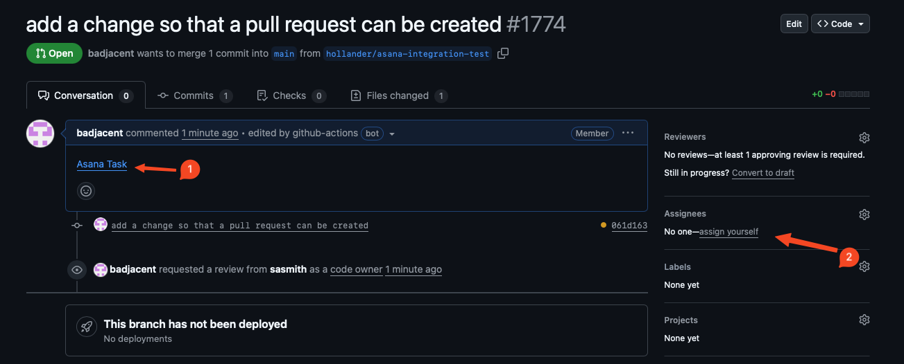

1. The Asana Task link. This is created by the action. It will take a little bit of time to show up. 
2. The assignees section, which we will use while testing

Next familiarize yourself with the github action. 

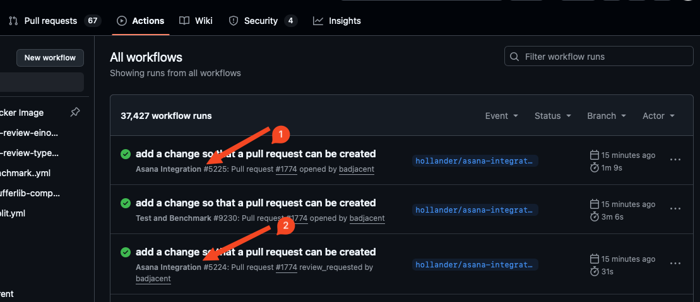

This screen shot shows that the action was run twice when the PR was opened, and again when a review was auto-requested. If you go into the logs for the first run, you can see where the Asana task was created and linked:

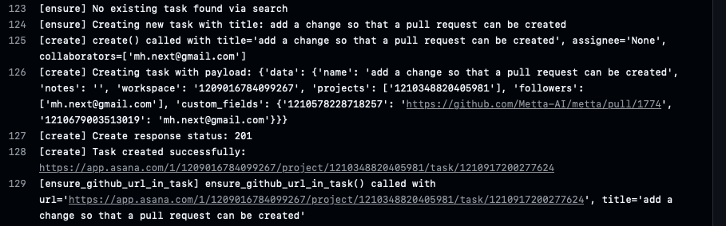

Now open the Asana task via the link in the pull request. Note the Github Sync links which show the activity of the plugin.

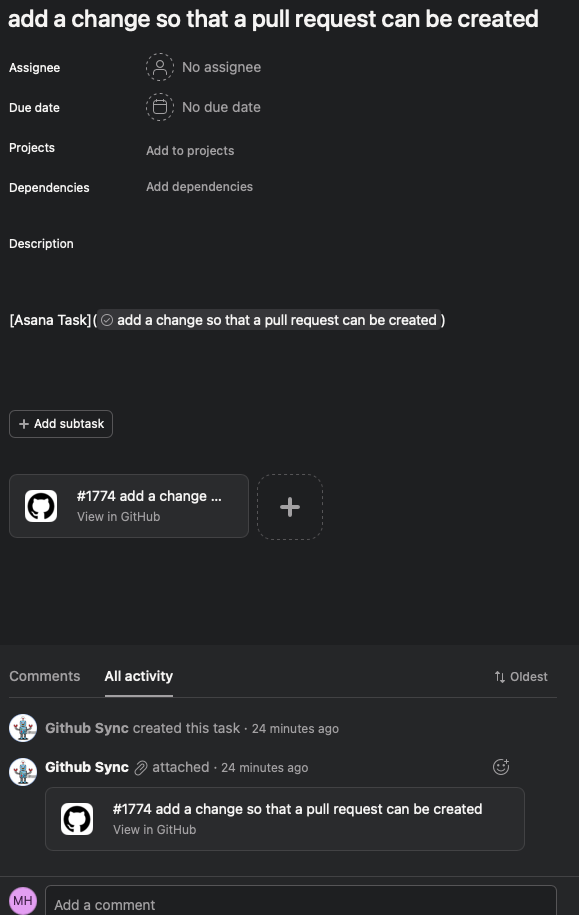

## 2: Action changes Asana task assignee when Github assignee set
Set the Github assignee:

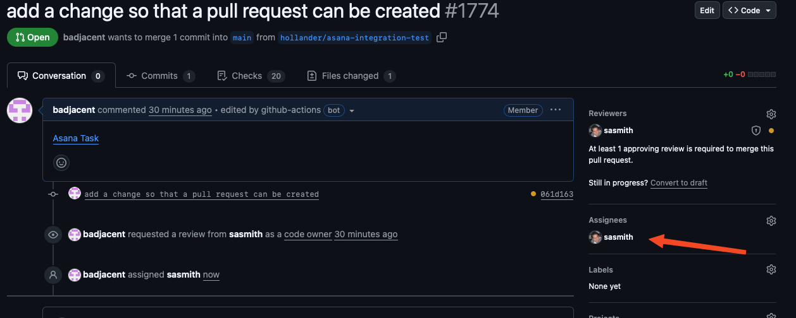

This should trigger an action which sets the Asana assignee:

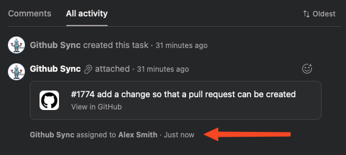

## 3: Action changes Asana task assignee and adds comment when task reviewed

GitHub won't let you review your own PRs, so to do this, you'll need a second github account with access to the PR. For example:

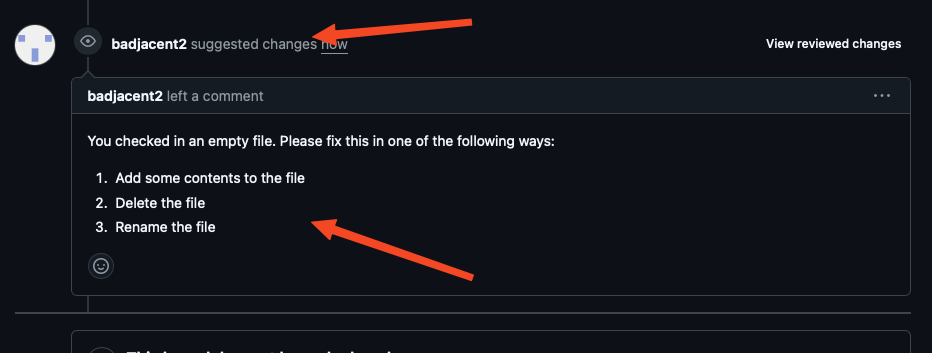

Note the "suggested changes" which is the review status and the comments.

After the action runs, the Asana task should change. The review comment should be added, and the assignee should change:

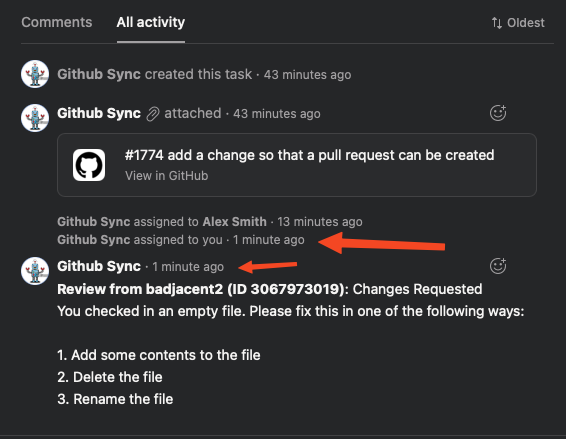


## 4: Action changes Asana task assignee when review re-requested in GitHub

Now check the workflow around re-requesting reviews. to re-request a review in GitHub, hit the re-request button.

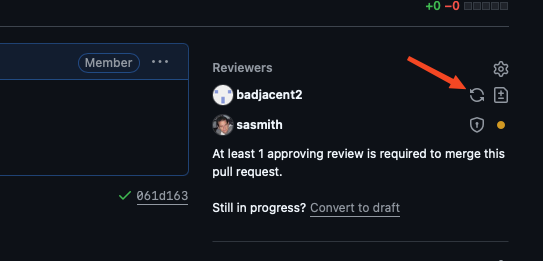

After the action runs, the assignee should change in Asana:

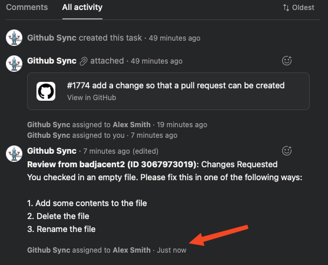

## 5: Close pull request

Finally, close the pull request. After the action runs, the task should be marked complete:

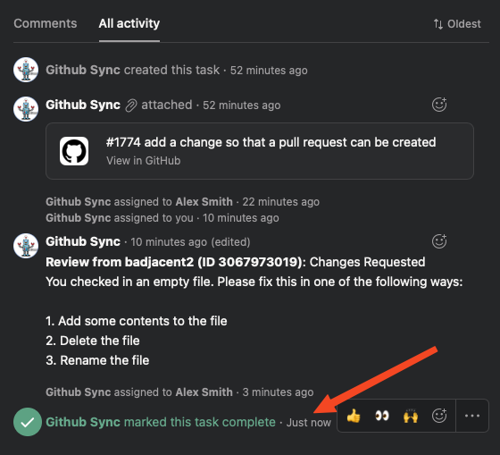


