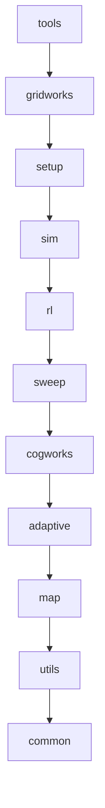

# Metta AI

<p align="center">
  <a href="https://github.com/Metta-AI/metta/actions/workflows/checks.yml">
    
  </a>
  <a href="https://discord.gg/secret-hologenesis">
    
  </a>
  <a href="LICENSE">
    
  </a>
  <a href="https://deepwiki.com/Metta-AI/metta">
    
  </a>
</p>

A reinforcement learning codebase focusing on the emergence of cooperation and alignment in multi-agent AI systems.

- **Discord**: <https://discord.gg/mQzrgwqmwy>
- **Short (5m) Talk**: <https://www.youtube.com/watch?v=bt6hV73VA8I>
- **Talk**: <https://foresight.org/summary/david-bloomin-metta-learning-love-is-all-you-need/>

## What is Metta Learning?

<p align="middle">

<br>
</p>

Metta AI is an open-source research project investigating the emergence of cooperation and alignment in multi-agent AI
systems. By creating a model organism for complex multi-agent gridworld environments, the project aims to study the
impact of social dynamics, such as kinship and mate selection, on learning and cooperative behaviors of AI agents.

Metta AI explores the hypothesis that social dynamics, akin to love in biological systems, play a crucial role in the
development of cooperative AGI and AI alignment. The project introduces a novel reward-sharing mechanism mimicking
familial bonds and mate selection, allowing researchers to observe the evolution of complex social behaviors and
cooperation among AI agents. By investigating this concept in a controlled multi-agent setting, the project seeks to
contribute to the broader discussion on the path towards safe and beneficial AGI.

## Introduction

Metta is a simulation environment (game) designed to train AI agents capable of meta-learning general intelligence. The
core idea is to create an environment where incremental intelligence is rewarded, fostering the development of generally
intelligent agents.

### Motivation and Approach

1. **Agents and Environment**: Agents are shaped by their environment, learning policies that enhance their fitness. To
   develop general intelligence, agents need an environment where increasing intelligence is continually rewarded.

2. **Competitive and Cooperative Dynamics**: A game with multiple agents and some competition creates an evolving
   environment where challenges increase with agent intelligence. Purely competitive games often reach a Nash
   equilibrium, where locally optimal strategies are hard to deviate from. Adding cooperative dynamics introduces more
   behavioral possibilities and smooths the behavioral space.

3. **Kinship Structures**: The game features a flexible kinship structure, simulating a range of relationships from
   close kin to strangers. Agents must learn to coordinate with close kin, negotiate with more distant kin, and compete
   with strangers. This diverse social environment encourages continuous learning and intelligence growth.

The game is designed to evolve with the agents, providing unlimited learning opportunities despite simple rules.

### Game Overview

The current version of the game can be found [here](https://huggingface.co/metta-ai/baseline.v0.1.0). It's a grid world
with the following dynamics:

- **Agents and Vision**: Agents can see a limited number of squares around them.
- **Resources**: Agents harvest diamonds, convert them to energy at charger stations, and use energy to power the "heart
  assembler" for rewards.
- **Energy Management**: All actions cost energy, so agents learn to manage their energy budgets efficiently.
- **Combat**: Agents can attack others, temporarily freezing the target and stealing resources.
- **Defense**: Agents can toggle shields, which drain energy but absorb attacks.
- **Cooperation**: Agents can share energy or resources and use markers to communicate.

### Exploration and Expansion

The game offers numerous possibilities for exploration, including:

1. **Diverse Energy Profiles**: Assigning different energy profiles to agents, essentially giving them different bodies
   and policies.
2. **Dynamic Energy Profiles**: Allowing agents to change their energy profiles, reflecting different postures or
   emotions.
3. **Resource Types and Conversions**: Introducing different resource types and conversion mechanisms.
4. **Environment Modification**: Enabling agents to modify the game board by creating, destroying, or altering objects.

### Kinship and Social Dynamics

The game explores various kinship structures:

1. **Random Kinship Scores**: Each pair of agents has a kinship score sampled from a distribution.
2. **Teams**: Agents belong to teams with symmetric kinship among team members.
3. **Hives/Clans/Families**: Structuring agents into larger kinship groups.

Future plans include incorporating mate-selection dynamics, where agents share future rewards at a cost, potentially
leading to intelligence gains through a signaling arms race.

Metta aims to create a rich, evolving environment where AI agents can develop general intelligence through continuous
learning and adaptation.

## Research Explorations

The project's modular design and open-source nature make it easy for researchers to adapt and extend the platform to
investigate their own hypotheses in this domain. The highly performant, open-ended game rules provide a rich environment
for studying these behaviors and their potential implications for AI alignment.

Some areas of research interest:

#### 1. Environment Development

Develop rich and diverse gridworld environments with complex dynamics, such as resource systems, agent diversity,
procedural terrain generation, support for various environment types, population dynamics, and kinship schemes.

#### 2. Agent Architecture Research

Incorporate techniques like dense learning signals, surprise minimization, exploration strategies, and blending
reinforcement and imitation learning.

#### 3. Scalable Training Infrastructure

Investigate scalable training approaches, including distributed reinforcement learning, student-teacher architectures,
and blending reinforcement learning with imitation learning, to enable efficient training of large-scale multi-agent
systems.

#### 4. Intelligence Evaluations for Gridworld Agents

Design and implement a comprehensive suite of intelligence evaluations for gridworld agents, covering navigation tasks,
maze solving, in-context learning, cooperation, and competition scenarios.

#### 5. DevOps and Tooling

Develop tools and infrastructure for efficient management, tracking, and deployment of experiments, such as cloud
cluster management, experiment tracking and visualization, and continuous integration and deployment pipelines.

This README provides only a brief overview of research explorations. Visit the
[research roadmap](https://github.com/Metta-AI/metta/blob/main/roadmap.md) for more details.

## Folder Hierarchy

The `metta/` package has a folder hierarchy where higher folders can import from lower folders, but not vice versa. To
add or reorder folders, edit `.importlinter` then run `metta codebase generate-folder-diagram`. Run
`uv run lint-imports` to check for violations.

<!-- FOLDER_DIAGRAM_START -->



<!-- FOLDER_DIAGRAM_END -->

## Installation

### Quick Start

Clone the repository and run the setup:

```bash
git clone https://github.com/Metta-AI/metta.git
cd metta
./install.sh  # Interactive setup - installs uv and other system packages, configures metta, and installs
              # Can provide --help to see all available options
```

After installation, you can use metta commands directly:

```bash
metta status       # Check component status
metta install      # Install additional components
metta configure    # Reconfigure for a different profile
```

## Usage

The repository contains command-line tools in the `tools/` directory.

### Quickstart: train, evaluate, play, and replay

`run.py` is a script that kicks off tasks like training, evaluation, and visualization. The runner looks up the task,
builds its configuration, and runs it.

**Discover available tools**:

```bash
# List all tools in a recipe
./tools/run.py arena --list

# List all recipes that provide a specific tool
./tools/run.py train --list
```

**Common tasks**:

- **Train**: `./tools/run.py train arena run=my_experiment`
- **Evaluate**: `./tools/run.py evaluate arena policy_uris=file://./train_dir/my_run/checkpoints`
- **Play** (browser): `./tools/run.py play arena policy_uri=file://./train_dir/my_run/checkpoints`
- **Replay**: `./tools/run.py replay arena policy_uri=file://./train_dir/my_run/checkpoints`

**Navigation recipe**: Replace `arena` with `navigation` for navigation tasks

### Example Training Notebooks

All the notebooks available at `./notebooks`

#### Train on Cogames:

[](https://colab.research.google.com/drive/1YaIdg5a5Ji5_J_HkVOdY9itJTFju54oG?usp=sharing)

### Task arguments

run.py applies arguments provided through `[key=value ...]`, classifying each:

- **Function arguments**: Arguments that match parameters of your task function
- **Configuration overrides**: Arguments that match fields in the Tool configuration (supports nested paths with dots)

Examples:

```bash
# The runner automatically identifies 'run' as a function arg and the rest as overrides
./tools/run.py train arena run=local.alice.1 \
  system.device=cpu wandb.enabled=false trainer.total_timesteps=100000

# Evaluate a specific policy URI
./tools/run.py evaluate arena policy_uris=s3://my-bucket/checkpoints/local.alice.1/local.alice.1:v10.pt

# Use --verbose to see how arguments are classified
./tools/run.py train arena run=test --verbose
```

### Recipe Structure

Recipes define explicit tool functions that return Tool instances:

```python
def train() -> TrainTool:
    return TrainTool(...)

def evaluate() -> EvaluateTool:
    return EvaluateTool(simulations=[...])
```

> Trainer state (optimizer, scheduler, curriculum, timers) now checkpoints automatically whenever a new policy snapshot
> is written. Legacy knobs such as `context_checkpointer.epoch_interval` or `keep_last_n` no longer have any effect.

Recipes can optionally define helper functions like `mettagrid()` or `simulations()` to avoid duplication when multiple
tools need the same configuration.

Examples:

- `./tools/run.py train arena`
- `./tools/run.py evaluate arena policy_uris=mock://test`

Shorthands are supported:

- Omit `recipes.experiment.` or `recipes.prod.`: `arena.train` == `recipes.experiment.arena.train`
- Two‑token form: `train arena` == `arena.train`

Tips:

- Strings with spaces: quote the value, for example `notes="my local run"`.
- Booleans are lowercase: `true` and `false`.
- If a value looks numeric but should be a string, wrap it in quotes (for example, `run="001"`).

#### Defining your own runner tasks

A “task” is just a Python function (or class) that returns a Tool configuration. The runner loads it by name and runs
its `invoke()` method.

What you write:

- A function that returns a Tool, for example `TrainTool`, `EvaluateTool`, `PlayTool`, or `ReplayTool`.
- Place it anywhere importable (for personal use, `experiments/user/<your_file>.py` is convenient).
- The function name becomes part of the task name you run.

Minimal example:

```python
# experiments/user/my_tasks.py
from metta.rl.training import EvaluatorConfig, TrainingEnvironmentConfig
from mettagrid.config.envs import make_arena
from metta.sim.simulation_config import SimulationConfig
from metta.tools.train import TrainTool
from mettagrid.builder.envs import make_arena


def my_train() -> TrainTool:
    return TrainTool(
        training_env=TrainingEnvironmentConfig(),
        evaluator=EvaluatorConfig(
            simulations=[
                SimulationConfig(
                    suite="arena", name="arena/basic", env=make_arena(num_agents=6)
                )
            ]
        ),
    )
```

Run your task:

```bash
./tools/run.py experiments.user.my_tasks.my_train run=local.me.1 system.device=cpu wandb.enabled=false
```

Notes:

- Tasks can also be Tool classes (subclasses of `metta.common.tool.Tool`)
- The runner automatically determines which arguments go to the function vs configuration overrides
- Use `--verbose` to see how arguments are being classified
- If an argument doesn't match either category, you'll get a helpful error message

## Visualizing a Model

### Mettascope: in-browser viewer

Mettascope allows you to run and view episodes in the environment you specify. It goes beyond just spectator mode, and
allows taking over an agent and controlling it manually.

For more information, see
[./packages/mettagrid/nim/mettascope/README.md](./packages/mettagrid/nim/mettascope/README.md).

#### Run the interactive simulation

```bash
./tools/run.py play arena
```

Optional overrides:

- `policy_uri=<path>`: Use a specific policy for NPC agents.
  - Local checkpoints: `file://./train_dir/<run>/checkpoints/<run>:v{epoch}.pt`
- S3 checkpoints: `s3://bucket/path/<run_name>/checkpoints/<run_name>:v5.pt`

#### Replay a single episode

```
./tools/run.py replay arena policy_uri=s3://my-bucket/checkpoints/local.alice.1/local.alice.1:v10.pt
```

### Viewing evaluation results while training

You can always run model evaluation locally with `./tools/run.py path.to.sim.tool`. See the Quickstart table for
examples.

If you have Weights and Biases enabled, you will also be able to see results on evaluation suites on your WandB run page
when training.

### Setting up Weights & Biases for Personal Use

To use WandB with your personal account:

1. Get your WandB API key from [wandb.ai](https://wandb.ai) (click your profile → API keys)
2. Add it to your `~/.netrc` file:
   ```
   machine api.wandb.ai
     login user
     password YOUR_API_KEY_HERE
   ```

Now you can run training with your personal WandB config:

```
./tools/run.py arena.train run=local.yourname.123 wandb.enabled=true wandb.entity=<your_user>
```

### Evaluating a Model

#### Evaluate a policy

Evaluate a policy against the arena evaluation suite:

```
./tools/run.py evaluate arena policy_uri=s3://my-bucket/checkpoints/local.alice.1/local.alice.1:v10.pt
```

Evaluate on the navigation evaluation suite (provide the policy URI):

```
./tools/run.py evaluate navigation policy_uris=s3://my-bucket/checkpoints/local.alice.1/local.alice.1:v10.pt
```

### Specifying your agent architecture

#### Configuring a MettaAgent

This repo implements a `MettaAgent` policy class. By default we now build policies using the ViT-based
`ViTDefaultConfig` (defined in `metta.agent.policies.vit`). Policy architectures are now expressed as Python configs in
`metta.agent.policies`, replacing the legacy `configs/agent/*.yaml` files referenced in older docs. See
[`metta.agent.policies.vit`](agent/src/metta/agent/policies/vit.py) for a concrete example and consult the
[agent-architecture wiki](https://deepwiki.com/Metta-AI/metta/6-agent-architecture) for conceptual documentation.

To use `MettaAgent` with a non-default architecture config:

- (Optional): Implement your own `PolicyArchitecture` subclass (for example by copying `ViTDefaultConfig` into
  `metta/agent/policies/my_agent.py`).
- Run with the configuration file of your choice:
  ```bash
  ./tools/run.py train arena policy_architecture.agent_config=my_agent
  ```

#### Defining your own PyTorch agent

We support agent architectures without using the MettaAgent system:

- Implement your agent class under `metta/agent/src/metta/agent/pytorch/my_agent.py`. See
  `metta/agent/src/metta/agent/pytorch/fast.py` for an example.
- Register it in `metta/agent/src/metta/agent/agent_config.py` by adding an entry to `AGENT_REGISTRY` with a key name
  (e.g., `"my_agent"`).
- Select it at runtime using the runner and an override on the agent config name:
  ```bash
  ./tools/run.py train arena policy_architecture.name=pytorch/my_agent
  ```

Further updates to support bringing your own agent are coming soon.

## Development Setup

To run the style checks and tests locally:

```bash
metta lint
metta pytest
pyright metta  # optional, some stubs are missing
```

### CLI cheat sheet

| Task                        | Command                                                                                                        |
| --------------------------- | -------------------------------------------------------------------------------------------------------------- |
| Train (arena)               | `./tools/run.py train arena run=my_experiment`                                                                 |
| Train (navigation)          | `./tools/run.py train navigation run=my_experiment`                                                            |
| Play (browser)              | `./tools/run.py play arena`                                                                                    |
| Replay (policy)             | `./tools/run.py replay arena policy_uri=s3://my-bucket/checkpoints/local.alice.1/local.alice.1:v10.pt`         |
| Evaluate (arena)            | `./tools/run.py evaluate arena policy_uris=s3://my-bucket/checkpoints/local.alice.1/local.alice.1:v10.pt`      |
| Evaluate (navigation suite) | `./tools/run.py evaluate navigation policy_uris=s3://my-bucket/checkpoints/local.alice.1/local.alice.1:v10.pt` |

Running these commands mirrors our CI configuration and helps keep the codebase consistent.
