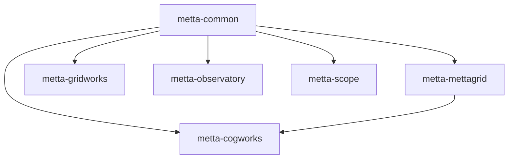

# Metta Repository Organization Plan - Flattened Structure

## Overview

This document outlines a flattened organization structure for the Metta monorepo, using consistent `metta-*` package naming while maintaining simple directory names and imports.

### Naming Convention

Our three-tier naming system:
1. **Directory name**: Simple, no prefix (e.g., `cogworks/`)
2. **Import name**: Matches directory (e.g., `from cogworks import api`)
3. **Package name**: Company-prefixed (e.g., `pip install metta-cogworks`)

This gives us the best of all worlds:
- Clean, simple imports for developers
- Clear company branding for published packages
- Consistent file structure that's easy to navigate

### Goals of the Flattened Structure

1. **Independent Packages**: Each component is its own Python package with distinct namespaces
2. **Simple Imports**: Direct package names without deep nesting
3. **Clear Boundaries**: Each package has a focused purpose and minimal dependencies
4. **Consistent Branding**: All Python packages use `metta-` prefix for PyPI distribution
5. **Developer Ergonomics**: Simple directory structure that matches import names

## Package Structure

```
Softmax/
├── pyproject.toml              # Workspace configuration
├── uv.lock                     # Unified lock file
│
├── cogworks/                   # RL training framework
│   ├── pyproject.toml          # name = "metta-cogworks"
│   ├── __init__.py
│   ├── api.py                  # Main training APIs
│   ├── agent/                  # Agent/policy code
│   ├── rl/                     # RL algorithms
│   ├── eval/                   # Evaluation tools
│   ├── sweep/                  # Hyperparameter sweeping
│   ├── sim/                    # Simulation management
│   ├── mapgen/                 # Map generation
│   ├── setup/                  # Setup tools
│   ├── recipes/                # Example scripts
│   └── tests/
│
├── mettagrid/                  # C++/Python environment
│   ├── pyproject.toml          # name = "metta-mettagrid"
│   ├── CMakeLists.txt
│   ├── __init__.py
│   ├── mettagrid_env.py        # Main environment class
│   ├── mettagrid_config.py     # Configuration
│   ├── curriculum/             # Curriculum definitions
│   ├── cpp/                    # C++ source
│   ├── tests/
│   └── benchmarks/
│
├── common/                     # Shared utilities
│   ├── pyproject.toml          # name = "metta-common"
│   ├── __init__.py
│   ├── util/                   # Common utilities
│   ├── profiling/              # Performance monitoring
│   ├── wandb/                  # WandB integration
│   └── tests/
│
├── gridworks/                  # Map editor (future package)
│   ├── pyproject.toml          # name = "metta-gridworks"
│   ├── package.json
│   ├── server/                 # Python backend
│   ├── src/                    # TypeScript frontend
│   └── tests/
│
├── observatory/                # Production monitoring (future package)
│   ├── pyproject.toml          # name = "metta-observatory"
│   ├── package.json
│   ├── api/                    # Backend API
│   ├── src/                    # React frontend
│   └── docker/
│
├── mettascope/                 # Replay viewer (future package)
│   ├── pyproject.toml          # name = "metta-scope"
│   ├── package.json
│   ├── src/                    # TypeScript frontend
│   └── data/                   # Assets
│
├── tools/                      # Standalone scripts
├── configs/                    # Hydra configurations
├── scenes/                     # Map/scene definitions
├── docs/                       # Documentation
└── devops/                     # Infrastructure
```

## Package Configuration Examples

### Main Training Framework

```toml
# cogworks/pyproject.toml
[project]
name = "metta-cogworks"
version = "0.1.0"
description = "Metta RL training framework"

[tool.uv]
# This ensures imports work as "from cogworks import ..."
# while the package installs as "pip install metta-cogworks"
```

**Imports:**
```python
from cogworks import api
from cogworks.rl import trainer
from cogworks.agent import MettaAgent
```

**Installation:**
```bash
pip install metta-cogworks
```

### Environment Package

```toml
# mettagrid/pyproject.toml
[project]
name = "metta-mettagrid"
version = "0.1.0"
description = "High-performance grid environments"
dependencies = ["metta-common>=0.1.0"]
```

**Imports:**
```python
import mettagrid
from mettagrid import MettaGridPufferEnv
```

### Common Utilities

```toml
# common/pyproject.toml
[project]
name = "metta-common"
version = "0.1.0"
description = "Shared utilities for Metta packages"

# Note: Import name differs from package name
[tool.setuptools]
packages = ["mettacommon"]
```

**Imports:**
```python
from mettacommon import logger
from mettacommon.util import config
```

## Current → Proposed Mapping

Here's how the existing structure maps to our new organization:

```
# CURRENT PACKAGE NAME          → NEW PACKAGE NAME
metta                          → metta-cogworks
metta-common                   → metta-common (unchanged)
metta-agent                    → (merged into metta-cogworks)
metta-mettagrid                → metta-mettagrid (unchanged)
metta-app-backend              → (split into respective apps)
```

## Installation Examples

```bash
# Just the environment
pip install metta-mettagrid

# Training framework (includes dependencies)
pip install metta-cogworks

# Development setup
uv sync  # Installs all workspace packages

# What uv will show during build:
# Built metta-cogworks @ file:///workspace/cogworks
# Built metta-common @ file:///workspace/common
# Built metta-mettagrid @ file:///workspace/mettagrid
```

## Import Philosophy

We maintain a clear separation between:
- **Package distribution names** (with `metta-` prefix for branding)
- **Import names** (simple, no prefix for developer ergonomics)

This approach is used by many successful projects:
- `scikit-learn` → `import sklearn`
- `beautifulsoup4` → `import bs4`
- `pillow` → `import PIL`

## Benefits

1. **Brand Recognition**: All packages clearly belong to Metta
2. **No Naming Conflicts**: `metta-` prefix prevents PyPI collisions
3. **Clean Imports**: Developers write `from cogworks` not `from metta_cogworks`
4. **Consistent Structure**: Directory names match import names
5. **Easy Migration**: Existing `metta` imports become `cogworks` imports

## Dependency Graph



## Future Packages

As the web apps mature, they'll follow the same pattern:
- `gridworks/` → `from gridworks` → `pip install metta-gridworks`
- `observatory/` → `from observatory` → `pip install metta-observatory`
- `mettascope/` → `from mettascope` → `pip install metta-scope`

## Migration Path

1. Update `pyproject.toml` files with `metta-` prefixed names
2. Update imports from `from metta.rl` to `from cogworks.rl`
3. Ensure `common/` exports as `mettacommon` module
4. Test with `uv sync` to verify package names
5. Update documentation and CI/CD

This structure gives us professional, branded packages while keeping the developer experience clean and simple.
