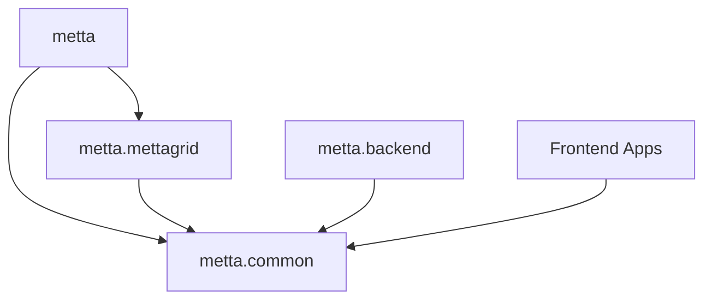
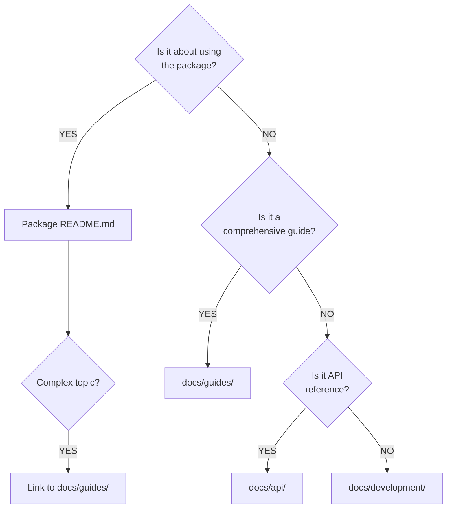

# Metta Repository Organization Plan

## Overview

This document outlines the organization structure for the Metta monorepo, balancing maintainability with modularity.

## Core Principles

1. **Minimize Package Count**: Limit subpackages to logical, cohesive units that could theoretically be deployed independently
2. **Minimize Hierarchy**: Keep namespace as flat as possible for developer ergonomics
   - **10+ subfolder rule**: Only add an extra layer of hierarchy when a directory has more than 10 subfolders
3. **Clear Dependencies**: Maintain a directed acyclic graph (DAG) of dependencies
4. **Consistent Structure**: All packages follow the same `src/` layout pattern (per uv best practices)
5. **Pragmatic Grouping**: Group related functionality to avoid excessive fragmentation
6. **Pragmatic PEP 420**: Follow PEP 420 patterns in subpackages but use `__init__.py` files as needed

## Development Workflow

All packages remain in the monorepo with:
- Shared tooling configuration
- Unified testing and CI/CD
- Consistent code formatting and linting
- Single `uv.lock` for dependency management
- Common development environment setup

## Package Structure

```
metta/
├── src/                  # Core Python package
├── common/               # Shared utilities
├── mettagrid/            # C++ environment
├── backend/              # Backend services
├── apps/                 # All applications (web, desktop, etc.)
│   ├── shared/           # Shared app code
│   ├── observatory/      # Production web app
│   ├── mettascope/       # Replay viewer
│   └── studio/           # Development UI
├── configs/              # Hydra configurations
├── tools/                # CLI tools
├── recipes/              # Example programs
├── docs/                 # Documentation
└── devops/               # Deployment/setup
```

### Core Packages (6 total)

```
metta/
├── src/                   # Main package code
│   ├── __init__.py        # Configures imports to expose metta.* namespace
│   ├── api.py             # API definitions
│   ├── rl/                # Reinforcement learning
│   ├── sweep/             # Hyperparameter sweeping
│   ├── setup/             # Setup tools
│   ├── map/               # Map tools
│   └── eval/              # Evaluation tools
├── tests/                 # Tests for metta/src
├── configs/               # Hydra config DI hierarchy
├── tools/                 # Hydra CLI interface for API
├── recipes/               # Common training and evaluation programs
├── docs/                  # Documentation
├── devops/                # Machine and cloud setup
├── common/                # Shared utilities package (PEP420)
│   └── src/
│       └── metta/
│           └── common/    # metta.common namespace
├── mettagrid/             # C++/PyBind environment package (PEP420)
│   ├── src/
│   │   └── metta/
│   │       └── mettagrid/ # metta.mettagrid namespace
│   └── CMakeLists.txt
├── backend/               # Remote services package (PEP420)
│   └── src/
│       └── metta/
│           └── backend/   # metta.backend namespace
│               ├── observatory/  # Observatory API endpoints
│               ├── sweep-names/  # Name registration service
│               └── stat-buffer/  # Data persistence layer
├── apps/                  # All user-facing applications
│   ├── shared/            # Shared components and utilities
│   │   ├── components/    # Reusable React components
│   │   ├── utils/         # Common TypeScript utilities
│   │   ├── styles/        # Shared CSS/styling
│   │   └── hooks/         # Shared React hooks
│   ├── observatory/       # Production monitoring web app
│   │   ├── src/           # TypeScript/React source
│   │   ├── server.py      # Python server (if needed)
│   │   └── package.json
│   ├── mettascope/        # Web replay visualization
│   │   ├── src/           # TypeScript source
│   │   ├── server.py      # Local Python server
│   │   ├── replays.py     # Replay handling
│   │   └── package.json
│   └── studio/            # Local development UI
│       ├── src/           # TypeScript source
│       ├── server.py      # Local Python server
│       └── package.json
└── pyproject.toml         # Root configuration
```

### Import Examples

```python
# All imports use metta.* namespace
from metta.common import utils
from metta.rl import MettaTrainer
from metta.sweep import SweepManager
from metta.mettagrid import MettaGridPufferEnv
from metta.backend.sweep_names import SweepNameRegistry
from metta.backend.observatory import RemoteStatsDb
```

## Package Descriptions

### Main Package (`metta`)
- **Location**: Root-level `src/` directory
- **Namespace**: `metta.*`
- **Purpose**: Core ML functionality

  - **rl/**: Reinforcement learning algorithms and wrappers
  - **sweep/**: Hyperparameter optimization and experiment management
  - **setup/**: Environment and dependency setup tools
  - **map/**: Map generation and manipulation tools
  - **eval/**: Evaluation metrics and analysis tools
  - **api.py**: Core API definitions and interfaces

### Shared Utilities (`metta.common`)
- **Location**: `common/` directory
- **Namespace**: `metta.common`
- **Purpose**: Shared utilities that all packages can depend on

  - Config management and Hydra resolvers
  - Logging utilities
  - Base interfaces and protocols
  - Data structures used across packages

*Note: Separate package allows mettagrid to depend on common utils without circular dependency*

### Environment Engine (`metta.mettagrid`)
- **Location**: `mettagrid/` directory
- **Namespace**: `metta.mettagrid`
- **Purpose**: Core C++ simulation engine with Python bindings

  - High-performance grid-based environments
  - C++ implementation with PyBind11 interface
  - Depends on `metta.common` but not main `metta` package

### Backend Services (`metta.backend`)
- **Location**: `backend/` directory
- **Namespace**: `metta.backend`
- **Purpose**: Unified backend services for all server-side functionality

  - **observatory/**: API endpoints for experiment tracking and visualization
  - **sweep-names/**: Process name registration service for sweeps
  - **stat-buffer/**: Data persistence and database interfaces

### Frontend Applications

#### Observatory
- Production web interface for experiment tracking and visualization
- Connects to deployed backend service
- Public-facing deployment

#### Mettascope
- Local visualization and replay tool
- Real-time agent observation and replay analysis
- Direct file system access for replay files

#### Studio
- Next-generation local development UI
- Map creation tools
- Enhanced debugging and analysis capabilities

## Dependency Rules



1. `metta.common` has no internal dependencies (base utilities)
2. `metta.mettagrid` depends only on `metta.common`
3. Main `metta` package depends on `metta.common` and `metta.mettagrid`
4. `metta.backend` depends only on `metta.common`
5. Frontend packages are independent TypeScript/Node projects
6. Frontend `server.py` files can import from any metta.* package

### External Library Dependencies

Remember that python has no built-in tree shaking for dependencies! To keep packages lightweight and minimize dependency bloat:

To minimize dependency footprint and improve import times:

```python
# ❌ AVOID: Importing entire packages
import torch
import numpy as np
from sklearn import *

# ✅ PREFERRED: Import only specific submodules/functions
from torch.nn import functional as F
from numpy import array, zeros
from sklearn.metrics import accuracy_score
```

**Package-specific rules:**
- `metta.common`: Import only stdlib and minimal utilities
- `metta.backend`: Import only specific web framework components
  ```python
  # Good: from fastapi import FastAPI, HTTPException
  # Bad:  import fastapi
  ```
- `metta.mettagrid`: Import only essential numerical operations
  ```python
  # Good: from numpy import ndarray, zeros
  # Bad:  import numpy
  ```

This approach:
- Reduces memory usage (only loads needed submodules)
- Speeds up import times
- Makes dependencies explicit and easier to audit
- Helps identify if a package is getting too heavy


## PEP 420 Strategy

### Package Structure
- **Main package** (`src/`): Traditional package with `__init__.py`
- **Subpackages** (`common/`, `mettagrid/`, `backend/`): Follow PEP 420 patterns with `__init__.py` as needed

### Implementation Philosophy
1. Structure packages following PEP 420 patterns
2. Use `__init__.py` when helpful for tooling compatibility
3. Focus on clean architecture over strict compliance
4. Remove `__init__.py` files as tooling improves


## Documentation Strategy

### Documentation Types and Purposes

We maintain three complementary documentation systems:

1. **README.md files**: User-facing documentation for quick understanding and usage
2. **CLAUDE.md files**: AI assistant context for architectural decisions and complex patterns
3. **docs/ folder**: Comprehensive guides, references, and detailed documentation

### Package-Level Documentation

Each package maintains its own documentation suited to its complexity:

```
package/
├── README.md              # Required: Package overview and usage
├── CLAUDE.md              # Optional
└── src/
    └── complex_module/
        └── README.md      # Optional
```

#### README.md Guidelines
- **Required** for all packages
- Focus on: Installation, basic usage, API examples
- Keep concise (under 500 lines)
- Link to `docs/` for detailed information
- Include package-specific badges and status

#### CLAUDE.md Guidelines
- **Optional** - only create when package has:
  - Complex architectural decisions
  - Non-obvious design patterns
  - Domain-specific knowledge (e.g., C++ bindings, RL algorithms)
  - Common implementation pitfalls
- Focus on: Design rationale, patterns, gotchas
- Update when architecture changes or patterns evolve

### Root Documentation Folder

The `docs/` folder serves as our comprehensive documentation hub:

```
docs/
├── README.md              # Documentation index and navigation
├── api/                   # API references and examples
│   ├── reference.md       # Auto-generated API docs
│   └── examples.md        # Curated usage examples
├── guides/                # Step-by-step user guides
│   ├── quickstart.md
│   ├── installation.md
│   └── mapgen.md          # Feature-specific guides
├── metrics/               # Metrics and monitoring documentation
│   ├── README.md          # Metrics overview
│   └── wandb/             # Auto-generated WandB metric docs
├── development/           # Developer and contributor docs
│   ├── architecture.md    # System design documentation
│   ├── contributing.md
│   └── workflows/        # Development workflows
└── assets/               # Images, diagrams, and media
```

### Documentation Hierarchy

Follow this decision tree for where to document:


`
### Maintenance Protocol

1. **When adding features**: Update package README.md
2. **When changing architecture**: Update relevant CLAUDE.md
3. **When adding complex workflows**: Create guide in docs/
4. **When metrics change**: Auto-regenerate docs/metrics/
5. **During major refactors**: Review all three documentation levels

### Anti-Patterns to Avoid

- ❌ Duplicating content between README and docs/
- ❌ Creating CLAUDE.md for simple utility packages
- ❌ Putting user guides in CLAUDE.md
- ❌ Nesting documentation more than necessary
- ❌ Mixing auto-generated and manual content in same file

This documentation strategy ensures users can quickly understand any package while maintaining detailed references for complex topics and providing AI assistants with the context they need to help effectively.
