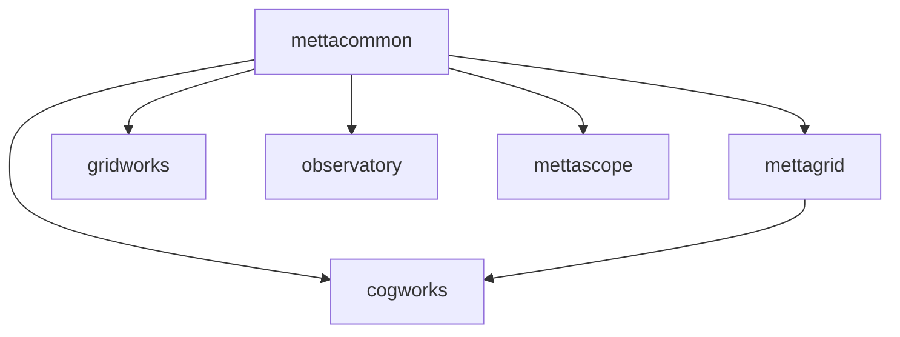

# Metta Repository Organization Plan - Flattened Structure

## Overview

This document outlines a flattened organization structure for the Metta monorepo, emphasizing simplicity and clear package boundaries.

### Goals of the Flattened Structure

Our flattened package structure achieves these key goals:

#### Technical Goals

1. **Independent Packages**: Each major component is its own Python package with distinct namespaces
2. **Simple Imports**: Direct package names without deep nesting (e.g., `import mettagrid`, `from cogworks import train`)
3. **Clear Boundaries**: Each package has a focused purpose and minimal dependencies

#### Organizational Goals

4. **Easy Publishing**: Any package can be published to PyPI independently with minimal effort
5. **Shallow Hierarchy**: Maximum 2 levels deep for any module path
6. **Developer Ergonomics**: Simple, predictable structure that's easy to navigate

### Import Philosophy

Rather than forcing everything under a `metta.*` namespace, we embrace distinct package identities:

```python
# Clear, focused imports
import mettagrid                    # Environment package
from cogworks import train          # RL training
from cogworks.rl import PPO         # RL algorithms
from mettacommon import logger      # Shared utilities
from gridworks import MapEditor     # Map editing tools
```

## Core Principles

1. **Flat is Better**: Avoid nested src/ directories and deep hierarchies
2. **Package Independence**: Each package can be `pip install`ed separately
3. **Clear Namespaces**: Each package owns its namespace (no forced metta.* prefix)
4. **Minimal Shared Code**: Only truly universal utilities go in common
5. **Direct Imports**: Prefer `from package import module` over `from package.subpackage.submodule import thing`

## Package Structure

### Current Structure → Proposed Structure

Here's how the existing repository maps to the new flattened structure:

```
# CURRENT STRUCTURE                 → PROPOSED STRUCTURE
metta/                              → Softmax/
├── metta/                          → cogworks/
│   ├── __init__.py                   ├── __init__.py
│   ├── api.py                        ├── api.py
│   ├── rl/                           ├── rl/
│   ├── eval/                         ├── eval/
│   ├── sweep/                        ├── sweep/
│   ├── map/                          ├── mapgen/
│   ├── sim/                          ├── sim/
│   └── setup/                        └── setup/
├── agent/                          → (merged into cogworks/agent/)
├── common/                         → mettacommon/
├── mettagrid/                      → mettagrid/ (unchanged)
├── mettascope/                     → mettascope/ (unchanged)
├── observatory/                    → observatory/ (unchanged)
├── studio/                         → gridworks/
├── app_backend/                    → (split into respective apps)
├── tools/                          → tools/ (unchanged)
├── configs/                        → configs/ (unchanged)
├── scenes/                         → scenes/ (unchanged)
├── recipes/                        → recipes/ (moved to cogworks/recipes/)
├── tests/                          → (distributed to packages)
├── docs/                           → docs/ (unchanged)
├── devops/                         → devops/ (unchanged)
└── wandb_carbs/                    → (integrated or removed)
```

### Detailed New Structure

```
Softmax/
├── pyproject.toml              # Workspace configuration
├── uv.lock                     # Unified lock file
│
├── cogworks/                   # RL training framework (from metta/ + agent/)
│   ├── pyproject.toml          # name = "cogworks"
│   ├── __init__.py
│   ├── api.py                  # Main training APIs
│   ├── train.py                # Training entry point
│   ├── agent/                  # Agent/policy code (from agent/)
│   │   ├── policy.py
│   │   ├── modules/
│   │   └── distributions/
│   ├── rl/                     # RL algorithms
│   │   ├── experience.py
│   │   ├── losses.py
│   │   ├── ppo.py
│   │   └── trainer.py
│   ├── eval/                   # Evaluation tools
│   │   ├── analysis.py
│   │   └── dashboard_data.py
│   ├── sweep/                  # Hyperparameter sweeping
│   │   ├── protein_metta.py
│   │   └── sweep_name_config.py
│   ├── sim/                    # Simulation management
│   │   ├── simulation.py
│   │   └── simulation_stats_db.py
│   ├── mapgen/                 # Map generation (from map/)
│   │   ├── random/
│   │   ├── scenes/
│   │   └── utils/
│   ├── setup/                  # Setup and installation tools
│   ├── recipes/                # Example scripts (from root recipes/)
│   └── tests/                  # All RL/agent tests
│
├── mettagrid/                  # C++/Python environment (mostly unchanged)
│   ├── pyproject.toml          # name = "mettagrid"
│   ├── CMakeLists.txt
│   ├── __init__.py
│   ├── src/                    # C++ source
│   │   └── metta/
│   │       └── mettagrid/
│   ├── configs/                # Environment configs
│   ├── tests/
│   └── benchmarks/
│
├── mettacommon/                # Minimal shared utilities (from common/)
│   ├── pyproject.toml          # name = "mettacommon"
│   ├── __init__.py
│   ├── util/                   # Common utilities
│   │   ├── logger.py
│   │   ├── config.py
│   │   └── system_monitor.py
│   ├── profiling/              # Performance monitoring
│   │   ├── memory_monitor.py
│   │   └── stopwatch.py
│   ├── wandb/                  # WandB integration
│   └── tests/
│
├── gridworks/                  # Map editor and studio (from studio/)
│   ├── pyproject.toml          # name = "gridworks"
│   ├── package.json
│   ├── __init__.py
│   ├── server/                 # Python backend
│   │   ├── api.py
│   │   └── routes.py
│   ├── src/                    # TypeScript/React frontend
│   │   ├── app/
│   │   ├── components/
│   │   └── lib/
│   ├── public/
│   └── tests/
│
├── observatory/                # Production monitoring (unchanged)
│   ├── pyproject.toml          # name = "observatory"
│   ├── package.json
│   ├── __init__.py
│   ├── api.py                  # Backend API (from app_backend/)
│   ├── db.py                   # Database models
│   ├── src/                    # React frontend
│   ├── docker/
│   └── tests/
│
├── mettascope/                 # Replay viewer (unchanged)
│   ├── pyproject.toml          # name = "mettascope"
│   ├── package.json
│   ├── __init__.py
│   ├── replays.py              # Replay handling
│   ├── server.py               # Local server
│   ├── src/                    # TypeScript frontend
│   ├── data/                   # Assets (atlas, fonts, ui)
│   └── tests/
│
├── tools/                      # Standalone entry scripts
│   ├── train.py                # Main training script
│   ├── sweep_init.py           # Sweep initialization
│   ├── sweep_eval.py           # Sweep evaluation
│   ├── play.py                 # Interactive play
│   ├── sim.py                  # Run simulations
│   ├── replay.py               # Generate replays
│   ├── analyze.py              # Analysis tools
│   ├── dashboard.py            # Dashboard launcher
│   ├── renderer.py             # Render utilities
│   ├── validate_config.py      # Config validation
│   ├── stats_duckdb_cli.py     # Stats DB CLI
│   └── map/                    # Map generation tools
│       ├── gen.py
│       └── gen_scene.py
│
├── configs/                    # Hydra configurations
│   ├── agent/                  # Agent configs
│   ├── env/                    # Environment configs
│   │   └── mettagrid/
│   ├── trainer/                # Training configs
│   ├── hardware/               # Hardware profiles
│   ├── sim/                    # Simulation configs
│   ├── sweep/                  # Sweep configs
│   ├── user/                   # User preferences
│   └── wandb/                  # WandB configs
│
├── scenes/                     # Map/scene definitions
│   ├── convchain/
│   ├── dcss/
│   ├── test/
│   └── wfc/
│
├── docs/                       # Documentation
│   ├── api.md
│   ├── mapgen.md
│   ├── wandb/
│   └── workflows/
│
├── devops/                     # Infrastructure and tooling
│   ├── aws/
│   ├── charts/                 # Kubernetes/Helm
│   ├── docker/
│   ├── git-hooks/
│   ├── macos/
│   ├── skypilot/
│   ├── tf/                     # Terraform
│   ├── tools/                  # Dev tools
│   └── wandb/
│
├── checkpoints/                # Model checkpoints (gitignored)
├── wandb/                      # WandB runs (gitignored)
└── .github/                    # GitHub workflows
```

## Package Details

### Training Framework (`cogworks`)

**Namespace**: `cogworks`
**Purpose**: Core RL training functionality

```python
# Example imports
from cogworks import train, evaluate
from cogworks.rl import PPO, MettaAgent
from cogworks.sweep import SweepManager
from cogworks.api import Environment, Agent
```

**Why "cogworks"?**: Distinct identity for our RL framework, cognitive training workbench.

### Environment Engine (`mettagrid`)

**Namespace**: `mettagrid`
**Purpose**: High-performance grid environment

```python
# Example imports
import mettagrid
from mettagrid import GridEnv, Curriculum
from mettagrid.curriculum import NavigationTasks
```

**Independence**: Can be installed standalone for researchers who just want the environment.

### Shared Utilities (`mettacommon`)

**Namespace**: `mettacommon`
**Purpose**: Minimal truly shared code

```python
# Example imports
from mettacommon import setup_logging, profile
from mettacommon.config import load_config
```

**Why "mettacommon"?**: Matches the single-word pattern of `mettagrid`. Simple, consistent naming across our core packages.

**Scope**: Only utilities needed by 2+ packages. If only web apps use it, it goes in a web-specific package.

### Map Editor (`gridworks`)

**Namespace**: `gridworks`
**Purpose**: Map creation and testing studio

Features both Python backend and TypeScript frontend in one package.

### Monitoring (`observatory`)

**Namespace**: `observatory`
**Purpose**: Production experiment tracking

Self-contained web application with its own backend.

### Replay Viewer (`mettascope`)

**Namespace**: `mettascope`
**Purpose**: Local replay analysis

Lightweight viewer that can run standalone.

## Entry Points

The `tools/` directory contains standalone scripts that compose functionality:

```python
# tools/train.py
#!/usr/bin/env python
"""Direct training without Hydra complexity."""
from cogworks import train
from mettagrid import GridEnv

if __name__ == "__main__":
    env = GridEnv(...)
    train(env, ...)
```

## Dependency Graph



Rules:
1. `mettacommon` has no dependencies
2. `mettagrid` only depends on `mettacommon`
3. `cogworks` depends on `mettagrid` and `mettacommon`
4. Web apps depend only on `mettacommon` (not on cogworks)

## Installation Examples

```bash
# Just the environment
pip install mettagrid

# Training framework (includes mettagrid)
pip install cogworks

# Everything
pip install cogworks[all]

# Development
uv sync  # Installs all workspace packages
```

## Migration from Current Structure

### Phase 1: Flatten Hierarchy
- Remove unnecessary src/ directories
- Consolidate nested packages

### Phase 2: Namespace Migration
- Move from `metta.*` imports to direct package imports
- Update all import statements

### Phase 3: Package Independence
- Ensure each package has complete pyproject.toml
- Test independent installation

## Benefits of Flat Structure

1. **Discoverability**: Easy to see what's available at a glance
2. **Simple Imports**: No deep nesting to remember
3. **Tool Friendly**: IDEs and tools work better with flatter structures
4. **Beginner Friendly**: Lower cognitive load for new developers
5. **Flexible Publishing**: Any package can be extracted and published

## Package Publishing Strategy

Each package maintains PyPI readiness:

```toml
# mettagrid/pyproject.toml
[project]
name = "mettagrid"
version = "0.1.0"
description = "High-performance grid environments"
dependencies = ["mettacommon>=0.1.0"]

# cogworks/pyproject.toml
[project]
name = "cogworks"
version = "0.1.0"
description = "RL training framework"
dependencies = ["mettagrid>=0.1.0", "mettacommon>=0.1.0"]
```

This allows:
- Independent version management
- Clear dependency relationships
- Easy extraction for external use

## Future Considerations

This flattened structure provides flexibility for:
- Renaming packages as they mature
- Extracting packages to separate repos if needed
- Converting to a fuller microservice architecture
- Supporting both research and production use cases

The key is starting simple and flat, then adding structure only where truly needed.

## Development Workflow

All packages remain in the monorepo with:

- Shared tooling configuration (ruff, pyright, pytest)
- Unified CI/CD pipeline
- Single `uv.lock` for consistent dependencies
- Common development environment
- Shared git hooks and code quality standards

### Local Development

```bash
# Clone and setup
git clone https://github.com/metta-ai/metta
cd metta
uv sync

# Work on specific package
cd cogworks
uv run pytest

# Run from anywhere
uv run python tools/train.py
```

## Testing Strategy

Each package maintains its own focused test suite:

```
cogworks/
├── tests/
│   ├── test_trainer.py
│   ├── test_losses.py
│   └── rl/
│       └── test_ppo.py

mettagrid/
├── tests/
│   ├── test_env.py
│   ├── test_curriculum.py
│   └── cpp/
│       └── test_grid.cpp
```

### Testing Principles

1. **Unit tests stay with package**: Each package tests its own code
2. **Integration tests in tools/**: Cross-package tests live at the root
3. **Shared test utilities**: `mettacommon.testing` provides fixtures
4. **Fast feedback**: Package tests should run in <30 seconds

## What Goes Where - Detailed Examples

### cogworks/ - RL Training Framework

```
cogworks/
├── __init__.py
├── api.py              # Environment, Agent base classes
├── train.py            # Main training loop
├── rl/
│   ├── ppo.py          # PPO implementation
│   ├── losses.py       # Loss functions
│   ├── experience.py   # Experience buffer
│   └── utils.py        # RL-specific utilities
├── eval/
│   ├── metrics.py      # Evaluation metrics
│   └── visualize.py    # Training curves
├── sweep/
│   ├── manager.py      # Hyperparameter sweep orchestration
│   └── strategies.py   # Search strategies
└── recipes/
    ├── basic_ppo.py    # Simple training example
    └── distributed.py  # Multi-GPU example
```

### mettagrid/ - Environment Package

```
mettagrid/
├── __init__.py
├── env.py              # Main GridEnv class
├── curriculum/
│   ├── __init__.py
│   ├── base.py         # Curriculum interface
│   ├── navigation.py   # Navigation tasks
│   └── configs/        # Task YAML files
├── cpp/
│   ├── grid.cpp        # Core grid logic
│   ├── entities.cpp    # Agents, objects
│   └── physics.cpp     # Movement, collisions
├── bindings/
│   └── py_env.cpp      # PyBind11 wrapper
└── assets/
    └── sprites/        # Visual assets
```

### mettacommon/ - Truly Shared Code

```
mettacommon/
├── __init__.py
├── config.py           # Config loading utilities
├── logger.py           # Logging configuration
├── types.py            # AgentID, Position, etc.
├── profiling.py        # Performance monitoring
├── testing.py          # Shared test fixtures
└── distributed.py      # Multi-GPU utilities
```

**Rule of thumb**: If it's used by only one package, it doesn't belong here.

## Documentation Strategy

### Three Levels of Documentation

1. **README.md** - Quick start and overview (per package)
2. **docs/** - Comprehensive guides and tutorials (root level)
3. **DESIGN.md** - Architecture decisions (per complex package)

### Package Documentation

```
cogworks/
├── README.md           # Installation, basic usage
├── DESIGN.md           # Why PPO? Architecture choices
└── examples/
    └── quickstart.py   # Runnable example

mettagrid/
├── README.md           # Environment overview, installation
├── BUILDING.md         # C++ build instructions
└── docs/
    └── curriculum.md   # How to create tasks
```

### Root Documentation

```
docs/
├── getting-started.md  # Overall project intro
├── guides/
│   ├── training.md     # Using cogworks
│   ├── environments.md # Using mettagrid
│   └── distributed.md  # Multi-GPU setup
├── api/
│   ├── cogworks.md     # API reference
│   └── mettagrid.md    # Environment API
└── contributing.md     # Development guide
```

## Common Patterns and Best Practices

### Import Organization

```python
# Standard library
import os
from pathlib import Path

# External packages
import numpy as np
import torch

# Our packages (alphabetical)
from cogworks import train
from mettagrid import GridEnv
from mettacommon import logger

# Local imports
from .utils import helper
```

### Cross-Package Communication

When packages need to interact:

```python
# cogworks/api.py
from typing import Protocol

class Environment(Protocol):
    """Interface that environments must implement."""
    def reset(self): ...
    def step(self, action): ...

# mettagrid/env.py
class GridEnv:  # Implements Environment protocol
    def reset(self): ...
    def step(self, action): ...
```

### Optional Dependencies

Keep packages lightweight with optional features:

```toml
# cogworks/pyproject.toml
[project.optional-dependencies]
wandb = ["wandb>=0.13.0"]
distributed = ["torch-distributed>=2.0"]
all = ["wandb>=0.13.0", "torch-distributed>=2.0"]
```

## Anti-Patterns to Avoid

1. **Deep nesting**: `from cogworks.rl.algorithms.ppo.utils import thing` ❌
2. **Circular imports**: cogworks → mettagrid → cogworks ❌
3. **Kitchen sink common**: Putting everything in mettacommon ❌
4. **Mixed concerns**: Training code in mettagrid ❌
5. **Hidden dependencies**: Web UI importing from cogworks ❌

## Migration Checklist

- [ ] Flatten directory structure
- [ ] Update all imports
- [ ] Create package-specific pyproject.toml files
- [ ] Move tests to package directories
- [ ] Update CI/CD configuration
- [ ] Test independent package installation
- [ ] Update documentation
- [ ] Communicate changes to team

This flattened structure prioritizes developer experience and maintainability while keeping our options open for future growth.
