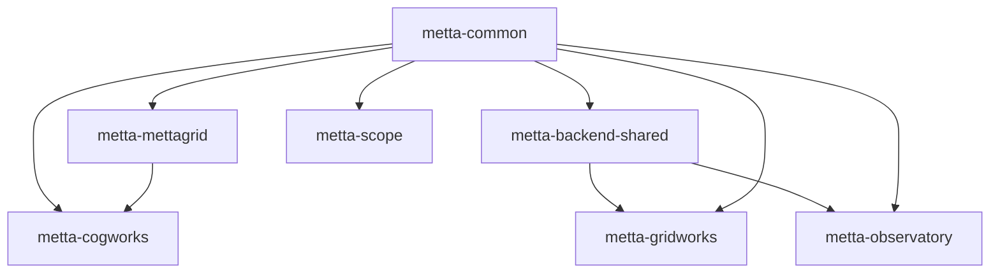

# Metta Repository Organization Plan - Flattened Structure

## Overview

This document outlines a flattened organization structure for the Metta monorepo, using consistent `metta-*` package naming while maintaining simple directory names and imports.

### Naming Convention

Our three-tier naming system:
1. **Directory name**: Simple, no prefix (e.g., `cogworks/`)
2. **Import name**: Matches directory (e.g., `from cogworks import api`)
3. **Package name**: Company-prefixed (e.g., `pip install metta-cogworks`)

This gives us the best of all worlds:
- Clean, simple imports for developers
- Clear company branding for published packages
- Consistent file structure that's easy to navigate

### Goals of the Flattened Structure

1. **Independent Packages**: Each component is its own Python package with distinct namespaces
2. **Simple Imports**: Direct package names without deep nesting
3. **Clear Boundaries**: Each package has a focused purpose and minimal dependencies
4. **Consistent Branding**: All Python packages use `metta-` prefix for PyPI distribution
5. **Developer Ergonomics**: Simple directory structure that matches import names

## Package Structure

```
softmax/
├── cogworks/                   # RL training framework
├── mettagrid/                  # C++/Python environment
├── common/                     # Shared utilities
├── backend-shared/             # Shared backend services
├── gridworks/                  # Map editor
├── observatory/                # Production monitoring
├── mettascope/                 # Replay viewer
├── tools/                      # Standalone scripts
├── configs/                    # Hydra configurations
├── scenes/                     # Map/scene definitions
├── docs/                       # Documentation
├── devops/                     # Infrastructure
└── pyproject.toml              # Workspace configuration
```

## Detailed New Structure

Based on the current repository, here's the new flattened structure focusing on key changes:

```
metta/
├── cogworks/                   # RL training framework (merged from metta/ + agent/)
│   ├── agent/                  # From agent/src/metta/agent/
│   ├── rl/                     # From metta/rl/
│   ├── eval/                   # From metta/eval/
│   ├── sweep/                  # From metta/sweep/
│   ├── sim/                    # From metta/sim/
│   ├── mapgen/                 # From metta/map/
│   ├── recipes/                # Example scripts
│   ├── tests/                  # Combined tests
│   ├── pyproject.toml          # name = "metta-cogworks"
│   └── api.py                  # Main API (from metta/api.py)
│
├── mettagrid/                  # C++/Python environment
│   ├── tests/
│   ├── benchmarks/
│   ├── configs/
│   ├── *.py                    # Flattened Python files
│   └── pyproject.toml          # name = "metta-mettagrid"
│
├── mettacommon/                # Shared Python utilities (mettacommon module)
│   ├── util/                   # From common/src/metta/common/util/
│   ├── profiling/              # From common/src/metta/common/profiling/
│   ├── wandb/                  # From common/src/metta/common/wandb/
│   ├── tests/
│   └── pyproject.toml          # name = "metta-common"
│
├── backend-shared/             # Shared backend services
│   ├── sweep_names.py          # Name registration service
│   ├── stat_buffer.py          # Data persistence layer
│   ├── auth.py                 # Authentication utilities
│   ├── database.py             # Database connection pooling
│   ├── cache.py                # Caching utilities
│   ├── utils.py                # General backend utilities
│   ├── tests/
│   └── pyproject.toml          # name = "metta-backend-shared"
│
├── ui-shared/                  # Shared UI components for web apps
│   ├── components/             # Reusable React components
│   ├── hooks/                  # Shared React hooks
│   ├── utils/                  # Common TypeScript utilities
│   ├── styles/                 # Shared CSS/styling
│   └── package.json            # Shared UI dependencies
│
├── gridworks/                  # Map editor (from studio/)
│   ├── src/                    # TypeScript/React frontend
│   ├── public/
│   ├── server.py               # Python server
│   ├── pyproject.toml          # name = "metta-gridworks" (new)
│   └── package.json
│
├── observatory/                # Production monitoring
│   ├── src/                    # React frontend
│   ├── api/                    # Observatory-specific backend
│   │   ├── endpoints.py        # Observatory API endpoints
│   │   └── requirements.txt    # API-specific Python dependencies
│   ├── pyproject.toml          # name = "metta-observatory"
│   ├── package.json
│   └── Dockerfile              # From backend/docker/observatory/
│
├── mettascope/                 # Replay viewer
│   ├── src/                    # TypeScript source
│   ├── data/                   # Assets
│   ├── tools/                  # Python tools
│   ├── server.py               # Python replay server
│   ├── replays.py              # Replay handling
│   └── package.json
│
├── tools/                      # Standalone scripts (train.py, sweep_*.py, etc.)
├── configs/                    # Hydra configurations
├── scenes/                     # Map generation patterns
├── docs/                       # Documentation
├── devops/                     # Infrastructure
├── setup/                      # From metta/setup/
├── pyproject.toml              # Workspace configuration
└── README.md                   # Mono-repo overview
```

### Notes on Python Package Organization:

**Python packages** (with pyproject.toml):
- `cogworks/` - Main RL framework (new package combining metta + agent)
- `mettagrid/` - Environment (existing package)
- `common/` - Shared utilities (existing package, needs module rename)
- `backend-shared/` - Shared backend services (new package)

**Hybrid packages** (Python backend + JS/TS frontend):
- `gridworks/` - Needs new pyproject.toml for Python server parts
- `observatory/` - Needs new pyproject.toml for API backend
- `mettascope/` - Currently just has Python scripts, no package structure

**Pure frontend** (no Python packaging needed):
- The TypeScript/React parts of gridworks, observatory, and mettascope

### Key Migration Tasks:

1. **Flatten mettagrid**: Move files from `mettagrid/src/metta/mettagrid/` directly to `mettagrid/`
2. **Rename common module**: Change `common/src/metta/common/` to export as `mettacommon`
3. **Create cogworks**: Merge `metta/` and `agent/` into new `cogworks/` package
4. **Create backend-shared**: Extract shared backend services:
   - `backend/src/metta/backend/sweep_names/` → `backend-shared/sweep_names.py`
   - `backend/src/metta/backend/stat_buffer/` → `backend-shared/stat_buffer.py`
   - Add new shared utilities for auth, caching, database connections, etc.
5. **Consolidate backend services**: The entire `backend/` directory is eliminated:
   - `backend/src/metta/backend/observatory/` → `observatory/api/endpoints.py`
   - `backend/docker/observatory/Dockerfile` → `observatory/Dockerfile`
   - `backend/docker/observatory/requirements.txt` → `observatory/api/requirements.txt`
   - Shared services → `backend-shared/`
6. **Create ui-shared**: Extract shared React/TypeScript components from existing web apps
7. **Add Python servers**: Ensure each web app has its Python server file where needed

## Package Configuration Examples

### Main Training Framework

```toml
# cogworks/pyproject.toml
[project]
name = "metta-cogworks"
version = "0.1.0"
description = "Metta RL training framework"

[tool.uv]
# This ensures imports work as "from cogworks import ..."
# while the package installs as "pip install metta-cogworks"
```

**Imports:**
```python
from cogworks import api
from cogworks.rl import trainer
from cogworks.agent import MettaAgent
```

**Installation:**
```bash
pip install metta-cogworks
```

### Environment Package

```toml
# mettagrid/pyproject.toml
[project]
name = "metta-mettagrid"
version = "0.1.0"
description = "High-performance grid environments"
dependencies = ["metta-common>=0.1.0"]
```

**Imports:**
  ```python
import mettagrid
from mettagrid import MettaGridPufferEnv
```

### Common Utilities

```toml
# common/pyproject.toml
[project]
name = "metta-common"
version = "0.1.0"
description = "Shared utilities for Metta packages"

# Note: Import name differs from package name
[tool.setuptools]
packages = ["mettacommon"]
```

**Imports:**
```python
from mettacommon import logger
from mettacommon.util import config
```

### Backend Shared Services

```toml
# backend-shared/pyproject.toml
[project]
name = "metta-backend-shared"
version = "0.1.0"
description = "Shared backend services for Metta applications"
dependencies = [
    "metta-common>=0.1.0",
    "fastapi>=0.100.0",
    "sqlalchemy>=2.0.0",
    "redis>=5.0.0",
]

[tool.setuptools]
packages = ["backend_shared"]
```

**Imports:**
```python
from backend_shared import sweep_names
from backend_shared.stat_buffer import StatBuffer
from backend_shared.auth import authenticate
from backend_shared.cache import cache_result
```

**Installation:**
```bash
pip install metta-backend-shared
```

## Current → Proposed Mapping

Here's how the existing structure maps to our new organization:

```
# CURRENT LOCATION             → NEW LOCATION
metta/src/api.py              → cogworks/api.py
metta/src/rl/                 → cogworks/rl/
metta/src/sweep/              → cogworks/sweep/
metta/src/setup/              → cogworks/setup/
metta/src/agent/              → cogworks/agent/
metta/src/map/                → cogworks/mapgen/
metta/src/eval/               → cogworks/eval/
metta/tests/                  → cogworks/tests/
metta/configs/                → configs/ (root level)
metta/tools/                  → tools/ (root level)
metta/recipes/                → cogworks/recipes/
metta/docs/                   → docs/ (root level)
metta/devops/                 → devops/ (root level)

common/src/metta/common/      → common/ (flattened)
mettagrid/src/metta/mettagrid/→ mettagrid/ (flattened)

backend/src/metta/backend/sweep_names/ → backend-shared/sweep_names.py
backend/src/metta/backend/stat_buffer/ → backend-shared/stat_buffer.py
backend/src/metta/backend/observatory/ → observatory/api/endpoints.py
backend/docker/observatory/   → observatory/Dockerfile

apps/shared/                  → ui-shared/ (root level)
apps/observatory/             → observatory/ (root level)
apps/mettascope/              → mettascope/ (root level)
apps/studio/                  → gridworks/ (root level)

# PACKAGE NAMES
metta                         → metta-cogworks
metta-common                  → metta-common
metta-agent                   → (merged into metta-cogworks)
metta-mettagrid              → metta-mettagrid
metta-app-backend            → metta-backend-shared (for shared services)
```

## Installation Examples

```bash
# Just the environment
pip install metta-mettagrid

# Training framework (includes dependencies)
pip install metta-cogworks

# Backend services
pip install metta-backend-shared

# Development setup
uv sync  # Installs all workspace packages

# What uv will show during build:
# Built metta-cogworks @ file:///workspace/cogworks
# Built metta-common @ file:///workspace/common
# Built metta-mettagrid @ file:///workspace/mettagrid
# Built metta-backend-shared @ file:///workspace/backend-shared
```

## Import Philosophy

We maintain a clear separation between:
- **Package distribution names** (with `metta-` prefix for branding)
- **Import names** (simple, no prefix for developer ergonomics)

This approach is used by many successful projects:
- `scikit-learn` → `import sklearn`
- `beautifulsoup4` → `import bs4`
- `pillow` → `import PIL`

## Benefits

1. **Brand Recognition**: All packages clearly belong to Metta
2. **No Naming Conflicts**: `metta-` prefix prevents PyPI collisions
3. **Clean Imports**: Developers write `from cogworks` not `from metta_cogworks`
4. **Consistent Structure**: Directory names match import names
5. **Easy Migration**: Existing `metta` imports become `cogworks` imports
6. **Flat Structure**: No unnecessary src/ nesting for Python packages
7. **Semantic Grouping**: Top-level directories clearly indicate purpose

## Coverage Verification

All components from the original structure have been accounted for:
- **Core functionality** → `cogworks/` (RL, agent, eval, sweep, etc.)
- **Environment** → `mettagrid/` (flattened C++/Python)
- **Utilities** → `common/` (flattened shared code)
- **Backend directory** → Eliminated entirely:
  - Shared services → `backend-shared/` (sweep_names, stat_buffer, etc.)
  - API services → `observatory/api/` (endpoints only)
  - Docker configs → App-specific locations (e.g., `observatory/Dockerfile`)
  - Requirements → With their respective services
- **Web applications** → Root-level with descriptive names
- **Shared UI** → `ui-shared/` for React/TypeScript components
- **Supporting files** → Root-level (configs/, tools/, recipes/, docs/, devops/)

## Dependency Graph



## Future Packages

As the web apps mature, they'll follow the same pattern:
- `gridworks/` → `from gridworks` → `pip install metta-gridworks`
- `observatory/` → `from observatory` → `pip install metta-observatory`
- `mettascope/` → `from mettascope` → `pip install metta-scope`

## Migration Path

1. Update `pyproject.toml` files with `metta-` prefixed names
2. Update imports from `from metta.rl` to `from cogworks.rl`
3. Ensure `common/` exports as `mettacommon` module
4. Create `backend-shared/` with shared backend services
5. Test with `uv sync` to verify package names
6. Update documentation and CI/CD

This structure gives us professional, branded packages while keeping the developer experience clean and simple.
