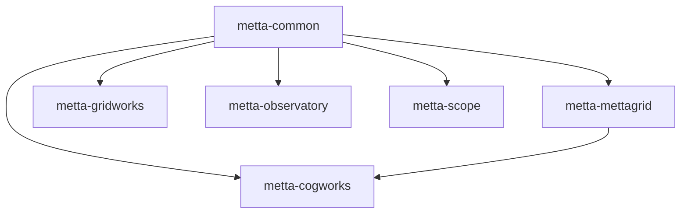

# Metta Repository Organization Plan - Flattened Structure

## Overview

This document outlines a flattened organization structure for the Metta monorepo, using consistent `metta-*` package naming while maintaining simple directory names and imports.

### Naming Convention

Our three-tier naming system:
1. **Directory name**: Simple, no prefix (e.g., `cogworks/`)
2. **Import name**: Matches directory (e.g., `from cogworks import api`)
3. **Package name**: Company-prefixed (e.g., `pip install metta-cogworks`)

This gives us the best of all worlds:
- Clean, simple imports for developers
- Clear company branding for published packages
- Consistent file structure that's easy to navigate

### Goals of the Flattened Structure

1. **Independent Packages**: Each component is its own Python package with distinct namespaces
2. **Simple Imports**: Direct package names without deep nesting
3. **Clear Boundaries**: Each package has a focused purpose and minimal dependencies
4. **Consistent Branding**: All Python packages use `metta-` prefix for PyPI distribution
5. **Developer Ergonomics**: Simple directory structure that matches import names

## Package Structure

```
Softmax/
├── cogworks/                   # RL training framework
├── mettagrid/                  # C++/Python environment
├── common/                     # Shared utilities
├── gridworks/                  # Map editor
├── observatory/                # Production monitoring
├── mettascope/                 # Replay viewer
├── tools/                      # Standalone scripts
├── configs/                    # Hydra configurations
├── scenes/                     # Map/scene definitions
├── docs/                       # Documentation
├── devops/                     # Infrastructure
└── pyproject.toml              # Workspace configuration
```

## Detailed New Structure

Based on the current repository, here's the accurate mapping to the new flattened structure:

```
Softmax/
├── cogworks/                   # RL training framework (from metta/ + agent/)
│   ├── agent/                  # Agent/policy code (from agent/src/metta/agent/)
│   │   ├── lib/                # Agent modules
│   │   ├── external/
│   │   ├── mocks/
│   │   ├── util/
│   │   ├── __init__.py
│   │   ├── metta_agent.py
│   │   ├── policy_store.py
│   │   ├── policy_cache.py
│   │   ├── policy_record.py
│   │   ├── policy_metadata.py
│   │   └── policy_state.py
│   ├── rl/                     # RL algorithms (from metta/rl/)
│   │   ├── fast_gae/
│   │   ├── __init__.py
│   │   ├── trainer.py
│   │   ├── trainer_config.py
│   │   ├── trainer_checkpoint.py
│   │   ├── functions.py
│   │   ├── experience.py
│   │   ├── losses.py
│   │   ├── policy.py
│   │   ├── kickstarter.py
│   │   ├── kickstarter_config.py
│   │   ├── torch_profiler.py
│   │   ├── vecenv.py
│   │   ├── fast_gae.cpp
│   │   └── fast_gae.pyi
│   ├── eval/                   # Evaluation tools (from metta/eval/)
│   │   ├── __init__.py
│   │   ├── analysis.py
│   │   ├── analysis_config.py
│   │   ├── dashboard_data.py
│   │   └── eval_stats_db.py
│   ├── sweep/                  # Hyperparameter sweeping (from metta/sweep/)
│   │   ├── __init__.py
│   │   ├── protein.py
│   │   ├── protein_metta.py
│   │   ├── protein_wandb.py
│   │   └── README.md
│   ├── sim/                    # Simulation management (from metta/sim/)
│   │   ├── __init__.py
│   │   ├── simulation.py
│   │   ├── simulation_config.py
│   │   ├── simulation_stats_db.py
│   │   ├── simulation_suite.py
│   │   └── map_preview.py
│   ├── mapgen/                 # Map generation (from metta/map/)
│   │   ├── random/
│   │   ├── scenes/
│   │   ├── utils/
│   │   ├── __init__.py
│   │   ├── mapgen.py
│   │   ├── scene.py
│   │   ├── types.py
│   │   ├── load.py
│   │   ├── load_random.py
│   │   ├── load_random_from_index.py
│   │   └── config.py
│   ├── setup/                  # Setup tools (from metta/setup/)
│   │   ├── components/
│   │   ├── installer/
│   │   ├── __init__.py
│   │   ├── metta_cli.py
│   │   ├── config.py
│   │   └── README.md
│   ├── studio/                 # Studio integration (from metta/studio/)
│   │   └── server.py
│   ├── recipes/                # Example scripts (from root recipes/)
│   ├── tests/                  # All RL/agent tests
│   ├── pyproject.toml          # name = "metta-cogworks" (new)
│   ├── Makefile                # Build commands
│   ├── README.md               # Package documentation
│   ├── __init__.py
│   └── api.py                  # Main APIs (from metta/api.py)
│
├── mettagrid/                  # C++/Python environment (mostly unchanged)
│   ├── src/                    # Python and C++ source
│   │   └── metta/
│   │       └── mettagrid/      # Will be flattened to mettagrid/
│   ├── configs/                # Environment configs
│   ├── tests/
│   ├── benchmarks/
│   ├── scripts/
│   ├── pyproject.toml          # name = "metta-mettagrid"
│   ├── CMakeLists.txt
│   ├── CMakePresets.json
│   ├── Makefile
│   ├── README.md
│   ├── LICENSE
│   ├── conftest.py
│   ├── compiler_flags.cmake
│   ├── tests.cmake
│   ├── CPPLINT.cfg
│   ├── .gitignore
│   └── .clang-format
│
├── common/                     # Shared utilities (from common/)
│   ├── src/                    # Will be reorganized
│   │   └── metta/
│   │       └── common/         # Will become mettacommon/
│   │           ├── util/
│   │           ├── profiling/
│   │           ├── wandb/
│   │           ├── __init__.py
│   │           └── py.typed
│   ├── tests/
│   ├── pyproject.toml          # name = "metta-common"
│   ├── Makefile
│   └── README.md
│
├── gridworks/                  # Map editor and studio (from studio/)
│   ├── src/                    # TypeScript/React frontend
│   │   ├── app/
│   │   ├── components/
│   │   ├── hooks/
│   │   ├── icons/
│   │   ├── lib/
│   │   └── server/
│   ├── public/
│   ├── tests/                  # (new)
│   ├── pyproject.toml          # name = "metta-gridworks" (new for Python parts)
│   ├── package.json
│   ├── pnpm-lock.yaml
│   ├── tsconfig.json
│   ├── next.config.ts
│   ├── next-env.d.ts
│   ├── postcss.config.mjs
│   ├── prettier.config.js
│   ├── import-sorter.json
│   ├── README.md
│   ├── .eslintrc.json
│   ├── .gitignore
│   └── start.py                # Python server
│
├── observatory/                # Production monitoring (unchanged)
│   ├── src/                    # React frontend
│   ├── api/                    # Backend API (from app_backend, new)
│   │   ├── __init__.py
│   │   ├── endpoints.py
│   │   └── models.py
│   ├── pyproject.toml          # name = "metta-observatory" (new for Python API)
│   ├── package.json
│   ├── package-lock.json
│   ├── vite.config.ts
│   ├── tsconfig.json
│   ├── tsconfig.node.json
│   ├── biome.jsonc
│   ├── nginx.conf
│   ├── index.html
│   ├── README.md
│   └── Dockerfile
│
├── mettascope/                 # Replay viewer (unchanged)
│   ├── src/                    # TypeScript source
│   ├── data/                   # Assets
│   │   ├── atlas/
│   │   ├── fonts/
│   │   ├── ui/
│   │   └── view/
│   ├── tools/
│   │   ├── gen_atlas.py
│   │   └── gen_html.py
│   ├── docs/
│   ├── tests/
│   ├── package.json            # JavaScript package
│   ├── package-lock.json
│   ├── tsconfig.json
│   ├── biome.jsonc
│   ├── index.html
│   ├── index.css
│   ├── style.css
│   ├── install.sh
│   ├── README.md
│   ├── __init__.py
│   ├── server.py               # Python replay server
│   └── replays.py              # Replay handling
│
├── tools/                      # Standalone entry scripts
│   ├── map/
│   │   ├── gen.py
│   │   ├── gen_scene.py
│   │   └── normalize_ascii_map.py
│   ├── train.py
│   ├── sweep_init.py
│   ├── sweep_eval.py
│   ├── sweep_config_utils.py
│   ├── play.py
│   ├── sim.py
│   ├── replay.py
│   ├── analyze.py
│   ├── dashboard.py
│   ├── renderer.py
│   ├── validate_config.py
│   ├── stats_duckdb_cli.py
│   ├── upload_map_imgs.py
│   ├── autotune.py
│   └── dump_src.py
│
├── configs/                    # Hydra configurations
│   ├── agent/
│   ├── env/
│   │   └── mettagrid/
│   ├── trainer/
│   ├── hardware/
│   ├── sim/
│   ├── sweep/
│   ├── user/
│   ├── wandb/
│   └── *.yaml                  # Root config files
│
├── scenes/                     # Map/scene definitions
│   ├── convchain/
│   ├── dcss/
│   ├── test/
│   └── wfc/
│
├── recipes/                    # Example scripts
│   ├── arena.sh
│   ├── nav_memory_sequence.sh
│   ├── navigation.sh
│   └── *.sh
│
├── docs/                       # Documentation
│   ├── wandb/
│   │   └── metrics/
│   ├── workflows/
│   ├── api.md
│   └── mapgen.md
│
├── devops/                     # Infrastructure and tooling
│   ├── aws/
│   ├── charts/
│   ├── docker/
│   ├── git-hooks/
│   ├── macos/
│   ├── mettabox/
│   ├── skypilot/
│   ├── tf/
│   ├── tools/
│   ├── wandb/
│   └── *.sh                    # Various scripts
│
├── wandb_carbs/                # WandB/CARBS integration (TBD)
├── checkpoints/                # Model checkpoints (gitignored)
├── wandb/                      # WandB runs (gitignored)
├── .github/                    # GitHub workflows
│   └── workflows/
├── pyproject.toml              # Workspace configuration (new)
└── uv.lock                     # Unified lock file
```

### Notes on Python Package Organization:

**Python packages** (with pyproject.toml):
- `cogworks/` - Main RL framework (new package combining metta + agent)
- `mettagrid/` - Environment (existing package)
- `common/` - Shared utilities (existing package, needs module rename)

**Hybrid packages** (Python backend + JS/TS frontend):
- `gridworks/` - Needs new pyproject.toml for Python server parts
- `observatory/` - Needs new pyproject.toml for API backend
- `mettascope/` - Currently just has Python scripts, no package structure

**Pure frontend** (no Python packaging needed):
- The TypeScript/React parts of gridworks, observatory, and mettascope

### Key Migration Tasks:

1. **Flatten mettagrid**: Move files from `mettagrid/src/metta/mettagrid/` directly to `mettagrid/`
2. **Rename common module**: Change `common/src/metta/common/` to export as `mettacommon`
3. **Create cogworks**: Merge `metta/` and `agent/` into new `cogworks/` package
4. **Split app_backend**: Distribute its functionality to respective apps

## Package Configuration Examples

### Main Training Framework

```toml
# cogworks/pyproject.toml
[project]
name = "metta-cogworks"
version = "0.1.0"
description = "Metta RL training framework"

[tool.uv]
# This ensures imports work as "from cogworks import ..."
# while the package installs as "pip install metta-cogworks"
```

**Imports:**
```python
from cogworks import api
from cogworks.rl import trainer
from cogworks.agent import MettaAgent
```

**Installation:**
```bash
pip install metta-cogworks
```

### Environment Package

```toml
# mettagrid/pyproject.toml
[project]
name = "metta-mettagrid"
version = "0.1.0"
description = "High-performance grid environments"
dependencies = ["metta-common>=0.1.0"]
```

**Imports:**
```python
import mettagrid
from mettagrid import MettaGridPufferEnv
```

### Common Utilities

```toml
# common/pyproject.toml
[project]
name = "metta-common"
version = "0.1.0"
description = "Shared utilities for Metta packages"

# Note: Import name differs from package name
[tool.setuptools]
packages = ["mettacommon"]
```

**Imports:**
```python
from mettacommon import logger
from mettacommon.util import config
```

## Current → Proposed Mapping

Here's how the existing structure maps to our new organization:

```
# CURRENT PACKAGE NAME          → NEW PACKAGE NAME
metta                          → metta-cogworks
metta-common                   → metta-common (unchanged)
metta-agent                    → (merged into metta-cogworks)
metta-mettagrid                → metta-mettagrid (unchanged)
metta-app-backend              → (split into respective apps)
```

## Installation Examples

```bash
# Just the environment
pip install metta-mettagrid

# Training framework (includes dependencies)
pip install metta-cogworks

# Development setup
uv sync  # Installs all workspace packages

# What uv will show during build:
# Built metta-cogworks @ file:///workspace/cogworks
# Built metta-common @ file:///workspace/common
# Built metta-mettagrid @ file:///workspace/mettagrid
```

## Import Philosophy

We maintain a clear separation between:
- **Package distribution names** (with `metta-` prefix for branding)
- **Import names** (simple, no prefix for developer ergonomics)

This approach is used by many successful projects:
- `scikit-learn` → `import sklearn`
- `beautifulsoup4` → `import bs4`
- `pillow` → `import PIL`

## Benefits

1. **Brand Recognition**: All packages clearly belong to Metta
2. **No Naming Conflicts**: `metta-` prefix prevents PyPI collisions
3. **Clean Imports**: Developers write `from cogworks` not `from metta_cogworks`
4. **Consistent Structure**: Directory names match import names
5. **Easy Migration**: Existing `metta` imports become `cogworks` imports

## Dependency Graph



## Future Packages

As the web apps mature, they'll follow the same pattern:
- `gridworks/` → `from gridworks` → `pip install metta-gridworks`
- `observatory/` → `from observatory` → `pip install metta-observatory`
- `mettascope/` → `from mettascope` → `pip install metta-scope`

## Migration Path

1. Update `pyproject.toml` files with `metta-` prefixed names
2. Update imports from `from metta.rl` to `from cogworks.rl`
3. Ensure `common/` exports as `mettacommon` module
4. Test with `uv sync` to verify package names
5. Update documentation and CI/CD

This structure gives us professional, branded packages while keeping the developer experience clean and simple.
