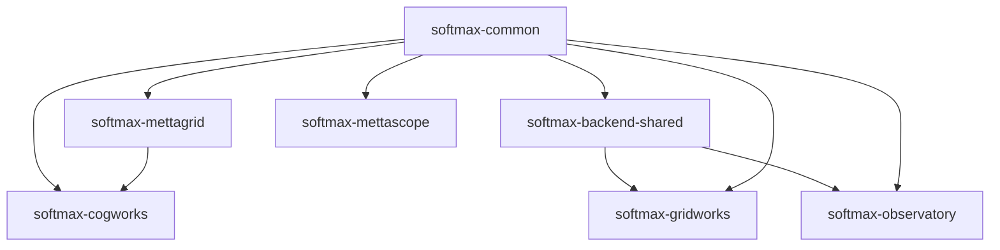

# Metta Repository Organization Plan

## Overview

This document outlines a flattened organization structure for the Metta monorepo, using consistent `softmax-*` package naming while maintaining simple directory names and imports with enforced `metta.*` namespace.

### Key Principles

1. **Enforced Namespace**: All imports MUST use `metta.` prefix (enforced by linting)
2. **Flat Structure**: Top-level package directories without src/ nesting
3. **Consistent Naming**: PyPI packages use `softmax-` prefix
4. **PEP 420 Namespaces**: Symlinks enable the `metta.*` import pattern
5. **Clean Imports**: Directory names remain simple (no prefix)

### Naming Convention

Our three-tier naming system:
1. **Directory name**: Simple, no prefix (e.g., `cogworks/`)
2. **Import name**: Enforced namespace (e.g., `from metta.cogworks import api`)
3. **Package name**: Company-prefixed (e.g., `pip install softmax-cogworks`)

This gives us the best of all worlds:
- Clean, simple directory structure
- Enforced consistent imports across the codebase (using familiar `metta.` namespace)
- Clear company branding for published packages (using `softmax-` prefix)
- Minimal code changes required (existing `metta.*` imports work as-is)

### Goals of the Flattened Structure

1. **Independent Packages**: Each component is its own Python package with distinct namespaces
2. **Simple Imports**: Direct package names without deep nesting
3. **Clear Boundaries**: Each package has a focused purpose and minimal dependencies
4. **Consistent Branding**: All Python packages use `softmax-` prefix for PyPI distribution
5. **Developer Ergonomics**: Simple directory structure with enforced import consistency

## Repository Structure

```
metta/
├── cogworks/                   # RL training framework
├── mettagrid/                  # C++/Python environment
├── common/                     # Shared utilities
├── backend-shared/             # Shared backend services
├── gridworks/                  # Map editor
├── observatory/                # Production monitoring
├── mettascope/                 # Replay viewer
├── metta/                      # PEP 420 namespace (symlinks only)
│   ├── cogworks → ../cogworks
│   ├── mettagrid → ../mettagrid
│   ├── common → ../common
│   └── ...                     # Other symlinks
├── tools/                      # Standalone scripts
├── recipes/                    # Example scripts and workflows
├── configs/                    # Hydra configurations
├── scenes/                     # Map/scene definitions
├── docs/                       # Documentation
├── devops/                     # Infrastructure
└── pyproject.toml              # Workspace configuration
```

## Detailed Structure

```
metta/
├── cogworks/                   # RL training framework (merged from metta/ + agent/)
│   ├── agent/                  # From agent/src/metta/agent/
│   ├── rl/                     # From metta/rl/
│   ├── eval/                   # From metta/eval/
│   ├── sweep/                  # From metta/sweep/
│   ├── sim/                    # From metta/sim/
│   ├── mapgen/                 # From metta/map/
│   ├── tests/                  # Combined tests
│   ├── pyproject.toml          # name = "softmax-cogworks"
│   └── api.py                  # Main API (from metta/api.py)
│
├── mettagrid/                  # C++/Python environment
│   ├── tests/
│   ├── benchmarks/
│   ├── configs/
│   ├── *.py                    # Flattened Python files
│   └── pyproject.toml          # name = "softmax-mettagrid"
│
├── common/                     # Shared Python utilities
│   ├── util/                   # From common/src/metta/common/util/
│   ├── profiling/              # From common/src/metta/common/profiling/
│   ├── wandb/                  # From common/src/metta/common/wandb/
│   ├── tests/
│   └── pyproject.toml          # name = "softmax-common"
│
├── backend-shared/             # Shared backend services
│   ├── sweep_names.py          # Name registration service
│   ├── stat_buffer.py          # Data persistence layer
│   ├── auth.py                 # Authentication utilities
│   ├── database.py             # Database connection pooling
│   ├── cache.py                # Caching utilities
│   ├── utils.py                # General backend utilities
│   ├── tests/
│   └── pyproject.toml          # name = "softmax-backend-shared"
│
├── ui-shared/                  # Shared UI components for web apps
│   ├── components/             # Reusable React components
│   ├── hooks/                  # Shared React hooks
│   ├── utils/                  # Common TypeScript utilities
│   ├── styles/                 # Shared CSS/styling
│   └── package.json            # Shared UI dependencies
│
├── gridworks/                  # Map editor (from studio/)
│   ├── src/                    # TypeScript/React frontend
│   ├── public/
│   ├── server.py               # Python server
│   ├── pyproject.toml          # name = "softmax-gridworks" (new)
│   └── package.json
│
├── observatory/                # Production monitoring
│   ├── src/                    # React frontend
│   ├── api/                    # Observatory-specific backend
│   │   ├── endpoints.py        # Observatory API endpoints
│   │   └── requirements.txt    # API-specific Python dependencies
│   ├── pyproject.toml          # name = "softmax-observatory"
│   ├── package.json
│   └── Dockerfile              # From backend/docker/observatory/
│
├── mettascope/                 # Replay viewer
│   ├── src/                    # TypeScript source
│   ├── data/                   # Assets
│   ├── tools/                  # Python tools
│   ├── server.py               # Python replay server
│   ├── replays.py              # Replay handling
│   └── package.json
│
├── metta/                      # PEP 420 namespace package (NO __init__.py)
│   ├── cogworks → ../cogworks         # Symlink to ../cogworks
│   ├── mettagrid → ../mettagrid       # Symlink to ../mettagrid
│   ├── common → ../common              # Symlink to ../common
│   ├── backend_shared → ../backend-shared  # Symlink to ../backend-shared
│   ├── gridworks → ../gridworks       # Symlink to ../gridworks
│   ├── observatory → ../observatory   # Symlink to ../observatory
│   └── mettascope → ../mettascope     # Symlink to ../mettascope
│
├── tools/                      # Standalone scripts (train.py, sweep_*.py, etc.)
├── recipes/                    # Example scripts and workflows
├── configs/                    # Hydra configurations
├── scenes/                     # Map generation patterns
├── docs/                       # Documentation
├── devops/                     # Infrastructure
├── pyproject.toml              # Workspace configuration
└── README.md                   # Mono-repo overview
```

## Import Convention (ENFORCED)

All imports MUST use the `metta.` namespace prefix:

```python
# ✅ CORRECT (enforced by linting)
from metta.cogworks import api
from metta.cogworks.rl import trainer
from metta.cogworks.agent import MettaAgent
from metta.common.util import config
from metta.mettagrid import MettaGridPufferEnv
from metta.backend_shared import sweep_names

# ❌ INCORRECT (blocked by linting)
from cogworks import api  # Will fail lint check
import mettagrid  # Will fail lint check
from common import logger  # Will fail lint check
```

A custom lint rule will enforce this convention across the entire codebase.

## Package Configuration Examples

### Main Training Framework

```toml
# cogworks/pyproject.toml
[project]
name = "softmax-cogworks"
version = "0.1.0"
description = "Metta RL training framework"

[tool.uv]
# This ensures imports work as "from metta.cogworks import ..."
# while the package installs as "pip install softmax-cogworks"
```

**Imports:**
```python
from metta.cogworks import api
from metta.cogworks.rl import trainer
from metta.cogworks.agent import MettaAgent
```

**Installation:**
```bash
pip install softmax-cogworks
```

### Environment Package

```toml
# mettagrid/pyproject.toml
[project]
name = "softmax-mettagrid"
version = "0.1.0"
description = "High-performance grid environments"
dependencies = ["softmax-common>=0.1.0"]
```

**Imports:**
```python
from metta.mettagrid import MettaGridPufferEnv
from metta.mettagrid.wrappers import AsyncWrapper
```

### Common Utilities

```toml
# common/pyproject.toml
[project]
name = "softmax-common"
version = "0.1.0"
description = "Shared utilities for Metta packages"
```

**Imports:**
```python
from metta.common import logger
from metta.common.util import config
```

### Backend Shared Services

```toml
# backend-shared/pyproject.toml
[project]
name = "softmax-backend-shared"
version = "0.1.0"
description = "Shared backend services for Metta applications"
dependencies = [
    "softmax-common>=0.1.0",
    "fastapi>=0.100.0",
    "sqlalchemy>=2.0.0",
    "redis>=5.0.0",
]


[tool.setuptools]
packages = ["backend_shared"]
package_dir = {"backend_shared": "backend-shared"}

```

**Imports:**
```python
from metta.backend_shared import sweep_names
from metta.backend_shared.stat_buffer import StatBuffer
from metta.backend_shared.auth import authenticate
from metta.backend_shared.cache import cache_result
```

**Installation:**
```bash
pip install softmax-backend-shared
```

## Current → New Mapping

```
# CURRENT LOCATION                      → NEW LOCATION
metta/src/api.py                       → cogworks/api.py
metta/src/rl/                          → cogworks/rl/
metta/src/sweep/                       → cogworks/sweep/
metta/src/setup/                       → cogworks/setup/
metta/src/agent/                       → cogworks/agent/
metta/src/map/                         → cogworks/mapgen/
metta/src/eval/                        → cogworks/eval/
metta/tests/                           → cogworks/tests/
metta/configs/                         → configs/
metta/tools/                           → tools/
metta/recipes/                         → recipes/
metta/docs/                            → docs/
metta/devops/                          → devops/

common/src/metta/common/               → common/
mettagrid/src/metta/mettagrid/         → mettagrid/

backend/src/metta/backend/sweep_names/ → backend-shared/sweep_names.py
backend/src/metta/backend/stat_buffer/ → backend-shared/stat_buffer.py
backend/src/metta/backend/observatory/ → observatory/api/endpoints.py
backend/docker/observatory/            → observatory/Dockerfile

apps/shared/                           → ui-shared/
apps/observatory/                      → observatory/
apps/mettascope/                       → mettascope/
apps/studio/                           → gridworks/

# PACKAGE NAMES
metta                         → softmax-cogworks
metta-common                  → softmax-common
metta-agent                   → (merged into softmax-cogworks)
metta-mettagrid              → softmax-mettagrid
metta-app-backend            → softmax-backend-shared (for shared services)

# NAMESPACE SYMLINKS (NEW)
(none)                                 → metta/cogworks → ../cogworks
(none)                                 → metta/mettagrid → ../mettagrid
(none)                                 → metta/common → ../common
(none)                                 → metta/backend_shared → ../backend-shared
```

## Installation Examples

```bash
# Just the environment
pip install softmax-mettagrid

# Training framework (includes dependencies)
pip install softmax-cogworks

# Backend services
pip install softmax-backend-shared

# Development setup
uv sync  # Installs all workspace packages

# What uv will show during build:
# Built softmax-cogworks @ file:///workspace/cogworks
# Built softmax-common @ file:///workspace/common
# Built softmax-mettagrid @ file:///workspace/mettagrid
# Built softmax-backend-shared @ file:///workspace/backend-shared
```

## PEP 420 Namespace Setup

The `metta/` directory is a PEP 420 implicit namespace package:
- NO `__init__.py` file
- Contains only symlinks to actual packages
- Enables `metta.*` imports without code duplication

**Creating the symlinks:**
```bash
mkdir -p metta
cd metta
ln -s ../cogworks cogworks
ln -s ../mettagrid mettagrid
ln -s ../common common
ln -s ../backend-shared backend-shared
ln -s ../gridworks gridworks
ln -s ../observatory observatory
ln -s ../mettascope mettascope
```

## Import Philosophy

We maintain a clear separation between:
- **Package distribution names** (with `softmax-` prefix for branding)
- **Import names** (enforced `metta.` namespace for consistency)

This approach is used by many successful projects:
- `scikit-learn` → `import sklearn`
- `beautifulsoup4` → `import bs4`
- `pillow` → `import PIL`

In our case:
- Install with: `pip install softmax-cogworks`
- Import with: `from metta.cogworks import api`

## Benefits

1. **Brand Recognition**: All packages clearly belong to Softmax
2. **No Naming Conflicts**: `softmax-` prefix prevents PyPI collisions
3. **Enforced Consistency**: All code uses `metta.*` imports
4. **Flat Structure**: Simple directory layout
5. **Easy Migration**: Minimal changes to existing codebase imports
6. **No Ambiguity**: Enforced import style prevents confusion
7. **Semantic Grouping**: Top-level directories clearly indicate purpose
8. **Code Stability**: Existing `metta.*` imports continue to work

## Dependency Graph



## Future Packages

As the web apps mature, they'll follow the same pattern:
- `gridworks/` → `from metta.gridworks` → `pip install softmax-gridworks`
- `observatory/` → `from metta.observatory` → `pip install softmax-observatory`
- `mettascope/` → `from metta.mettascope` → `pip install softmax-mettascope`

## Migration Path

1. Create `metta/` namespace directory with symlinks
2. Update all imports to use `metta.` prefix (minimal changes needed)
3. Add lint rule to enforce `metta.` imports
4. Update `pyproject.toml` files with `softmax-` prefixed names
5. Move `recipes/` to root level
6. Create `backend-shared/` with shared backend services
7. Test with `uv sync` to verify package names
8. Update CI/CD and documentation

This structure provides a clean, professional organization with enforced consistency across the entire codebase while maintaining the Softmax brand identity in package distribution and keeping code imports stable.
