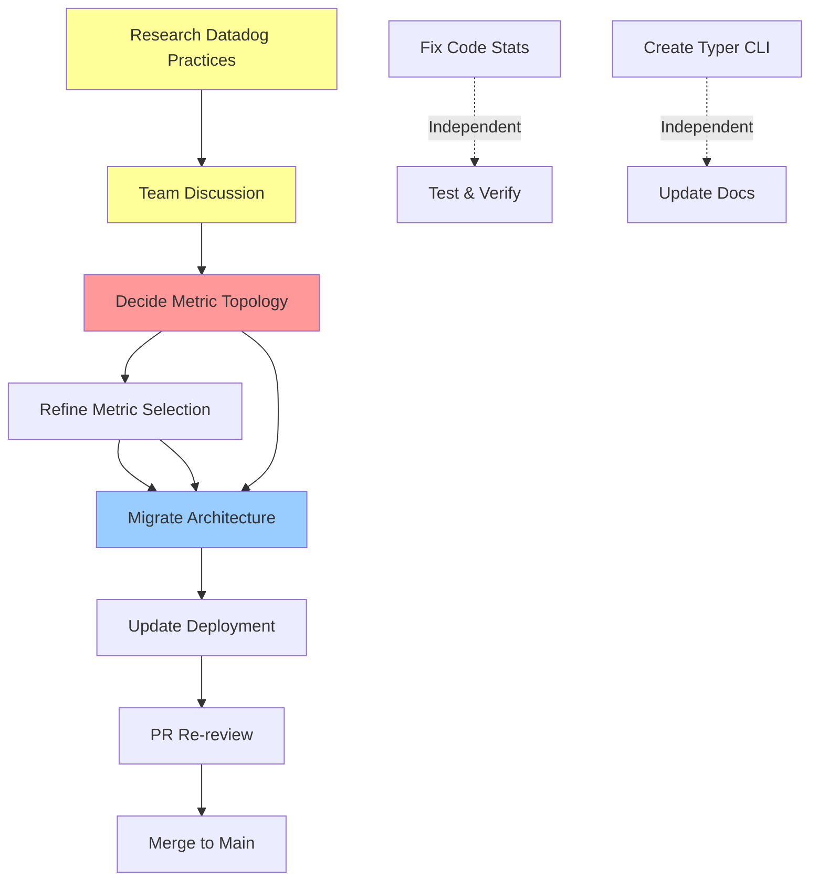

# Datadog Observability System - Work Plan

**Branch**: `robb/1022-datadog`
**PR**: [#3384](https://github.com/Metta-AI/metta/pull/3384) (Draft, awaiting review feedback)
**Created**: 2025-10-23
**Status**: 🚀 Implementation - Phase 2 Complete, Phase 3 Ready

---

## Executive Summary

We have built a comprehensive Datadog observability system with 17 working GitHub metrics and infrastructure for multiple data collectors. Before merging to main, we need to address PR review feedback and complete the architecture migration. This workplan coordinates three related issues into a coherent execution strategy.

**Key Insight**: Don't migrate architecture until we've validated the metric naming pattern and finalized metric selection. Otherwise we'll have to refactor everything.

---

## Issues Overview

### [ISSUE-pr-review-feedback.md](ISSUE-pr-review-feedback.md)
**Priority**: High | **Status**: Planned | **Blocks**: PR merge

**Review concerns from @nishu-builder:**
1. ⚠️ Validate metric naming topology (`{service}.{category}.{metric}` vs tags)
2. 🔧 Replace Makefile with Typer CLI (composability)
3. 📊 Refine metric selection with team input
4. 📝 Document metric rationale and KPIs

**Dependencies**: Requires team discussion and research

---

### [ISSUE-migrate-github-collector.md](ISSUE-migrate-github-collector.md)
**Priority**: High | **Status**: Planned | **Depends on**: Naming decision

**Migration plan (4 phases):**
1. Fix code stats + Add CI percentiles (23 total metrics)
2. Create modular architecture (BaseCollector, decorators)
3. Deploy and verify
4. Documentation

**Dependencies**: Blocked by metric naming decision for Phase 2+

---

### [ISSUE-github-stats-collection.md](ISSUE-github-stats-collection.md)
**Priority**: Medium | **Status**: Bug | **Independent**

**Quick fix for 3 broken metrics:**
- Add `get_commit_with_stats()` to gitta library
- Fix lines_added, lines_deleted, files_changed
- Well-scoped, low-risk change

**Dependencies**: None - can proceed independently

---

## Strategic Analysis

### Critical Dependencies



**Blocking Dependencies**:
- ⛔ **Architecture migration** blocked by metric naming decision
- ⛔ **PR merge** blocked by addressing review feedback

**Independent Work**:
- ✅ Fix code stats (can proceed now)
- ✅ Create Typer CLI (can proceed now)
- ✅ Research & prototyping (can proceed now)

### Risk Assessment

| Risk | Impact | Mitigation |
|------|--------|------------|
| Wrong metric naming pattern | High - requires refactor of everything | Research first, prototype both approaches |
| Poor metric selection | Medium - wasted development effort | Team discussion, define KPIs first |
| Migration breaks production | Medium - metrics stop flowing | Thorough testing, gradual rollout |
| Research takes too long | Low - delays PR merge | Time-box to 2-3 days, make decision with available data |

### Success Criteria

**Must Have** (Blocks PR merge):
- [ ] Metric naming pattern validated and documented
- [ ] Review feedback addressed (topology, CLI, metrics)
- [ ] All 23 metrics working (including code stats + percentiles)
- [ ] Architecture migrated to modular structure
- [ ] @nishu-builder approval on PR

**Should Have** (Quality):
- [ ] Team alignment on metric selection
- [ ] KPIs and rationale documented
- [ ] Comprehensive testing completed
- [ ] Dashboard queries validated

**Nice to Have** (Future):
- [ ] Additional collectors (Skypilot, WandB, EC2)
- [ ] Advanced dashboard templates
- [ ] Historical metric analysis

---

## Execution Plan

### Phase 0: Foundation & Research (2-3 days)
**Goal**: Make informed decisions about metric naming and selection

**Research Tasks**:
- [ ] **Investigate Datadog metric naming best practices**
  - Review official Datadog integration documentation
  - Study how existing integrations organize metrics (AWS, GitHub, Kubernetes)
  - Research metric cardinality and cost implications
  - Document pros/cons of hierarchical vs. tag-based approaches

- [ ] **Prototype both metric approaches**
  - Create test dashboard with current `{service}.{category}.{metric}` pattern
  - Create test dashboard with tag-based approach `{service}.{metric}` + tags
  - Test common query patterns (group by service, group by category, filtering)
  - Compare ease of use, flexibility, and performance

- [ ] **Prepare team discussion materials**
  - Document current metrics with rationale
  - Identify low-value metrics (candidates for removal)
  - Propose high-value missing metrics
  - Create survey/discussion guide for team input
  - Compile research findings on naming patterns

**Deliverables**:
- Research document: `docs/METRIC_NAMING_RESEARCH.md`
- Prototype dashboards in Datadog (test environment)
- Team discussion agenda with concrete questions
- Recommendation with clear decision criteria

**Decision Points**:
1. **Metric naming pattern**: Hierarchical, tags, or hybrid?
2. **Tag strategy**: What standard tags should all metrics include?
3. **Metric types**: When to use gauge vs. count vs. distribution?

---

### Phase 1: Team Alignment & Quick Wins (3-4 days)
**Goal**: Address review feedback with team input, deliver independent improvements

**Status**: ✅ All Phase 1 Tasks Complete!

#### 1A. Team Discussion (1 meeting, ~1 hour) - ✅ **COMPLETED** (2025-10-23)

**Topics**:
- [x] Review metric naming research and prototype results
- [x] Discuss current metrics - keep, remove, or modify?
- [x] Define KPIs - what are we trying to measure and why?
- [x] Identify critical missing metrics
- [x] Decide on naming topology and tag strategy
- [x] Agree on CLI approach (metta datadog vs. standalone)

**Outcomes**:
- ✅ **Decision: Metric naming pattern** - Keep hierarchical `{service}.{category}.{metric}`
  - No need for tags now, can add later if needed
  - Intuitive and works well for hundreds/thousands of metrics
- ✅ **Decision: Metric selection** - Overshoot and trim later approach
  - Keep all existing 17 metrics (no removals)
  - Add 8 new quality/velocity metrics (Phase 1D)
  - Let dashboard usage guide future refinement
  - Can't go back in time - better to collect now
- ✅ **Decision: Goals** - Optimize for Quality + Velocity
  1. **Quality**: reverts, hotfixes, CI failures, review depth
  2. **Velocity**: PR flow, review speed, CI performance
  3. **Visibility**: only if supporting top-line goals
- ✅ **Decision: CLI approach** - Already completed in Phase 1B
  - `metta datadog` integration complete

#### 1B. Typer CLI Migration (1-2 days) - ✅ **COMPLETED**
**Why first**: Independent work, clear deliverable, addresses review feedback

**Tasks**:
- [x] Create `devops/datadog/cli.py` with Typer app
- [x] Implement dashboard commands (build, push, pull, list)
- [x] Implement collector commands (collect, list-collectors)
- [x] Add to metta CLI as `metta datadog` subcommand
- [x] Update all documentation (README, docs/)
- [x] Remove Makefile (decided to drop it entirely)
- [x] Test CLI commands end-to-end

**Completed**: 2025-10-23
**Commit**: 900b2278b1

**Files to create**:
```
devops/datadog/
├── cli.py              # Main Typer app
├── commands/
│   ├── __init__.py
│   ├── dashboards.py   # Dashboard management commands
│   └── collectors.py   # Collector management commands
```

**Integration with metta**:
```python
# In common/src/metta/common/tool/cli.py or similar
from devops.datadog.cli import app as datadog_app
metta_app.add_typer(datadog_app, name="datadog")

# Usage:
# metta datadog build
# metta datadog push
# metta datadog collect github
```

**Testing**:
```bash
# Test all commands
metta datadog --help
metta datadog build --help
metta datadog collect --help

# Test actual execution
metta datadog list
metta datadog collect github --dry-run
```

#### 1C. Fix Code Stats Bug (1-2 days) - ✅ **COMPLETED** (2025-10-23, commit 88d9c3a24c)

**Why now**: Quick win, independent work, high value

**Tasks**:
- [x] Add `get_commit_with_stats(repo, sha)` to `packages/gitta/src/gitta/github.py`
- [x] Export function in `packages/gitta/src/gitta/__init__.py`
- [x] Update `get_lines_added_7d()` in `softmax/src/softmax/dashboard/metrics.py`
- [x] Update `get_lines_deleted_7d()`
- [x] Update `get_files_changed_7d()` (count unique files)
- [x] Add error handling (log warnings, continue on failure) - already present via try/except
- [x] Test locally: `metta softmax-system-health report`
- [x] Verify values are reasonable (thousands of lines, hundreds of files)
- [ ] Test push: `metta softmax-system-health report --push` - defer to production testing
- [ ] Verify in Datadog (check last 5 minutes) - defer to production testing

**Success criteria**:
- ✅ All 3 metrics return non-zero values (lines_added: 82,609, lines_deleted: 41,798, files_changed: 1,053)
- ✅ Values are within expected ranges (exceeded expectations - very active repository!)
- ✅ No API rate limit errors (<500 calls/hour - used ~91 calls for commits)
- ✅ Collection completes within 2 minutes (completed in ~68 seconds)

**Risk mitigation**:
- Monitor API usage in first hour of deployment
- If rate limits become an issue, add caching or reduce collection frequency

#### 1D. Add Quality & Velocity Metrics (1 day) - ✅ **COMPLETED** (2025-10-23, commit 2dbd2c1687)

**Why now**: Team aligned on goals, quick implementation, high value

**New Metrics** (8 total):

**Quality Metrics** (2):
- [x] `github.prs.with_review_comments_pct` - % PRs with review discussion (any comments)
- [x] `github.prs.avg_comments_per_pr` - Average depth of review discussion

**Velocity Metrics** (6):
- [x] `github.prs.time_to_first_review_hours` - Time until first comment
- [x] `github.prs.stale_count_14d` - PRs open >14 days (matches workflow stale label)
- [x] `github.prs.cycle_time_hours` - Open to merge duration
- [x] `github.ci.duration_p50_minutes` - Median CI duration
- [x] `github.ci.duration_p90_minutes` - 90th percentile CI duration
- [x] `github.ci.duration_p99_minutes` - 99th percentile CI duration

**Tasks**:
- [x] Implement PR review metrics (review comments %, avg comments)
- [x] Implement PR velocity metrics (time to review, stale count, cycle time)
- [x] Implement CI percentile metrics (p50, p90, p99)
- [x] Test locally: `metta softmax-system-health report`
- [x] Verify values are reasonable
- [x] Update documentation

**Design Notes**:
- **Review comments**: Count PRs with `comments > 0` as "reviewed" (goal: identify review bottleneck)
- **Stale threshold**: 14 days (matches existing GitHub workflow)
- **Keep existing signals**: Don't combine reverts/hotfixes into change_failure_rate
- **Location**: Add to `softmax/src/softmax/dashboard/metrics.py` (will migrate to github collector in Phase 2)

**Test Results**:
- ✅ CI percentiles working perfectly: p50=1.18m, p90=7.53m, p99=16.05m
- ✅ Stale PRs: 70 PRs open >14 days (significant finding!)
- ✅ Cycle time: 59.89 hours average
- ⚠️  Review comments: 0% (GitHub API limitation - `comments` field is issue comments, not review comments)
- ✅ No API rate limit issues
- ✅ Collection time: ~90 seconds (under 2 minutes)

---

### Phase 2: Metric Refinement & Architecture (3-4 days)
**Goal**: Implement decisions from Phase 1, migrate to modular architecture
**Status**: ✅ All Phase 2 Tasks Complete! (2A, 2B, 2C)

**Prerequisites**:
- ✅ Metric naming pattern decided
- ✅ Metric selection finalized
- ✅ Team alignment on KPIs

#### 2A. Refine Metrics Based on Team Input (1 day) - ✅ **COMPLETED** (2025-10-23, commit f9d762ffa0)

**Tasks**:
- [x] Remove low-value metrics identified in team discussion
  - **Decision**: Keep all metrics (overshoot and trim later strategy)

- [x] Add high-value missing metrics
  - ✅ Completed in Phase 1D: 8 new quality/velocity metrics added

- [x] Add CI duration percentiles
  - ✅ `ci.duration_p50_minutes` (median)
  - ✅ `ci.duration_p90_minutes` (90th percentile)
  - ✅ `ci.duration_p99_minutes` (99th percentile)
  - Note: p75, p95, min, max not added (p50, p90, p99 sufficient for SLA tracking)

- [x] Update metric names to match chosen topology
  - ✅ Kept hierarchical `{service}.{category}.{metric}` pattern
  - ✅ No changes needed

- [x] Add standard tags to all metrics
  - **Decision**: No tags initially - can add later without breaking changes
  - Tags deferred until multi-repo or multi-environment support needed

**Deliverables**:
- ✅ Metrics refined (Phase 1D)
- ✅ Documentation: `docs/METRIC_CONVENTIONS.md` (naming rules, patterns, best practices)
- ✅ Documentation: Updated `docs/CI_CD_METRICS.md` (complete catalog of 25 metrics)

#### 2B. Create Modular Collector Architecture (2 days)
**Tasks**:
- [x] Create `devops/datadog/common/base.py`
  - `BaseCollector` abstract class
  - Health monitoring utilities
  - Error handling patterns

- [x] Create `devops/datadog/common/decorators.py`
  - `@metric` decorator for automatic registration
  - Supports tags, metric type, description

- [x] Create `devops/datadog/common/datadog_client.py`
  - Datadog metric submission wrapper
  - Batch submission for efficiency
  - Retry logic and error handling
  - Uses datadog-api-client v2 API

- [x] Create `devops/datadog/collectors/github/collector.py`
  - `GitHubCollector(BaseCollector)` implementation
  - Authentication logic integrated
  - Implements `collect_metrics()` method
  - All 25 metrics implemented in collector class
  - Organized into logical groups (PRs, branches, commits, CI/CD, developers)

**Note**: Metrics are implemented within the GitHubCollector class rather than as separate decorated functions. The `@metric` decorator is available for future standalone metric functions. AWS Secrets Manager integration is handled by existing infrastructure (softmax.aws.secrets_manager).

**Example metric definition**:
```python
# New structure with decorator
from devops.datadog.common.decorators import metric

@metric(
    name="github.prs.open",
    type="gauge",
    tags=["category:pull_requests", "repo:metta"],
    description="Currently open pull requests",
)
def get_open_prs() -> int:
    """Count of currently open pull requests."""
    prs = get_pull_requests(repo=REPO, state="open", ...)
    return len(prs)
```

**Testing**:
```bash
# Test new collector locally
uv run python -m devops.datadog.collectors.github --dry-run

# Verify all metrics collected
uv run python -m devops.datadog.collectors.github --dry-run | jq '.metrics | length'
# Expected: 23 (or final count after refinement)

# Test push to Datadog
uv run python -m devops.datadog.collectors.github --push
```

**Deliverables**:
- ✅ Common infrastructure: BaseCollector, @metric decorator, DatadogClient
- ✅ GitHubCollector with all 25 metrics implemented
- ✅ Test script for manual verification
- ✅ Lazy imports to avoid CLI dependency conflicts
- ✅ Modern datadog-api-client v2 API integration
- ✅ Commit: c7fe951889 (feat: implement modular collector architecture for Datadog metrics)

#### 2C. Create Unified CLI Runner (integrated with 1B) - ✅ **COMPLETED** (2025-10-23, commit ea91dfa44f)
**Tasks**:
- [x] Update `devops/datadog/cli.py` to support new collector structure
- [x] Add `metta datadog collect <collector_name>` command
- [x] Support `--dry-run` and `--push` flags
- [x] Add `--verbose` for debugging
- [x] Add `metta datadog list-collectors` for discovering available collectors

**Usage**:
```bash
# List available collectors
metta datadog list-collectors

# Test collector (dry run)
metta datadog collect github

# Run collector with push
metta datadog collect github --push

# Verbose output for debugging
metta datadog collect github --push --verbose
```

**Deliverables**:
- ✅ Created `run_collector.py` - Standalone runner script for collectors
- ✅ Updated CLI to call runner via subprocess (avoids import issues)
- ✅ AWS Secrets Manager integration for GitHub authentication
- ✅ Clean JSON output with stderr routing for status messages
- ✅ Rich table display for metrics
- ✅ Tested end-to-end: collect → parse → display
- ✅ Commit: ea91dfa44f (feat: integrate GitHubCollector with CLI)

---

### Phase 3: Deployment & Verification (2-3 days)
**Goal**: Deploy to production, verify metrics flowing correctly

#### 3A. Update Helm Deployment (1 day)
**Status**: 🔄 Helm chart updated, ready for deployment

**Tasks**:
- [x] Update `devops/charts/dashboard-cronjob/values.yaml`
  - ✅ Changed command to use new collector: `devops/datadog/run_collector.py github --push`
  - ✅ Kept same schedule (15 minutes)
  - ✅ Kept same secrets (AWS Secrets Manager IAM role)
  - ✅ Updated service name to `github-collector`
  - ✅ Updated README with new collector architecture

- [x] Test Helm chart locally
  ```bash
  helm template devops/charts/dashboard-cronjob
  # ✅ Verified: command is correct, secrets mounted, environment set
  ```

- [ ] Deploy to staging/test environment first
  ```bash
  # Setup kubectl access
  ./devops/k8s/setup-k8s.sh main

  # Deploy to staging
  ./devops/k8s/deploy-helm-chart.sh \
    --chart devops/charts/dashboard-cronjob \
    --release dashboard-cronjob-staging \
    --namespace monitoring-staging \
    --set schedule="*/30 * * * *" \
    --set datadog.env="staging" \
    --create-namespace
  ```

- [ ] Monitor test deployment
  ```bash
  kubectl get cronjobs -n monitoring-staging
  kubectl get jobs -n monitoring-staging --sort-by=.metadata.creationTimestamp
  kubectl logs -n monitoring-staging -l app.kubernetes.io/name=dashboard-cronjob --tail=100

  # Manually trigger for immediate testing
  kubectl create job --from=cronjob/dashboard-cronjob-staging test-run-$(date +%s) -n monitoring-staging
  ```

**Deployment Helper Scripts** (✅ Created):
- `devops/k8s/setup-k8s.sh` - Configure kubectl/helm for EKS
- `devops/k8s/deploy-helm-chart.sh` - Deploy Helm charts with options
- `devops/k8s/README.md` - General K8s deployment documentation
- `devops/datadog/docs/DEPLOYMENT_GUIDE.md` - Datadog collector specific deployment guide

#### 3B. Production Rollout (1 day)
**Tasks**:
- [ ] Deploy to production
  ```bash
  ./devops/k8s/deploy-helm-chart.sh \
    --chart devops/charts/dashboard-cronjob \
    --release dashboard-cronjob \
    --namespace monitoring \
    --cluster main
  ```

- [ ] Monitor first collection run
  - Check logs for errors
  - Verify all 23 metrics submitted
  - Check Datadog for metric arrival

- [ ] Monitor for 2 hours (8 collection cycles at 15min intervals)
  - Verify metrics update consistently
  - Check for API rate limit warnings
  - Validate metric values are reasonable

- [ ] Set up Datadog monitor for collector health
  - Alert if no metrics received in 30 minutes
  - Alert if API rate limit exceeded

#### 3C. Remove Old Code (0.5 days)
**Tasks**:
- [ ] Verify new collector running successfully for 24 hours
- [ ] Remove old code from `softmax/src/softmax/dashboard/`
  - Keep historical reference in git history
  - Update any references in documentation
- [ ] Remove old CronJob if it was separate
- [ ] Clean up any unused imports or dependencies

---

### Phase 4: Documentation & PR Finalization (1-2 days)
**Goal**: Complete documentation, get PR approved and merged

#### 4A. Documentation Updates (1 day)
**Status**: 🔄 Partially Complete

**Completed Tasks:**
- [x] Update `devops/datadog/README.md` (✅ commit 61d7532edc)
  - ✅ Reflected Typer CLI (removed all Makefile references)
  - ✅ Updated quickstart commands
  - ✅ Added examples of new CLI usage

- [x] Update `devops/datadog/docs/README.md` (✅ commit 61d7532edc)
  - ✅ Converted all Make commands to CLI
  - ✅ Updated workflow sections
  - ✅ Updated command reference table

- [x] Update `devops/datadog/docs/QUICK_START.md` (✅ commit 61d7532edc)
  - ✅ Used Typer CLI commands instead of Make
  - ✅ Updated all examples
  - ✅ Maintained troubleshooting section

**Remaining Tasks:**
- [ ] Update `devops/datadog/collectors/github/README.md`
  - Mark as ✅ Implemented (not just "to be migrated")
  - Document final metric list with rationale
  - Add troubleshooting section

- [ ] Verify `devops/datadog/docs/COLLECTORS_ARCHITECTURE.md` is current
  - GitHub collector as implemented example
  - Document BaseCollector pattern
  - Migration guide for future collectors

- [ ] Verify `devops/datadog/docs/METRIC_CONVENTIONS.md` is current
  - Document naming pattern decision
  - Tag taxonomy and usage rules
  - Metric type guidelines (gauge/count/distribution)
  - Examples of good vs. bad metric design

- [ ] Verify `devops/datadog/docs/CI_CD_METRICS.md` is current
  - Final metric catalog with rationale
  - KPIs and interpretation guide
  - Link to example dashboards

#### 4B. Testing & Validation (0.5 days)
**Tasks**:
- [ ] Run full test suite: `metta ci`
- [ ] Validate all CLI commands work
- [ ] Test dashboard queries with new metrics
- [ ] Verify documentation accuracy (follow own quickstart guide)
- [ ] Check for broken links in documentation

#### 4C. PR Review & Merge (0.5 days)
**Tasks**:
- [ ] Update PR description with final changes
  - Highlight how review feedback was addressed
  - Link to team discussion notes
  - Link to research documentation

- [ ] Request re-review from @nishu-builder
  - Tag in PR comment
  - Summarize key changes made
  - Address each original concern specifically

- [ ] Address any new feedback
  - Be responsive to reviewer questions
  - Make requested changes promptly

- [ ] Merge to main once approved
  - Squash or rebase as appropriate
  - Ensure commit message is clear
  - Monitor main branch after merge

---

## Timeline & Milestones

### Week 1: Research & Foundation
**Days 1-3**: Phase 0 (Research & Prototyping)
- **Milestone**: Metric naming decision made
- **Milestone**: Team discussion completed
- **Deliverable**: Research document and recommendation

**Days 4-5**: Phase 1A-1C (Team alignment + Quick wins)
- **Milestone**: Typer CLI implemented
- **Milestone**: Code stats bug fixed
- **Deliverable**: Working CLI, fixed metrics

### Week 2: Implementation & Deployment
**Days 6-9**: Phase 2 (Architecture migration)
- **Milestone**: Modular architecture implemented
- **Milestone**: All metrics refined and working
- **Deliverable**: New collector structure in `devops/datadog/`

**Days 10-11**: Phase 3 (Deployment)
- **Milestone**: Deployed to production
- **Milestone**: Verified 24 hours of successful collection
- **Deliverable**: Production deployment verified

### Week 3: Documentation & Merge
**Days 12-13**: Phase 4 (Documentation & PR)
- **Milestone**: Documentation complete
- **Milestone**: PR approved and merged
- **Deliverable**: Merged to main

**Total Estimated Time**: 13 days (2.5 weeks)

---

## Decision Framework

### Metric Naming Pattern Decision

**Evaluation Criteria**:

| Criterion | Weight | Hierarchical (`github.prs.open`) | Tag-Based (`github.metric` + tags) | Hybrid |
|-----------|--------|----------------------------------|-------------------------------------|--------|
| **Dashboard query ease** | High | Need to filter by prefix | Native tag filtering | Flexible |
| **Cardinality/cost** | High | One metric name per metric | Lower cardinality | Medium |
| **Datadog conventions** | Medium | Common in custom integrations | Common in official integrations | Best of both |
| **Future flexibility** | Medium | Hard to reorganize | Easy to reorganize | Good |
| **Team intuition** | Medium | Clear hierarchy visible | Need to know tags | Depends |
| **Multi-service queries** | Low | Requires wildcards | Easy with tags | Easy |

**Recommendation Process**:
1. Review official Datadog integrations for patterns
2. Prototype both approaches in test dashboards
3. Get team feedback on intuition and usability
4. Document decision with clear rationale
5. Create conventions guide for future metrics

**Example Decision Document**:
```markdown
# Metric Naming Decision

**Chosen Pattern**: Hybrid approach

**Rationale**:
- Use hierarchical names for primary organization: `{service}.{category}.{metric}`
- Add supplementary tags for flexible querying: `repo:metta`, `environment:prod`
- Allows intuitive browsing (hierarchy) + powerful filtering (tags)

**Examples**:
- Name: `github.prs.open`
  Tags: `repo:metta`, `org:metta-ai`, `category:pull_requests`

- Name: `github.ci.duration`
  Tags: `repo:metta`, `workflow:tests`, `branch:main`, `percentile:p95`

**Standard Tags** (all metrics):
- `repo:<repo_name>`
- `org:<org_name>`
- `environment:<env>`

**Category Tags** (specific to metric type):
- `category:<category>` (for grouping across services)
- `workflow:<name>` (for CI metrics)
- `branch:<name>` (for branch-specific metrics)
```

### Metric Selection Decision Framework

**Keep metric if**:
- ✅ Drives a specific decision or action
- ✅ Measures a defined KPI
- ✅ Helps diagnose problems
- ✅ Tracks improvement over time
- ✅ Team looks at it regularly

**Remove metric if**:
- ❌ Nobody knows what to do with the data
- ❌ Value doesn't inform any decisions
- ❌ Incentivizes wrong behavior (e.g., commits per developer)
- ❌ Too noisy to be useful (e.g., total active branches)
- ❌ Duplicates information from other metrics

**Example Evaluation**:
```markdown
## Metric: github.branches.active

**Current value**: 1162
**Decision**: REMOVE

**Rationale**:
- Very noisy number, no clear target
- Doesn't drive any action (what would we do if it's 1000 vs 1500?)
- Doesn't measure code quality, velocity, or health
- Team doesn't look at this metric

**Alternative**: Track `branches.stale` (>30 days no activity) - actionable
```

---

## Questions for Team Discussion

### 1. Metric Naming
- Which pattern feels more intuitive: `github.prs.open` or `github.metric` + `category:prs` tag?
- How do you envision grouping metrics in dashboards?
- Any strong preferences based on experience with other systems?

### 2. Metric Selection & KPIs
- What are we trying to optimize for?
  - Ship faster? → PR merge time, deployment frequency
  - Maintain quality? → Test coverage, revert rate, CI failure rate
  - Team health? → PR review time, work distribution

- Which current metrics are actually valuable?
- What's missing that would be valuable?

### 3. CLI Integration
- Prefer `metta datadog <command>` or standalone `datadog-cli <command>`?
- Any other commands we should add beyond build/push/collect?

### 4. Dashboard Requirements
- What dashboards do we actually need?
  - Weekly team report?
  - Real-time CI health?
  - Monthly trends?
  - Individual contributor stats (is this desired)?

---

## Risk Mitigation

### Risk: Metric naming decision is wrong
**Mitigation**:
- Prototype both approaches before deciding
- Review Datadog official integration patterns
- Get team input before committing
- Document rationale for future reference
- Accept that we can evolve naming over time (cost of changing)

### Risk: Migration breaks production metrics
**Mitigation**:
- Test thoroughly in staging environment
- Keep same metric names (no breaking changes initially)
- Deploy during low-traffic period
- Monitor closely for first 24 hours
- Have rollback plan ready (keep old code until verified)

### Risk: Team discussion doesn't reach consensus
**Mitigation**:
- Prepare clear options with pros/cons
- Use data from prototypes to inform discussion
- Time-box decision (don't bikeshed indefinitely)
- Decision-maker (you or project lead) makes final call if needed
- Document decision and move forward

### Risk: Scope creep during implementation
**Mitigation**:
- Stay focused on PR review feedback and migration
- Defer nice-to-haves (additional collectors, advanced dashboards)
- Use phases to control scope
- Each phase has clear deliverables
- Don't start Phase N+1 until Phase N is complete

---

## Success Metrics

### Technical Success
- [ ] All 23+ GitHub metrics collecting successfully
- [ ] Zero downtime during migration
- [ ] Code stats metrics showing non-zero values
- [ ] CI duration percentiles properly distributed
- [ ] API usage <500 calls/hour (90% headroom)
- [ ] Collection completes in <2 minutes
- [ ] All tests passing (`metta ci`)

### Process Success
- [ ] PR review feedback fully addressed
- [ ] Team consensus on metric selection
- [ ] Clear documentation of decisions
- [ ] @nishu-builder approval received
- [ ] PR merged to main within 3 weeks

### Long-term Success
- [ ] Modular architecture enables easy addition of new collectors
- [ ] Team actively uses dashboards for decision-making
- [ ] Metrics inform sprint planning and retrospectives
- [ ] System requires minimal maintenance

---

## Open Questions

### To Research (Phase 0)
- [ ] What metric naming pattern do GitHub/AWS/Kubernetes integrations use?
- [ ] What's the cardinality impact of different approaches?
- [ ] Can we easily change metric names later, or are we locked in?
- [ ] What metric types does Datadog support (gauge, count, rate, distribution)?

### To Discuss with Team (Phase 1)
- [ ] Which metrics do you actually look at regularly?
- [ ] What metrics would help you make better decisions?
- [ ] Do we care about individual contributor stats, or just team aggregate?
- [ ] What's our priority: ship faster, maintain quality, or team health?

### To Validate (Phase 3)
- [ ] Do dashboard queries work as expected with chosen naming?
- [ ] Are metric values in expected ranges?
- [ ] Is collection performance acceptable?
- [ ] Are we getting value from the metrics?

---

## Next Steps

### Immediate Actions (This Week)
1. **Start Typer CLI migration** (1-2 days, independent work)
   - Create `devops/datadog/cli.py`
   - Implement dashboard commands
   - Test end-to-end

2. **Fix code stats bug** (1-2 days, independent work)
   - Add `get_commit_with_stats()` to gitta
   - Update metrics.py
   - Test and verify

3. **Begin metric naming research** (2-3 days)
   - Study Datadog integrations
   - Prototype both approaches
   - Prepare team discussion materials

### Next Week
4. **Schedule team discussion** (1 hour meeting)
   - Present research findings
   - Discuss metric selection
   - Make decisions on naming and structure

5. **Start architecture migration** (after decisions made)
   - Create modular structure
   - Migrate metrics
   - Test thoroughly

### Following Week
6. **Deploy and verify**
7. **Complete documentation**
8. **Get PR approved and merge**

---

## Appendix

### Related Documents
- [ISSUE-pr-review-feedback.md](ISSUE-pr-review-feedback.md) - PR review concerns
- [ISSUE-migrate-github-collector.md](ISSUE-migrate-github-collector.md) - Migration plan
- [ISSUE-github-stats-collection.md](ISSUE-github-stats-collection.md) - Code stats bug
- [docs/COLLECTORS_ARCHITECTURE.md](docs/COLLECTORS_ARCHITECTURE.md) - Architecture design
- [docs/CI_CD_METRICS.md](docs/CI_CD_METRICS.md) - Metrics catalog

### Key Files to Create
- `docs/METRIC_NAMING_RESEARCH.md` - Research findings
- `docs/METRIC_CONVENTIONS.md` - Naming and tagging rules
- `devops/datadog/cli.py` - Typer CLI application
- `devops/datadog/common/base.py` - BaseCollector class
- `devops/datadog/common/decorators.py` - @metric decorator
- `devops/datadog/collectors/github/collector.py` - GitHub collector
- `devops/datadog/collectors/github/metrics.py` - Metric definitions

---

**Last Updated**: 2025-10-23
**Status**: Ready to begin execution
