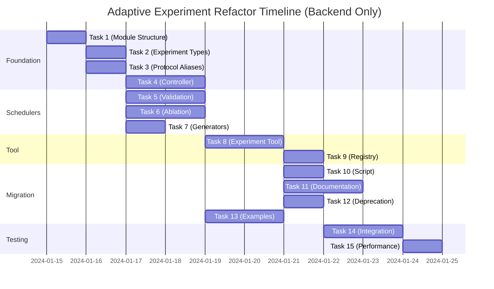

# Adaptive Experiment Refactor - Backend Tasks (No UI)

## Epic: Transform Sweep Infrastructure into Adaptive Experiment Framework
**Goal**: Generalize the sweep infrastructure through strategic renaming and minimal structural changes to reveal its true flexibility

---

## Phase 1: Foundation & Parallel Structure (Week 1)

### Task 1: Create Experiment Module Structure
**Priority**: High  
**Estimated LOC**: ~50 (mostly directory/file creation)  
**Assignee**: Infrastructure Team  
**Description**: Create parallel module structure without breaking existing code

**Acceptance Criteria**:
- [ ] Create `metta/experiment/` directory structure
- [ ] Add `__init__.py` files with import forwarding
- [ ] Create `metta/experiment/models.py` as copy of `sweep/models.py`
- [ ] Create `metta/experiment/protocols.py` as copy of `sweep/protocols.py`
- [ ] Add compatibility note in module docstrings

**Files to create**:
- `metta/experiment/__init__.py`
- `metta/experiment/models.py`
- `metta/experiment/protocols.py`
- `metta/experiment/controller.py`

---

### Task 2: Add Experiment Type Enumeration
**Priority**: High  
**Estimated LOC**: ~100  
**Assignee**: Core Team  
**Dependencies**: Task 1  
**Description**: Define experiment types and update models with semantic improvements

**Acceptance Criteria**:
- [ ] Add `ExperimentType` enum with 6 types
- [ ] Create `ExperimentMetadata` as enhanced `SweepMetadata`
- [ ] Add `ExperimentConfig` as generalized configuration model
- [ ] Keep backward compatibility with aliases
- [ ] Add comprehensive docstrings explaining each type

**Files to modify**:
- `metta/experiment/models.py`
- `tests/experiment/test_models.py` (new)

---

### Task 3: Create Protocol Aliases with Enhanced Documentation
**Priority**: Medium  
**Estimated LOC**: ~75  
**Assignee**: Core Team  
**Dependencies**: Task 1  
**Description**: Create semantic aliases for protocols with clearer documentation

**Acceptance Criteria**:
- [ ] Create `ExperimentScheduler` as alias for `Scheduler`
- [ ] Create `ConfigurationGenerator` as alias for `Optimizer`
- [ ] Add detailed docstrings with examples for each experiment type
- [ ] Keep `Dispatcher` and `Store` unchanged
- [ ] Ensure protocols remain runtime_checkable

**Files to modify**:
- `metta/experiment/protocols.py`

---

### Task 4: Implement Adaptive Experiment Controller
**Priority**: High  
**Estimated LOC**: ~200  
**Assignee**: Core Team  
**Dependencies**: Tasks 2, 3  
**Description**: Create new controller with experiment-aware naming

**Acceptance Criteria**:
- [ ] Create `AdaptiveExperimentController` class
- [ ] Add `experiment_type` parameter
- [ ] Rename internal variables (sweep_id → experiment_id)
- [ ] Keep all logic identical to `SweepController`
- [ ] Add backward compatibility factory method

**Files to modify**:
- `metta/experiment/controller.py`
- `tests/experiment/test_controller.py` (new)

---

## Phase 2: Scheduler Implementations (Week 1-2)

### Task 5: Create Validation Scheduler
**Priority**: High  
**Estimated LOC**: ~250  
**Assignee**: Sweep Team  
**Dependencies**: Task 3  
**Description**: Implement scheduler for reproducibility validation experiments

**Acceptance Criteria**:
- [ ] Create `ValidationScheduler` class implementing `ExperimentScheduler`
- [ ] Support configuration replay with different seeds
- [ ] Implement deduplication logic
- [ ] Add configuration for seed sequences
- [ ] Create unit tests with mock data

**Files to create**:
- `metta/experiment/schedulers/validation.py`
- `tests/experiment/schedulers/test_validation.py`

---

### Task 6: Create Ablation Scheduler
**Priority**: Medium  
**Estimated LOC**: ~200  
**Assignee**: Sweep Team  
**Dependencies**: Task 3  
**Description**: Implement scheduler for systematic ablation studies

**Acceptance Criteria**:
- [ ] Create `AblationScheduler` class
- [ ] Support component removal patterns
- [ ] Implement dependency tracking
- [ ] Add configuration for ablation sequences
- [ ] Include tests for common ablation patterns

**Files to create**:
- `metta/experiment/schedulers/ablation.py`
- `tests/experiment/schedulers/test_ablation.py`

---

### Task 7: Create Simple Configuration Generators
**Priority**: Medium  
**Estimated LOC**: ~150  
**Assignee**: Sweep Team  
**Dependencies**: Task 3  
**Description**: Implement basic configuration generators for non-optimization experiments

**Acceptance Criteria**:
- [ ] Create `SeedGenerator` for deterministic seed sequences
- [ ] Create `FixedConfigGenerator` for replaying configurations
- [ ] Create `SequentialGenerator` for ordered parameter exploration
- [ ] Add unit tests for each generator

**Files to create**:
- `metta/experiment/generators/basic.py`
- `tests/experiment/generators/test_basic.py`

---

## Phase 3: Tool Migration (Week 2)

### Task 8: Create Adaptive Experiment Tool
**Priority**: High  
**Estimated LOC**: ~300  
**Assignee**: Tools Team  
**Dependencies**: Tasks 4, 5  
**Description**: Implement new tool with experiment type awareness

**Acceptance Criteria**:
- [ ] Create `AdaptiveExperimentTool` class
- [ ] Add `experiment_type` parameter
- [ ] Implement scheduler factory based on type
- [ ] Implement generator factory based on type
- [ ] Rename all sweep references to experiment
- [ ] Add `SweepTool = AdaptiveExperimentTool` alias

**Files to create**:
- `metta/tools/experiment.py`
- `tests/tools/test_experiment.py`

---

### Task 9: Update Tool Registry and Commands
**Priority**: Medium  
**Estimated LOC**: ~100  
**Assignee**: Tools Team  
**Dependencies**: Task 8  
**Description**: Register new tool and update command structure

**Acceptance Criteria**:
- [ ] Register `experiment` command in tool registry
- [ ] Keep `sweep` as deprecated alias
- [ ] Update help text and documentation
- [ ] Add migration warnings for old command
- [ ] Test both old and new command paths

**Files to modify**:
- `tools/run.py`
- `metta/common/tool/__init__.py`

---

## Phase 4: Migration & Documentation (Week 2)

### Task 10: Create Migration Script
**Priority**: High  
**Estimated LOC**: ~200  
**Assignee**: DevOps Team  
**Dependencies**: Tasks 1-8  
**Description**: Build automated migration tool for existing code

**Acceptance Criteria**:
- [ ] Script to update import statements
- [ ] Update configuration files
- [ ] Generate migration report
- [ ] Support dry-run mode
- [ ] Handle edge cases gracefully

**Files to create**:
- `scripts/migrate_to_experiment.py`
- `scripts/migration_mappings.yaml`

---

### Task 11: Update Documentation
**Priority**: High  
**Estimated LOC**: Documentation  
**Assignee**: Documentation Team  
**Dependencies**: Tasks 1-9  
**Description**: Comprehensive documentation update

**Acceptance Criteria**:
- [ ] Update main README terminology
- [ ] Create experiment type guide
- [ ] Write migration guide
- [ ] Update API documentation
- [ ] Add example recipes for each experiment type

**Files to create/modify**:
- `docs/experiments/overview.md`
- `docs/experiments/types.md`
- `docs/experiments/migration.md`
- `docs/api/experiment.md`
- `README.md` (update)

---

### Task 12: Add Deprecation Warnings
**Priority**: Medium  
**Estimated LOC**: ~100  
**Assignee**: Core Team  
**Dependencies**: Tasks 1-8  
**Description**: Add graceful deprecation warnings to old code paths

**Acceptance Criteria**:
- [ ] Add warnings to `sweep` module imports
- [ ] Add warnings to `SweepTool` usage
- [ ] Include migration suggestions in warnings
- [ ] Set deprecation timeline (e.g., 3 months)
- [ ] Log warnings only once per session

**Files to modify**:
- `metta/sweep/__init__.py`
- `metta/tools/sweep.py`

---

### Task 13: Create Example Experiments
**Priority**: Low  
**Estimated LOC**: ~300  
**Assignee**: Experiments Team  
**Dependencies**: Tasks 5, 6, 7  
**Description**: Create example implementations for each experiment type

**Acceptance Criteria**:
- [ ] Create validation experiment example
- [ ] Create ablation study example
- [ ] Create curriculum learning example
- [ ] Add example configurations
- [ ] Include expected output documentation

**Files to create**:
- `experiments/examples/validation_example.py`
- `experiments/examples/ablation_example.py`
- `experiments/examples/curriculum_example.py`

---

## Phase 5: Testing & Rollout (Week 3)

### Task 14: Integration Testing Suite
**Priority**: High  
**Estimated LOC**: ~400  
**Assignee**: QA Team  
**Dependencies**: Tasks 1-9  
**Description**: Comprehensive integration tests for refactored system

**Acceptance Criteria**:
- [ ] Test all experiment types end-to-end
- [ ] Verify backward compatibility
- [ ] Test migration paths
- [ ] Performance regression tests
- [ ] Validate API compatibility

**Files to create**:
- `tests/integration/test_experiment_types.py`
- `tests/integration/test_backward_compat.py`
- `tests/integration/test_migration.py`

---

### Task 15: Performance Benchmarking
**Priority**: Medium  
**Estimated LOC**: ~150  
**Assignee**: Performance Team  
**Dependencies**: Task 14  
**Description**: Ensure no performance regression from refactoring

**Acceptance Criteria**:
- [ ] Benchmark controller loop performance
- [ ] Measure scheduler overhead
- [ ] Compare memory usage
- [ ] Document any differences
- [ ] Create performance report

**Files to create**:
- `benchmarks/experiment_performance.py`
- `benchmarks/performance_report.md`

## Milestones & Critical Path

## Success Criteria

- **Zero breaking changes** - All existing sweeps run unchanged
- **Clean abstraction** - New mental model is immediately clear
- **No performance impact** - Benchmarks show identical performance
- **Smooth migration** - Teams can adopt gradually
- **API backward compatibility** - Existing integrations continue working

## Risk Mitigation

1. **Parallel structure** reduces risk of breaking changes
2. **Incremental rollout** via aliases and deprecation warnings
3. **Comprehensive testing** before removing old code
4. **Documentation-first** approach ensures clarity
5. **Performance benchmarking** prevents regression

## Task Summary

- **Total Tasks**: 15 (down from 18)
- **Total Estimated LOC**: ~2,175 (excluding documentation)
- **Critical Path**: Tasks 1→2→3→4→8 (5 tasks that must be sequential)
- **Parallel Work**: 10 tasks can proceed in parallel after foundation
- **Timeline**: 3 weeks with proper parallelization

## Notes

- Removed UI-related tasks (Frontend models, UI components, navigation)
- Each task produces a focused PR of ~50-400 LOC
- Backend changes can be deployed independently of any future UI updates