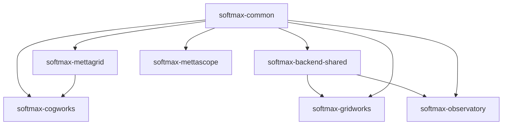

# Metta Repository Organization Plan

## Overview

This document outlines a flattened organization structure for the Metta monorepo, using consistent `softmax-*` package naming while maintaining simple directory names and imports with enforced `metta.*` namespace.

### Key Principles

1. **Enforced Namespace**: All imports MUST use `metta.` prefix (enforced by linting)
2. **Flat Structure**: Top-level package directories without deep src/ nesting
3. **Consistent Naming**: PyPI packages use `softmax-` prefix
4. **Standard Python Packages**: Each package contains its own `metta/` namespace directory
5. **Clean Imports**: Directory names remain simple (no prefix)

### Naming Convention

Our three-tier naming system:
1. **Directory name**: Simple, no prefix (e.g., `cogworks/`)
2. **Import name**: Enforced namespace (e.g., `from metta.cogworks import api`)
3. **Package name**: Company-prefixed (e.g., `pip install softmax-cogworks`)

This gives us the best of all worlds:
- Clean, simple directory structure
- Enforced consistent imports across the codebase (using familiar `metta.` namespace)
- Clear company branding for published packages (using `softmax-` prefix)
- Minimal code changes required (existing `metta.*` imports work as-is)

### Goals of the Flattened Structure

1. **Independent Packages**: Each component is its own Python package with distinct namespaces
2. **Simple Imports**: Direct package names without deep nesting
3. **Clear Boundaries**: Each package has a focused purpose and minimal dependencies
4. **Consistent Branding**: All Python packages use `softmax-` prefix for PyPI distribution
5. **Developer Ergonomics**: Simple directory structure with enforced import consistency

## Repository Structure

```
metta/
├── cogworks/                   # RL training framework
│   ├── pyproject.toml
│   └── metta/
│       └── cogworks/
│           ├── __init__.py
│           ├── interface/
│           ├── agent/
│           ├── rl/
│           └── ...
├── mettagrid/                  # C++/Python environment
│   ├── pyproject.toml
│   └── metta/
│       └── mettagrid/
│           ├── __init__.py
│           └── ...
├── common/                     # Shared utilities
│   ├── pyproject.toml
│   └── metta/
│       └── common/
│           ├── __init__.py
│           ├── util/
│           └── ...
├── backend-shared/             # Shared backend services
│   ├── pyproject.toml
│   └── metta/
│       └── backend_shared/
│           ├── __init__.py
│           └── ...
├── gridworks/                  # Map editor
├── observatory/                # Production monitoring
├── mettascope/                 # Replay viewer
├── tools/                      # Standalone scripts
├── recipes/                    # Example scripts and workflows
├── configs/                    # Hydra configurations
├── scenes/                     # Map/scene definitions
├── docs/                       # Documentation
├── devops/                     # Infrastructure
└── pyproject.toml              # Workspace configuration
```

## Detailed Structure

```
metta/
├── cogworks/                   # RL training framework (merged from metta/ + agent/)
│   ├── pyproject.toml          # name = "softmax-cogworks"
│   ├── tests/                  # Package tests
│   └── metta/
│       └── cogworks/
│           ├── __init__.py
│           ├── interface/      # API module directory (from metta/interface/)
│           ├── agent/          # From agent/src/metta/agent/
│           ├── rl/             # From metta/rl/
│           ├── eval/           # From metta/eval/
│           ├── sweep/          # From metta/sweep/
│           ├── sim/            # From metta/sim/
│           └── mapgen/         # From metta/map/
│
├── mettagrid/                  # C++/Python environment
│   ├── pyproject.toml          # name = "softmax-mettagrid"
│   ├── tests/
│   ├── benchmarks/
│   ├── configs/
│   └── metta/
│       └── mettagrid/
│           ├── __init__.py
│           └── *.py            # Flattened Python files
│
├── common/                     # Shared Python utilities
│   ├── pyproject.toml          # name = "softmax-common"
│   ├── tests/
│   └── metta/
│       └── common/
│           ├── __init__.py
│           ├── util/           # From common/src/metta/common/util/
│           ├── profiling/      # From common/src/metta/common/profiling/
│           └── wandb/          # From common/src/metta/common/wandb/
│
├── backend-shared/             # Shared backend services
│   ├── pyproject.toml          # name = "softmax-backend-shared"
│   ├── tests/
│   └── metta/
│       └── backend_shared/
│           ├── __init__.py
│           ├── sweep_names.py  # Name registration service
│           ├── stat_buffer.py  # Data persistence layer
│           ├── auth.py         # Authentication utilities
│           ├── database.py     # Database connection pooling
│           ├── cache.py        # Caching utilities
│           └── utils.py        # General backend utilities
│
├── ui-shared/                  # Shared UI components for web apps
│   ├── components/             # Reusable React components
│   ├── hooks/                  # Shared React hooks
│   ├── utils/                  # Common TypeScript utilities
│   ├── styles/                 # Shared CSS/styling
│   └── package.json            # Shared UI dependencies
│
├── gridworks/                  # Map editor (from studio/)
│   ├── src/                    # TypeScript/React frontend
│   ├── public/
│   ├── server.py               # Python server
│   ├── pyproject.toml          # name = "softmax-gridworks" (new)
│   └── package.json
│
├── observatory/                # Production monitoring
│   ├── src/                    # React frontend
│   ├── api/                    # Observatory-specific backend
│   │   ├── endpoints.py        # Observatory API endpoints
│   │   └── requirements.txt    # API-specific Python dependencies
│   ├── pyproject.toml          # name = "softmax-observatory"
│   ├── package.json
│   └── Dockerfile              # From backend/docker/observatory/
│
├── mettascope/                 # Replay viewer
│   ├── src/                    # TypeScript source
│   ├── data/                   # Assets
│   ├── tools/                  # Python tools
│   ├── server.py               # Python replay server
│   ├── replays.py              # Replay handling
│   └── package.json
│
├── tools/                      # Standalone scripts (train.py, sweep_*.py, etc.)
├── recipes/                    # Example scripts and workflows
├── configs/                    # Hydra configurations
├── scenes/                     # Map generation patterns
├── docs/                       # Documentation
├── devops/                     # Infrastructure
├── pyproject.toml              # Workspace configuration
└── README.md                   # Mono-repo overview
```

## Import Convention (ENFORCED)

All imports MUST use the `metta.` namespace prefix:

```python
# ✅ CORRECT (enforced by linting)
from metta.cogworks import api
from metta.cogworks.rl import trainer
from metta.cogworks.agent import MettaAgent
from metta.common.util import config
from metta.mettagrid import MettaGridPufferEnv
from metta.backend_shared import sweep_names

# ❌ INCORRECT (blocked by linting)
from cogworks import api  # Will fail lint check
import mettagrid  # Will fail lint check
from common import logger  # Will fail lint check
```

A custom lint rule will enforce this convention across the entire codebase.

## Package Configuration Examples

### Main Training Framework

```toml
# cogworks/pyproject.toml
[project]
name = "softmax-cogworks"
version = "0.1.0"
description = "Metta RL training framework"

[tool.setuptools]
packages = ["metta.cogworks"]
package-dir = {"": "."}
```

**Imports:**
```python
from metta.cogworks import api
from metta.cogworks.rl import trainer
from metta.cogworks.agent import MettaAgent
```

**Installation:**
```bash
pip install softmax-cogworks
```

### Environment Package

```toml
# mettagrid/pyproject.toml
[project]
name = "softmax-mettagrid"
version = "0.1.0"
description = "High-performance grid environments"
dependencies = ["softmax-common>=0.1.0"]

[tool.setuptools]
packages = ["metta.mettagrid"]
package-dir = {"": "."}
```

**Imports:**
```python
from metta.mettagrid import MettaGridPufferEnv
from metta.mettagrid.wrappers import AsyncWrapper
```

### Common Utilities

```toml
# common/pyproject.toml
[project]
name = "softmax-common"
version = "0.1.0"
description = "Shared utilities for Metta packages"

[tool.setuptools]
packages = ["metta.common"]
package-dir = {"": "."}
```

**Imports:**
```python
from metta.common import logger
from metta.common.util import config
```

### Backend Shared Services

```toml
# backend-shared/pyproject.toml
[project]
name = "softmax-backend-shared"
version = "0.1.0"
description = "Shared backend services for Metta applications"
dependencies = [
    "softmax-common>=0.1.0",
    "fastapi>=0.100.0",
    "sqlalchemy>=2.0.0",
    "redis>=5.0.0",
]

[tool.setuptools]
packages = ["metta.backend_shared"]
package-dir = {"": "."}
```

**Imports:**
```python
from metta.backend_shared import sweep_names
from metta.backend_shared.stat_buffer import StatBuffer
from metta.backend_shared.auth import authenticate
from metta.backend_shared.cache import cache_result
```

**Installation:**
```bash
pip install softmax-backend-shared
```

## Current → New Mapping

```
# CURRENT LOCATION                      → NEW LOCATION
metta/interface/                       → cogworks/metta/cogworks/interface/
metta/rl/functions/                    → cogworks/metta/cogworks/rl/util/
metta/rl/                              → cogworks/metta/cogworks/rl/
metta/sweep/                           → cogworks/metta/cogworks/sweep/
metta/setup/                           → cogworks/metta/cogworks/setup/
agent/src/metta/agent/                 → cogworks/metta/cogworks/agent/
metta/map/                             → cogworks/metta/cogworks/mapgen/
metta/eval/                            → cogworks/metta/cogworks/eval/
metta/sim/                             → cogworks/metta/cogworks/sim/
metta/tests/                           → cogworks/tests/
metta/configs/                         → configs/
metta/tools/                           → tools/
metta/recipes/                         → recipes/
metta/docs/                            → docs/
metta/devops/                          → devops/

common/src/metta/common/               → common/metta/common/
mettagrid/src/metta/mettagrid/         → mettagrid/metta/mettagrid/

backend/src/metta/backend/sweep_names/ → backend-shared/metta/backend_shared/sweep_names.py
backend/src/metta/backend/stat_buffer/ → backend-shared/metta/backend_shared/stat_buffer.py
backend/src/metta/backend/observatory/ → observatory/api/endpoints.py
backend/docker/observatory/            → observatory/Dockerfile

apps/shared/                           → ui-shared/
apps/observatory/                      → observatory/
apps/mettascope/                       → mettascope/
apps/studio/                           → gridworks/

# PACKAGE NAMES
metta                         → softmax-cogworks
metta-common                  → softmax-common
metta-agent                   → (merged into softmax-cogworks)
metta-mettagrid              → softmax-mettagrid
metta-app-backend            → softmax-backend-shared (for shared services)
```

## Installation Examples

```bash
# Just the environment
pip install softmax-mettagrid

# Training framework (includes dependencies)
pip install softmax-cogworks

# Backend services
pip install softmax-backend-shared

# Development setup
uv sync  # Installs all workspace packages

# What uv will show during build:
# Built softmax-cogworks @ file:///workspace/cogworks
# Built softmax-common @ file:///workspace/common
# Built softmax-mettagrid @ file:///workspace/mettagrid
# Built softmax-backend-shared @ file:///workspace/backend-shared
```

## Python Package Structure

Each Python package follows a standard structure:
- Top-level directory contains `pyproject.toml`, tests, and other package files
- `metta/` subdirectory contains the namespace package
- Actual code lives in `metta/<package_name>/`

This approach:
- Uses standard Python namespace packages (no PEP 420 needed)
- Each package is self-contained with its own `metta` namespace
- No symlinks or complex build configurations required
- Works seamlessly with standard Python packaging tools

## Import Philosophy

We maintain a clear separation between:
- **Package distribution names** (with `softmax-` prefix for branding)
- **Import names** (enforced `metta.` namespace for consistency)

This approach is used by many successful projects:
- `scikit-learn` → `import sklearn`
- `beautifulsoup4` → `import bs4`
- `pillow` → `import PIL`

In our case:
- Install with: `pip install softmax-cogworks`
- Import with: `from metta.cogworks import api`

## Benefits

1. **Brand Recognition**: All packages clearly belong to Softmax
2. **No Naming Conflicts**: `softmax-` prefix prevents PyPI collisions
3. **Enforced Consistency**: All code uses `metta.*` imports
4. **Standard Structure**: Follows Python packaging best practices
5. **Easy Migration**: Minimal changes to existing codebase imports
6. **No Ambiguity**: Enforced import style prevents confusion
7. **Self-Contained Packages**: Each package has its own namespace directory
8. **Code Stability**: Existing `metta.*` imports continue to work

## Dependency Graph



## Future Packages

As the web apps mature, they'll follow the same pattern:
- `gridworks/` → `from metta.gridworks` → `pip install softmax-gridworks`
- `observatory/` → `from metta.observatory` → `pip install softmax-observatory`
- `mettascope/` → `from metta.mettascope` → `pip install softmax-mettascope`

## Migration Path

1. Restructure each package to have `metta/<package_name>/` structure
2. Update all imports to use `metta.` prefix (minimal changes needed)
3. Add lint rule to enforce `metta.` imports
4. Update `pyproject.toml` files with `softmax-` prefixed names
5. Move `recipes/` to root level
6. Create `backend-shared/` with shared backend services
7. Test with `uv sync` to verify package names
8. Update CI/CD and documentation

This structure provides a clean, professional organization with enforced consistency across the entire codebase while maintaining the Softmax brand identity in package distribution and keeping code imports stable.
