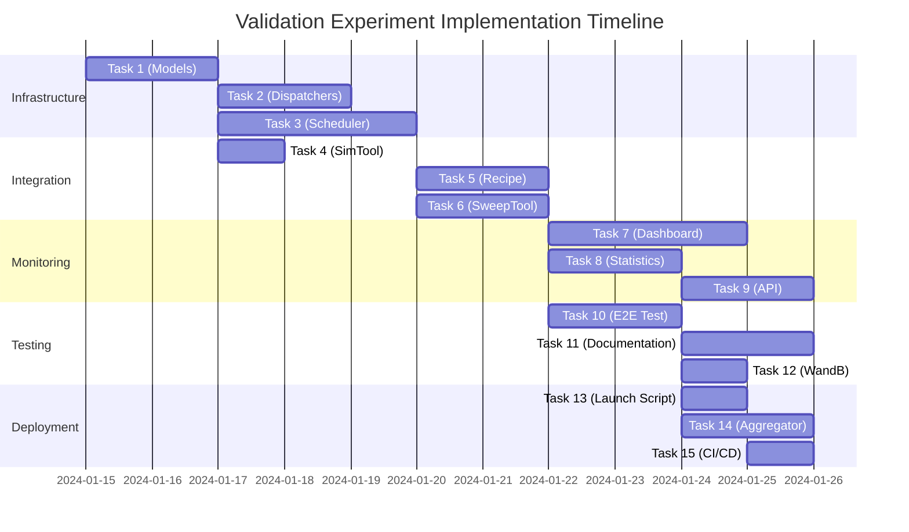

# Validation Experiment - Asana Task Breakdown

## Epic: MARL Hyperparameter Validation Infrastructure
**Goal**: Enable reproducible validation of high-performing hyperparameter configurations with controlled seed experiments

---

## Phase 1: Infrastructure Foundation (Week 1)

### Task 1: Add Seed Tracking to Sweep Models
**Priority**: High  
**Estimated LOC**: ~50-100  
**Assignee**: Sweep Team  
**Description**: Extend sweep data models to track and manage seeds explicitly

**Acceptance Criteria**:
- [ ] Add `seed: Optional[int]` field to `JobDefinition` in `metta/sweep/models.py`
- [ ] Add `seed: Optional[int]` field to `RunInfo` in `metta/sweep/models.py`
- [ ] Update model serialization/deserialization to handle seed field
- [ ] Add unit tests for seed field persistence

**Files to modify**:
- `metta/sweep/models.py`
- `tests/sweep/test_models.py` (new)

---

### Task 2: Create Seed Propagation in Dispatchers
**Priority**: High  
**Estimated LOC**: ~150-200  
**Assignee**: Sweep Team  
**Dependencies**: Task 1  
**Description**: Ensure dispatchers properly propagate seed values to training and evaluation jobs

**Acceptance Criteria**:
- [ ] Modify `LocalDispatcher` to pass seed as override when present
- [ ] Modify `SkypilotDispatcher` to pass seed as override when present  
- [ ] Update `RoutingDispatcher` to handle seed propagation
- [ ] Add logging for seed values in dispatch operations

**Files to modify**:
- `metta/sweep/dispatcher/local.py`
- `metta/sweep/dispatcher/skypilot.py`
- `metta/sweep/dispatcher/routing.py`

---

### Task 3: Create ValidationScheduler Base Class
**Priority**: High  
**Estimated LOC**: ~300-400  
**Assignee**: Sweep Team  
**Dependencies**: Task 1  
**Description**: Implement the core validation scheduler that orchestrates seed-controlled runs

**Acceptance Criteria**:
- [ ] Create `metta/sweep/schedulers/validation.py`
- [ ] Implement `ValidationScheduler` class with configuration handling
- [ ] Add method to fetch original run configurations from WandB
- [ ] Implement job generation logic with seed control
- [ ] Add duplicate detection to avoid re-running completed seed/config pairs

**Files to create**:
- `metta/sweep/schedulers/validation.py`
- `tests/sweep/schedulers/test_validation.py`

---

## Phase 2: Tool Integration (Week 1-2)

### Task 4: Add Seed Support to SimTool
**Priority**: Medium  
**Estimated LOC**: ~50-75  
**Assignee**: Simulation Team  
**Description**: Enable explicit seed control in evaluation tool

**Acceptance Criteria**:
- [ ] Add `seed: Optional[int]` parameter to `SimTool` class
- [ ] Propagate seed to `system.seed` when provided
- [ ] Update tool documentation with seed usage examples
- [ ] Add integration test for deterministic evaluation with fixed seed

**Files to modify**:
- `metta/tools/sim.py`
- `tests/tools/test_sim.py`

---

### Task 5: Create Validation Recipe Module
**Priority**: High  
**Estimated LOC**: ~200-250  
**Assignee**: Experiments Team  
**Dependencies**: Tasks 1-3  
**Description**: Create a dedicated recipe for validation experiments

**Acceptance Criteria**:
- [ ] Create `experiments/recipes/validation.py`
- [ ] Implement `validate_sweep_results()` function
- [ ] Add configuration for Phase 1 (10 seeds) and Phase 2 (20 seeds)
- [ ] Include statistical analysis helpers
- [ ] Add command-line interface for selecting runs to validate

**Files to create**:
- `experiments/recipes/validation.py`
- `experiments/recipes/configs/validation_seeds.yaml`

---

### Task 6: Extend SweepTool for Validation Mode
**Priority**: High  
**Estimated LOC**: ~150-200  
**Assignee**: Sweep Team  
**Dependencies**: Task 3  
**Description**: Add validation mode to SweepTool that uses ValidationScheduler

**Acceptance Criteria**:
- [ ] Add `validation_mode: bool` flag to `SweepTool`
- [ ] Add `target_runs: list[str]` parameter for specifying runs to validate
- [ ] Add `validation_seeds: list[int]` parameter with sensible defaults
- [ ] Wire up ValidationScheduler when in validation mode
- [ ] Update help text and documentation

**Files to modify**:
- `metta/tools/sweep.py`
- `docs/tools/sweep_validation.md` (new)

---

## Phase 3: Monitoring & Analysis (Week 2)

### Task 7: Create Validation Dashboard Components
**Priority**: Medium  
**Estimated LOC**: ~300-400  
**Assignee**: Frontend Team  
**Description**: Add UI components to Observatory for monitoring validation progress

**Acceptance Criteria**:
- [ ] Create ValidationRunsTable component showing seed/config matrix
- [ ] Add progress indicators for each seed/config combination
- [ ] Implement performance comparison chart across seeds
- [ ] Add statistical summary card (mean, std dev, CI)

**Files to create**:
- `observatory/src/components/validation/ValidationRunsTable.tsx`
- `observatory/src/components/validation/ValidationStatsCard.tsx`
- `observatory/src/components/validation/SeedComparisonChart.tsx`

---

### Task 8: Implement Validation Statistics Calculator
**Priority**: High  
**Estimated LOC**: ~200-250  
**Assignee**: Analysis Team  
**Dependencies**: Task 5  
**Description**: Create statistical analysis utilities for validation results

**Acceptance Criteria**:
- [ ] Create `metta/analysis/validation_stats.py`
- [ ] Implement confidence interval calculation
- [ ] Add performance stability metrics
- [ ] Create comparison with original sweep results
- [ ] Generate validation report in markdown format

**Files to create**:
- `metta/analysis/validation_stats.py`
- `tests/analysis/test_validation_stats.py`

---

### Task 9: Add Validation API Endpoints
**Priority**: Medium  
**Estimated LOC**: ~150-200  
**Assignee**: Backend Team  
**Dependencies**: Task 8  
**Description**: Create API endpoints for validation data

**Acceptance Criteria**:
- [ ] Add `/api/validation/runs/{sweep_id}` endpoint
- [ ] Add `/api/validation/stats/{sweep_id}` endpoint
- [ ] Implement caching for expensive statistical computations
- [ ] Add OpenAPI documentation

**Files to modify**:
- `app_backend/routers/validation.py` (new)
- `app_backend/models/validation.py` (new)
- `app_backend/main.py`

---

## Phase 4: Testing & Documentation (Week 2-3)

### Task 10: Create End-to-End Validation Test
**Priority**: High  
**Estimated LOC**: ~200-300  
**Assignee**: QA Team  
**Dependencies**: Tasks 1-6  
**Description**: Implement integration test for complete validation workflow

**Acceptance Criteria**:
- [ ] Create test that runs mini validation (2 configs, 3 seeds)
- [ ] Verify seed propagation through entire pipeline
- [ ] Check statistical calculations are correct
- [ ] Ensure results are properly stored and retrievable

**Files to create**:
- `tests/integration/test_validation_workflow.py`
- `tests/fixtures/validation_test_data.py`

---

### Task 11: Write Validation Experiment Guide
**Priority**: Medium  
**Estimated LOC**: Documentation  
**Assignee**: Documentation Team  
**Dependencies**: Tasks 1-10  
**Description**: Create comprehensive user guide for validation experiments

**Acceptance Criteria**:
- [ ] Write step-by-step validation workflow guide
- [ ] Document all configuration options
- [ ] Include troubleshooting section
- [ ] Add example commands and expected outputs
- [ ] Create FAQ section

**Files to create**:
- `docs/guides/validation_experiments.md`
- `docs/api/validation_scheduler.md`

---

### Task 12: Add Validation Metrics to WandB
**Priority**: Low  
**Estimated LOC**: ~100-150  
**Assignee**: Monitoring Team  
**Dependencies**: Task 8  
**Description**: Log validation-specific metrics to WandB

**Acceptance Criteria**:
- [ ] Create custom WandB charts for seed variance
- [ ] Log confidence intervals as WandB metrics
- [ ] Add validation summary table to WandB
- [ ] Create alert for high variance across seeds

**Files to modify**:
- `metta/rl/wandb.py`
- `metta/sweep/stores/wandb.py`

---

## Phase 5: Deployment & Execution (Week 3)

### Task 13: Create Validation Launch Script
**Priority**: Medium  
**Estimated LOC**: ~100-150  
**Assignee**: DevOps Team  
**Dependencies**: Tasks 1-11  
**Description**: Create convenience script for launching validation experiments

**Acceptance Criteria**:
- [ ] Create `scripts/launch_validation.sh`
- [ ] Add parameter validation and error handling
- [ ] Include dry-run mode for testing
- [ ] Add progress monitoring capabilities

**Files to create**:
- `scripts/launch_validation.sh`
- `scripts/validation_configs/phase1.yaml`
- `scripts/validation_configs/phase2.yaml`

---

### Task 14: Implement Validation Result Aggregator
**Priority**: Medium  
**Estimated LOC**: ~250-300  
**Assignee**: Analysis Team  
**Dependencies**: Task 8  
**Description**: Create tool to aggregate and summarize validation results

**Acceptance Criteria**:
- [ ] Collect results from all validation runs
- [ ] Generate comparative statistics
- [ ] Create visualization plots
- [ ] Export results to CSV/JSON formats
- [ ] Generate executive summary

**Files to create**:
- `metta/analysis/validation_aggregator.py`
- `scripts/generate_validation_report.py`

---

### Task 15: Add Validation CI/CD Pipeline
**Priority**: Low  
**Estimated LOC**: ~100  
**Assignee**: DevOps Team  
**Dependencies**: Tasks 1-14  
**Description**: Add GitHub Actions workflow for validation experiments

**Acceptance Criteria**:
- [ ] Create workflow for automated validation on PR
- [ ] Add smoke test with minimal seeds
- [ ] Configure result reporting to PR comments
- [ ] Set up artifact storage for validation results

**Files to create**:
- `.github/workflows/validation_experiment.yml`
- `.github/scripts/validation_smoke_test.py`

---

## Milestones & Dependencies

## Success Metrics

- All PRs under 500 lines of code
- Each task completable in 1-3 days
- Zero regression in existing sweep functionality
- 100% test coverage for new code
- Documentation complete before deployment

## Risk Mitigation

1. **Task 3 complexity**: If ValidationScheduler exceeds 500 lines, split into base class and implementation
2. **Task 7 frontend scope**: Can be split into 3 separate component tasks if needed
3. **Dependencies**: Tasks 1-3 are critical path - prioritize reviews
4. **Testing overhead**: Consider parallel test development alongside implementation