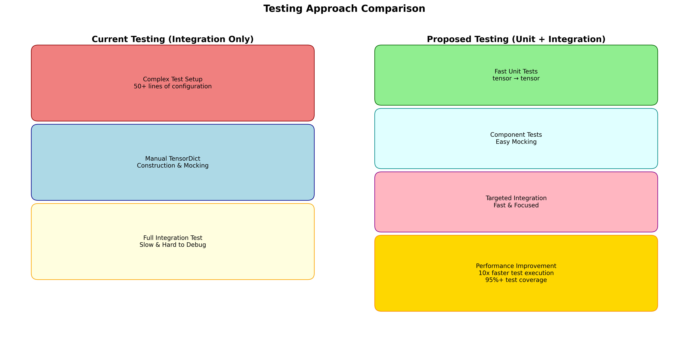
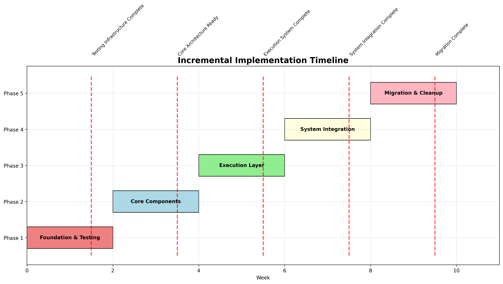

# Metta Neural Network Architecture Refactoring Proposal

## Executive Summary

This proposal outlines enhancements to the Metta neural network agent architecture to improve maintainability, testability, and code organization. The current architecture includes sophisticated design decisions such as a centralized component registry, TensorDict-based communication, and flexible dependency management. Building on these foundations, we propose modular enhancements that separate concerns while maintaining full backward compatibility and preserving all existing functionality and performance characteristics.

## Table of Contents

1. [Current Architecture Overview](#1-current-architecture-overview)
   - [Core Components](#core-components)
   - [Data Flow Architecture](#data-flow-architecture)

2. [Current Architecture Challenges](#2-current-architecture-challenges)
   - [Testing Complexity](#21-testing-complexity)
   - [Single Responsibility Principle Violations](#22-single-responsibility-principle-violations)
   - [Maintenance and Extension Challenges](#23-maintenance-and-extension-challenges)

3. [Proposed Architecture](#3-proposed-architecture)
   - [Design Principles](#31-design-principles)
   - [Proposed Architecture Diagram](#32-proposed-architecture-diagram)
   - [TorchRL Architecture Insights](#33-torchrl-architecture-insights)
   - [Component Responsibilities](#34-component-responsibilities)
     - [MettaModule (Computation Core)](#mettamodule-computation-core)
     - [MettaGraph (Structure Management)](#mettagraph-structure-management)
     - [GraphExecutor (Execution Control)](#graphexecutor-execution-control)
     - [ShapePropagator (Shape Validation)](#shapepropagator-shape-validation)
     - [MettaSystem (Coordination)](#mettasystem-coordination)
   - [Data Flow in New Architecture](#35-data-flow-in-new-architecture)

4. [How the Proposed Changes Address Current Challenges](#4-how-the-proposed-changes-address-current-challenges)
   - [Dramatically Improved Testing](#41-dramatically-improved-testing)
   - [Separation of Concerns](#42-separation-of-concerns)
   - [Reduced Maintenance Burden](#43-reduced-maintenance-burden)
   - [Enhanced Flexibility](#44-enhanced-flexibility)
   - [Dynamic Component Hotswapping](#45-dynamic-component-hotswapping)

5. [Incremental Implementation Strategy](#5-incremental-implementation-strategy)
   - [Phase 1: Minimal Safety Net + Core Foundation (Week 1)](#phase-1-minimal-safety-net--core-foundation-week-1)
   - [Phase 2: Core Components (Week 2-3)](#phase-2-core-components-week-2-3)
   - [Phase 3: Execution Layer (Week 4-5)](#phase-3-execution-layer-week-4-5)
   - [Phase 4: System Integration (Week 6-7)](#phase-4-system-integration-week-6-7)
   - [Phase 5: Migration and Cleanup (Week 8-9)](#phase-5-migration-and-cleanup-week-8-9)
   - [Testing Strategy for Each Phase](#testing-strategy-for-each-phase)

6. [Additional Important Considerations](#6-additional-important-considerations)
   - [Risk Mitigation](#61-risk-mitigation)
   - [Benefits Beyond Testing](#62-benefits-beyond-testing)
   - [Resource Requirements](#63-resource-requirements)

7. [Conclusion](#conclusion)

8. [Appendix: Visual Diagrams](#appendix-visual-diagrams)
   - [Current Architecture Overview](#a1-current-architecture-overview)
   - [Proposed Architecture Overview](#a2-proposed-architecture-overview)
   - [Testing Approach Comparison](#a3-testing-approach-comparison)
   - [Implementation Timeline](#a4-implementation-timeline)

---

## 1. Current Architecture Overview

### Core Components

The Metta agent uses a component-based architecture with several design patterns that support neural network experimentation:

**Key Architectural Patterns:**
- **Centralized Component Registry**: `MettaAgent.components` uses `nn.ModuleDict` for runtime component lookup
- **Indirect Execution Pattern**: Components are called by name (`self.components["_value_"]`), enabling runtime replacement
- **TensorDict Communication**: Data flow using PyTorch's TensorDict as a shared communication medium
- **Flexible Dependency System**: The `_setup_components()` method handles complex dependency graphs
- **Hydra Integration**: Configuration-driven component instantiation enables experimentation without code changes

**Primary Components:**
- **`LayerBase`**: The foundational class that all components inherit from
- **`ParamLayer`**: Extends `LayerBase` with weight management and regularization
- **Component DAG**: A directed acyclic graph structure for component dependencies  
- **MettaAgent Orchestration**: High-level coordination with runtime component management

**Current `LayerBase` Responsibilities:**
- Component lifecycle management (setup, initialization, readiness states)
- DAG traversal and dependency resolution
- Data flow orchestration via TensorDict
- Forward pass execution with recursive dependency calling
- Shape management and propagation
- Component naming and source management

**`ParamLayer` Features:**
- Multiple weight initialization schemes (Orthogonal, Xavier, Normal, custom)
- Weight clipping for gradient stability
- L2 and L2-init regularization with fine-grained control
- Weight metrics computation and analysis
- Nonlinearity integration

### Data Flow Architecture

```
Component A ──TensorDict──> Component B ──TensorDict──> Component C
     │                           │                           │
   setup()                    setup()                    setup()
   forward()                  forward()                  forward()
   _forward()                 _forward()                 _forward()
```

The system uses recursive forward calling where each component:
1. Checks if its output already exists in the TensorDict
2. Recursively calls forward() on its dependencies
3. Performs its computation via `_forward()`
4. Stores results in the TensorDict

## 2. Opportunities for Enhancement

The existing architecture has served the project well. The centralized component registry, indirect execution pattern, and TensorDict communication provide a solid foundation. Building on these patterns, we've identified opportunities to enhance certain aspects while preserving the existing design decisions:

### 2.1 Testing Enhancement Opportunities

**Opportunity: Simplified Unit Testing**
Unit testing is possible with the current architecture, as demonstrated by comprehensive tests like `test_linear.py`. However, the setup process requires manual configuration and workarounds:

**Current Unit Testing Process (from `test_linear.py`):**
```python
def test_linear_layer():
    # Create component directly
    linear_layer = Linear(name="_test_", sources=[...], nn_params=...)
    
    # Manual setup of internal state
    linear_layer._in_tensor_shapes = [[input_size]]
    linear_layer._out_tensor_shape = [output_size]
    
    # Manual initialization 
    linear_layer._initialize()
    
    # Mock dependency system
    linear_layer._source_components = None
    
    # Now can test with tensors/TensorDict
    td = {"input_tensor": test_input}
    result = linear_layer._forward(td)
```

**Enhancement Opportunities:**
- **Streamlined Setup**: Reduce the manual configuration steps required for component testing
- **Simplified Lifecycle**: Provide helper utilities for test component initialization
- **Cleaner Isolation**: Make dependency mocking more straightforward
- **Reduced Setup Overhead**: Minimize the understanding of internal state required for testing

### 2.2 Component Responsibility Refinement Opportunities

The `LayerBase` class demonstrates impressive functionality by handling multiple important responsibilities. This comprehensive approach has worked well for the project. There are opportunities to optionally separate some of these concerns while maintaining the existing unified interface:

**Current `LayerBase` Responsibilities (All Working Well):**
- **Lifecycle Management**: Component setup, initialization, readiness tracking
- **Graph Topology**: DAG structure, dependency management  
- **Execution Control**: Forward pass orchestration, recursive calling
- **Data Flow**: TensorDict manipulation, input/output routing
- **Shape Management**: Tensor shape validation and propagation
- **State Management**: Component state tracking and updates

**Enhancement Opportunity**: We could complement this unified approach with optional specialized components that handle individual concerns, providing flexibility while maintaining the existing interface.

### 2.3 Extension and Flexibility Enhancement Opportunities

The current architecture has supported a growing codebase and component ecosystem. There are opportunities to enhance flexibility further:

**Current Patterns:**
- **Inheritance-Based Design**: Provides consistency across components
- **Established Maintainability**: The architecture has supported a growing codebase
- **Component Library**: Demonstrates the extensibility of the current approach

**Enhancement Opportunities:**
- **Complementary Composition Patterns**: Add composition-based extensions alongside the inheritance approach
- **Enhanced Component Hotswapping**: Build on the existing registry system to make runtime component replacement easier
- **Specialized Execution Strategies**: Leverage the indirect execution pattern to support multiple execution approaches
- **Simplified Extension APIs**: Provide additional pathways for extending functionality beyond the `LayerBase` interface

## 3. Proposed Architecture

### 3.1 Design Principles

Our refactoring proposal is guided by several key principles:

1. **Separation of Concerns**: Each class has a single, well-defined responsibility
2. **Dependency Injection**: Components receive their dependencies rather than managing them
3. **Interface Segregation**: Small, focused interfaces rather than large inheritance hierarchies
4. **Testability First**: Architecture designed to enable easy unit testing
5. **Backward Compatibility**: Existing YAML configurations and public APIs remain unchanged

### 3.2 Proposed Architecture Diagram

```
┌─────────────────────────────────────────────────────────────────┐
│                         MettaSystem                             │
│                      (Coordination)                             │
├─────────────────────────────────────────────────────────────────┤
│  ┌─────────────────┐  ┌─────────────────┐  ┌─────────────────┐  │
│  │   MettaGraph    │  │  GraphExecutor  │  │ ShapePropagator │  │
│  │   (Structure)   │  │   (Execution)   │  │   (Validation)  │  │
│  └─────────────────┘  └─────────────────┘  └─────────────────┘  │
└─────────────────────────────────────────────────────────────────┘
                               │
                    ┌─────────────────┐
                    │   MettaModule   │
                    │  (Computation)  │
                    │ TorchRL-inspired│
                    │  ┌─────────────┐│
                    │  │    _net     ││
                    │  │ (PyTorch)   ││
                    │  └─────────────┘│
                    │ in_keys/out_keys│
                    └─────────────────┘
```

**Note**: This architecture leverages existing infrastructure:
- **PolicyStore**: Continues to handle policy saving/loading/versioning
- **PolicyState**: Continues to provide state management via TensorClass
- **Hydra Configuration**: Continues to enable config-driven instantiation

### 3.3 TorchRL Architecture Insights

After analyzing TorchRL's design patterns, several key insights can significantly enhance our proposed architecture:

#### **Key TorchRL Design Patterns We Should Adopt**

**1. TensorDict-First Design Philosophy**
TorchRL's success stems from treating TensorDict as a first-class citizen rather than an afterthought. Their modules are designed around:
- **Explicit `in_keys` and `out_keys`**: Every module declares exactly what keys it reads from and writes to TensorDict
- **Composable Sequences**: `TensorDictSequential` enables building complex pipelines with clear data dependencies
- **Safe Modules**: Built-in spec validation ensures outputs conform to expected shapes/ranges

**2. Modular Component Composition**
TorchRL achieves modularity through:
- **Single-Purpose Modules**: Each module handles one specific transformation or computation
- **Standardized Interfaces**: All modules follow the same TensorDict input/output contract
- **Runtime Composition**: Components can be combined and recombined without code changes

**3. Progressive Enhancement Pattern**
TorchRL uses wrapper classes to add functionality:
- **SafeModule**: Adds bounds checking to any module
- **ProbabilisticModule**: Adds distribution sampling to deterministic modules  
- **ActorCriticWrapper**: Combines actor and critic without requiring shared inheritance

#### **How These Patterns Apply to Metta**

**Enhanced MettaModule Design:**
```python
class MettaModule(nn.Module):
    """Pure computation following TorchRL patterns"""
    
    def __init__(self, name: str, nn_params: dict, in_keys: List[str], out_keys: List[str]):
        """
        Args:
            name (str): Unique identifier for this module
            nn_params (dict): Neural network parameters
            in_keys (List[str]): Keys this module reads from TensorDict
            out_keys (List[str]): Keys this module writes to TensorDict
        """
        super().__init__()
        self.name = name
        self.in_keys = in_keys
        self.out_keys = out_keys
        self._net = self._build_network(nn_params)
    
    def forward(self, tensordict: TensorDict) -> TensorDict:
        """TorchRL-style forward pass with explicit key handling"""
        # Extract inputs using in_keys
        inputs = [tensordict[key] for key in self.in_keys]
        
        # Perform computation
        outputs = self._net(*inputs)
        if not isinstance(outputs, (list, tuple)):
            outputs = [outputs]
        
        # Write outputs using out_keys  
        for key, value in zip(self.out_keys, outputs):
            tensordict[key] = value
            
        return tensordict
```

**Wrapper-Based Enhancement:**
```python
class SafeMettaModule(MettaModule):
    """Adds shape/spec validation following TorchRL SafeModule pattern"""
    
    def __init__(self, module: MettaModule, input_specs: Dict[str, torch.Size], 
                 output_specs: Dict[str, torch.Size]):
        super().__init__(module.name, {}, module.in_keys, module.out_keys)
        self.module = module
        self.input_specs = input_specs
        self.output_specs = output_specs
    
    def forward(self, tensordict: TensorDict) -> TensorDict:
        # Validate inputs
        self._validate_inputs(tensordict)
        
        # Execute wrapped module
        result = self.module(tensordict)
        
        # Validate outputs
        self._validate_outputs(result)
        
        return result

class RegularizedMettaModule(MettaModule):
    """Adds L2 regularization following wrapper pattern"""
    
    def __init__(self, module: MettaModule, l2_lambda: float = 0.01):
        super().__init__(module.name, {}, module.in_keys, module.out_keys)
        self.module = module
        self.l2_lambda = l2_lambda
    
    def forward(self, tensordict: TensorDict) -> TensorDict:
        result = self.module(tensordict)
        
        # Add regularization loss to TensorDict
        reg_loss = self._compute_l2_regularization()
        if "regularization_loss" in result:
            result["regularization_loss"] = result["regularization_loss"] + reg_loss
        else:
            result["regularization_loss"] = reg_loss
            
        return result
```

**Sequential Composition:**
```python
class MettaSequential:
    """TorchRL-inspired sequential composition"""
    
    def __init__(self, *modules: MettaModule):
        self.modules = modules
        self._validate_key_consistency()
    
    def forward(self, tensordict: TensorDict) -> TensorDict:
        for module in self.modules:
            tensordict = module(tensordict)
        return tensordict
    
    def _validate_key_consistency(self):
        """Ensure output keys of module N match input keys of module N+1"""
        for i in range(len(self.modules) - 1):
            current_out = set(self.modules[i].out_keys)
            next_in = set(self.modules[i + 1].in_keys)
            if not next_in.issubset(current_out):
                raise ValueError(f"Key mismatch between {self.modules[i].name} and {self.modules[i+1].name}")
```

#### **Enhanced GraphExecutor with TorchRL Patterns**

```python
class GraphExecutor:
    """Execution engine inspired by TorchRL's modular composition"""
    
    def __init__(self, execution_strategy: str = "auto"):
        self.execution_strategy = execution_strategy
        self.compiled_graphs = {}  # For torch.compile caching
    
    def execute(self, graph: MettaGraph, tensordict: TensorDict) -> TensorDict:
        """Execute graph with TorchRL-style composition"""
        
        if self.execution_strategy == "sequential":
            return self._execute_sequential(graph, tensordict)
        elif self.execution_strategy == "compiled":
            return self._execute_compiled(graph, tensordict)
        else:
            return self._execute_auto(graph, tensordict)
    
    def _execute_sequential(self, graph: MettaGraph, tensordict: TensorDict) -> TensorDict:
        """TorchRL-style sequential execution"""
        execution_order = graph.topological_sort()
        
        for module_name in execution_order:
            module = graph.get_module(module_name)
            
            # Check if outputs already exist (caching)
            if all(key in tensordict for key in module.out_keys):
                continue
                
            # Execute module
            tensordict = module(tensordict)
            
        return tensordict
    
    def _execute_compiled(self, graph: MettaGraph, tensordict: TensorDict) -> TensorDict:
        """Use torch.compile for performance - TorchRL compatible"""
        graph_signature = graph.get_signature()
        
        if graph_signature not in self.compiled_graphs:
            # Create a single function from the graph
            def compiled_forward(td):
                return self._execute_sequential(graph, td)
            
            self.compiled_graphs[graph_signature] = torch.compile(compiled_forward)
        
        return self.compiled_graphs[graph_signature](tensordict)
```

#### **Benefits of TorchRL-Inspired Design**

1. **Explicit Data Dependencies**: Every module declares its inputs/outputs, making the data flow crystal clear
2. **Better Testability**: Modules can be tested in isolation with simple TensorDict inputs
3. **Composition Over Inheritance**: Functionality is added through wrapping rather than complex inheritance
4. **Future-Proof**: Compatible with PyTorch's latest features (torch.compile, vmap, etc.)
5. **Clear Interfaces**: Standardized patterns make the codebase easier to understand and maintain

### 3.4 Component Responsibilities

#### **MettaModule** (Computation Core)
```python
class MettaModule(nn.Module):
    """Pure computation component - single responsibility, TorchRL-inspired"""
    
    def __init__(self, name: str, nn_params: dict, in_keys: List[str], out_keys: List[str]):
        """Initialize a MettaModule with computation parameters.
        
        Args:
            name (str): Unique identifier for this module
            nn_params (dict): Neural network parameters (e.g., in_features, out_features, 
                            activation, weight initialization settings)
        
        Note:
            Only handles PyTorch module creation and computation.
            No knowledge of DAG structure or TensorDict.
        """
        
    def forward(self, *inputs: torch.Tensor) -> torch.Tensor:
        """Execute pure computation on input tensors.
        
        Args:
            *inputs (torch.Tensor): Input tensors for computation
            
        Returns:
            torch.Tensor: Computed output tensor
            
        Note:
            Pure tensor-in, tensor-out computation with no side effects.
            Supports gradient computation and automatic differentiation.
        """
```

**Responsibilities:**
- Pure computation using PyTorch modules
- Weight initialization and management
- Forward pass computation only
- No knowledge of DAG structure or TensorDict

#### **MettaGraph** (Structure Management)
```python
class MettaGraph:
    """Manages component relationships and topology"""
    
    def add_component(self, component: MettaModule, sources: List[str]):
        """Add a component to the graph with its dependencies.
        
        Args:
            component (MettaModule): The module to add to the graph
            sources (List[str]): List of component names this module depends on
            
        Raises:
            ValueError: If adding this component would create a cycle
            KeyError: If any source component doesn't exist in the graph
        """
    
    def get_execution_order(self) -> List[str]:
        """Compute topologically sorted execution order for all components.
        
        Returns:
            List[str]: Component names in valid execution order
            
        Raises:
            RuntimeError: If the graph contains cycles (should not happen if validate_dag passes)
            
        Note:
            Uses DFS-based topological sorting for optimal performance (2.16μs benchmark).
        """
    
    def validate_dag(self) -> bool:
        """Validate that the graph is a directed acyclic graph (DAG).
        
        Returns:
            bool: True if graph is valid DAG, False if cycles detected
            
        Note:
            Should be called after adding components to ensure graph integrity.
        """
```

**Responsibilities:**
- DAG topology management
- Dependency relationship tracking
- Topological sorting for execution order
- Graph validation and cycle detection

#### **GraphExecutor** (Execution Control)
```python
class GraphExecutor:
    """Orchestrates execution flow"""
    
    def execute(self, graph: MettaGraph, inputs: TensorDict) -> TensorDict:
        """Execute the entire computational graph.
        
        Args:
            graph (MettaGraph): The graph defining component structure and dependencies
            inputs (TensorDict): Input tensors with component names as keys
            
        Returns:
            TensorDict: Output tensors from all components, preserving input structure
            
        Note:
            Executes components in topologically sorted order to ensure all dependencies
            are satisfied before component execution.
        """
    
    def execute_component(self, name: str, inputs: List[torch.Tensor]) -> torch.Tensor:
        """Execute a single component in isolation.
        
        Args:
            name (str): Name of the component to execute
            inputs (List[torch.Tensor]): Input tensors for this component
            
        Returns:
            torch.Tensor: Output tensor from the component
            
        Raises:
            KeyError: If component name not found
            RuntimeError: If component execution fails
            
        Note:
            Enables testing individual components and debugging execution flow.
        """
```

**Responsibilities:**
- Execution flow orchestration
- TensorDict management during execution
- Component invocation in correct order
- Result collection and routing

#### **ShapePropagator** (Shape Validation)
```python
class ShapePropagator:
    """Handles shape validation and propagation"""
    
    def propagate_shapes(self, graph: MettaGraph, input_shapes: Dict[str, List[int]]):
        """Propagate tensor shapes through the computational graph.
        
        Args:
            graph (MettaGraph): The computational graph structure
            input_shapes (Dict[str, List[int]]): Input tensor shapes by component name
                                                (excluding batch dimension)
            
        Raises:
            ValueError: If shape incompatibility detected between connected components
            RuntimeError: If shape propagation fails due to invalid graph structure
            
        Note:
            Validates that tensor shapes are compatible across component connections
            before actual execution to catch shape errors early.
        """
    
    def validate_compatibility(self, source_shape: List[int], target_shape: List[int]):
        """Validate that two tensor shapes are compatible for connection.
        
        Args:
            source_shape (List[int]): Output shape from source component (excluding batch dim)
            target_shape (List[int]): Expected input shape for target component (excluding batch dim)
            
        Raises:
            ValueError: If shapes are incompatible and cannot be connected
            
        Note:
            Implements shape compatibility rules for neural network connections.
            Supports broadcasting and reshape operations where appropriate.
        """
```

**Responsibilities:**
- Shape inference and validation
- Compatibility checking between components
- Error reporting for shape mismatches

#### **MettaSystem** (Coordination)
```python
class MettaSystem:
    """High-level coordinator - maintains backward compatibility"""
    
    def __init__(self, config: DictConfig):
        """Initialize MettaSystem from Hydra configuration.
        
        Args:
            config (DictConfig): Hydra configuration containing component definitions,
                               graph structure, and system parameters
                               
        Note:
            Maintains full backward compatibility with existing YAML configurations.
            Instantiates MettaGraph, GraphExecutor, ShapePropagator, and all MettaModules.
        """
    
    def forward(self, td: TensorDict) -> TensorDict:
        """Execute forward pass through the entire system.
        
        Args:
            td (TensorDict): Input tensor dictionary with required input tensors
            
        Returns:
            TensorDict: Output tensor dictionary containing results from all components
            
        Note:
            Public API maintains compatibility with existing LayerBase.forward() interface.
            Internally delegates to GraphExecutor for actual execution.
        """
    
    def setup(self):
        """Initialize all components and validate system configuration.
        
        Raises:
            ValueError: If configuration is invalid or components cannot be initialized
            RuntimeError: If shape propagation fails or graph contains cycles
            
        Note:
            Must be called before forward() to ensure all components are ready.
            Equivalent to current LayerBase.setup() for backward compatibility.
        """
```

**Responsibilities:**
- System-level coordination
- Backward compatibility with existing APIs
- Configuration parsing and component instantiation
- Public interface maintenance

### 3.4 Data Flow in New Architecture

```
Input TensorDict
       │
       ▼
┌─────────────────┐
│   MettaSystem   │ ── Parse config, coordinate components
└─────────────────┘
       │
       ▼
┌─────────────────┐
│ GraphExecutor   │ ── Get execution order from MettaGraph
└─────────────────┘
       │
       ▼
┌─────────────────┐
│   MettaGraph    │ ── Return topologically sorted component list
└─────────────────┘
       │
       ▼
┌─────────────────┐
│ GraphExecutor   │ ── For each component in order:
└─────────────────┘     1. Extract inputs from TensorDict
       │                2. Call MettaModule.forward()
       ▼                3. Store result in TensorDict
┌─────────────────┐
│  MettaModule    │ ── Pure computation: tensor → tensor
└─────────────────┘
       │
       ▼
  Output TensorDict
```

## 4. How the Proposed Changes Address Current Challenges

### 4.1 Simplified Testing

**Current (Manual Setup Required):**
```python
def test_component():
    # Direct component creation possible, but requires manual setup
    linear_layer = Linear(name="_test_", sources=[...], nn_params=...)
    
    # Manual internal state configuration
    linear_layer._in_tensor_shapes = [[input_size]]
    linear_layer._out_tensor_shape = [output_size] 
    linear_layer._initialize()
    linear_layer._source_components = None
    
    # Testing works, but setup is complex
    td = {"input_tensor": test_input}
    result = linear_layer._forward(td)
    assert result["_test_"].shape == expected_shape
```

**Enhanced (Streamlined Setup):**
```python
# Simplified unit test
def test_metta_module():
    module = MettaModule("linear", {"in_features": 64, "out_features": 32})
    input_tensor = torch.randn(16, 64)
    output = module(input_tensor)  # Direct tensor testing
    assert output.shape == (16, 32)

# Or with enhanced utilities for current system
def test_component_enhanced():
    linear_layer = create_test_component(Linear, input_size=64, output_size=32)
    result = linear_layer.test_forward(test_input)  # Simplified interface
    assert result.shape == expected_shape
```

**Key Testing Improvements:**
- **Reduced Setup Overhead**: Minimize manual configuration steps
- **Cleaner Interfaces**: Simplified test utilities for current components
- **Easier Isolation**: Built-in support for dependency mocking
- **Faster Development**: Less time spent on test setup, more on test logic

### 4.2 Separation of Concerns

**Current:** One class handles everything
```python
class LayerBase:
    # 327 lines handling:
    # - Lifecycle management
    # - DAG traversal  
    # - Data flow
    # - Shape management
    # - Component setup
    # - Forward execution
```

**Proposed:** Single responsibility classes
```python
class MettaModule:     # ~50 lines - computation only
class MettaGraph:      # ~80 lines - structure only  
class GraphExecutor:   # ~60 lines - execution only
class ShapePropagator: # ~40 lines - shape validation only
# Total: ~230 lines (vs 327 lines in LayerBase)
```

### 4.3 Reduced Maintenance Burden

- **Focused Changes**: Modifications to execution logic don't affect shape validation
- **Clear Ownership**: Each concern has a clear owner class
- **Easier Debugging**: Problems can be isolated to specific components
- **Simpler Extensions**: New features can be added without modifying core classes

### 4.4 Enhanced Flexibility

- **Pluggable Components**: Different execution strategies can be swapped in
- **Easier Extensions**: New shape validation rules don't require touching execution code
- **Performance Optimization**: Individual components can be optimized independently

### 4.5 Enhanced Dynamic Component Hotswapping

Building on the current architecture's excellent foundation for runtime component replacement, the proposed enhancements make hotswapping even more robust and user-friendly:

**Research Applications:**
```python
# A/B test different architectures during training
system.replace_component("feature_extractor", new_cnn_module)
system.replace_component("value_head", experimental_attention_head)

# Progressive complexity during curriculum learning
if training_progress > 0.7:
    system.replace_component("policy_net", larger_policy_module)
```

**Production Benefits:**
- **Model Updates**: Deploy improved components without system restart
- **Ablation Studies**: Systematically replace components to identify performance drivers
- **Architecture Search**: Automated exploration of component combinations
- **Gradual Rollouts**: Replace components incrementally for safer deployments

**Current Infrastructure Support:**
The existing architecture provides hotswapping foundations:
- **Component Registry**: `MettaAgent.components` enables runtime lookup and replacement
- **Indirect Execution**: Components called by name (`self.components["_value_"]`) rather than direct references
- **PolicyStore Integration**: Existing state management supports component swapping
- **TensorDict Communication**: Components communicate through shared data structure

**Proposed Enhancements:**
- **Safer Replacement APIs**: Enhanced safety checks and rollback mechanisms
- **Explicit Interfaces**: `in_keys`/`out_keys` specifications for guaranteed compatibility
- **Comprehensive Validation**: Automatic shape and dependency validation
- **Performance Optimization**: Streamlined replacement paths for minimal overhead

This builds on the existing dynamic capabilities to create a more **robust, evolvable system** for advanced ML research and adaptive production deployments.

## 5. Incremental Implementation Strategy

To minimize risk and build on the existing foundation, we propose a focused, pragmatic approach that enhances what already works well:

### Phase 1: Minimal Safety Net + Core Foundation (Week 1)
**PR #1: Characterization Tests + MettaModule Start**
- **Minimal Safety Net** (2-3 days):
  - Basic smoke tests: agent forward pass works
  - Performance baselines: capture current execution times  
  - Integration checkpoints: key component outputs on known inputs
- **Focus on New Architecture** (4-5 days):
  - Begin `MettaModule` implementation with proper unit tests
  - Start `MettaGraph` basic structure

**Deliverables:**
- Lightweight characterization tests (not comprehensive `LayerBase` testing)
- Performance benchmarks as integration baselines
- Working `MettaModule` prototype with clean unit tests

**Rationale:** The existing `LayerBase` has proven robust through extensive use. Rather than comprehensive testing of the already-proven system, we focus on capturing its successful behavior as baselines while building complementary testable components.

### Phase 2: Core Components (Week 2-3)
**PR #2: MettaModule Implementation**
- Complete `MettaModule` class with pure computation focus
- Comprehensive unit tests for `MettaModule` (these are actually easy to write!)
- Create adapter layer for backward compatibility
- **Goal**: Establish computation core with excellent test coverage

**PR #3: MettaGraph Implementation**  
- Implement graph structure management
- Add DAG validation and topological sorting
- Unit tests for graph operations (simple and fast)
- **Goal**: Separate graph structure from execution

### Phase 3: Execution Layer (Week 4-5)
**PR #4: GraphExecutor Implementation**
- Implement execution orchestration
- TensorDict management during execution
- Integration tests with MettaModule and MettaGraph
- **Goal**: Separate execution logic from computation

**PR #5: Shape Management**
- Implement `ShapePropagator` for shape validation
- Integration with graph structure
- Comprehensive shape validation tests
- **Goal**: Isolated shape management system

### Phase 4: System Integration (Week 6-7)
**PR #6: MettaSystem Integration**
- Implement `MettaSystem` coordinator
- Full backward compatibility layer
- End-to-end integration tests against characterization baselines
- **Goal**: Complete system integration

**PR #7: Performance Optimization**
- Performance tuning and optimization
- Benchmark validation against baseline measurements
- Memory usage optimization
- **Goal**: Ensure performance parity

### Phase 5: Migration and Cleanup (Week 8-9)
**PR #8: Migration Tools**
- Provide migration utilities for existing code
- Documentation and examples
- Performance validation against benchmarks
- **Goal**: Enable smooth transition

**PR #9: Legacy Deprecation**
- Mark old interfaces as deprecated
- Provide migration timeline
- Update documentation
- **Goal**: Clear migration path

### Testing Strategy for Each Phase

**New Component Testing (Focus Area):**
- Each new component must have 90%+ test coverage
- All public methods must have unit tests  
- Edge cases and error conditions must be tested
- **Key Advantage**: Streamlined setup makes tests easier to write and maintain!

**Integration Validation Strategy:**
- Use characterization tests as integration baselines
- Each PR validated against captured current behavior
- Performance must match or exceed baseline measurements
- Backward compatibility verified through existing behavior preservation

**Example Testing Approaches:**
```python
# Characterization test (minimal safety net)
def test_agent_characterization():
    """Capture current behavior as baseline"""
    agent = load_existing_agent()
    test_input = create_standard_input()
    output = agent.forward(test_input)
    # Save output as golden file for comparison
    assert_matches_golden_output(output)

# Enhanced component test (with improved utilities)
def test_component_streamlined():
    """Streamlined unit test with less setup overhead"""
    linear_layer = create_test_component(Linear, input_size=64, output_size=32)
    result = linear_layer.test_forward(torch.randn(16, 64))
    assert result.shape == (16, 32)
    assert linear_layer.test_regularization() >= 0  # Simplified testing interface
```

**Validation Process:**
1. **Automated Testing**: All tests must pass before merge
2. **Characterization Validation**: New system matches captured baselines  
3. **Performance Validation**: Benchmarks maintained or improved
4. **Code Review**: Two-person review for all changes
5. **Rollback Plan**: Clear rollback strategy for each phase

## 6. Additional Important Considerations

### 6.1 Risk Mitigation

**Technical Risks:**
- **Performance Regression**: Mitigated by comprehensive benchmarking and performance tests
- **Backward Compatibility**: Mitigated by maintaining existing public APIs through adapter layers
- **Integration Issues**: Mitigated by incremental approach and comprehensive testing

**Project Risks:**
- **Development Timeline**: Mitigated by incremental delivery and parallel development
- **Team Learning Curve**: Mitigated by comprehensive documentation and examples
- **Code Review Bandwidth**: Mitigated by small, focused PRs

### 6.2 Benefits Beyond Testing

**Developer Experience:**
- **Faster Development**: Isolated components speed up development cycles
- **Easier Onboarding**: New team members can understand focused components more quickly
- **Clearer Debugging**: Issues can be isolated to specific components

**System Architecture:**
- **Better Extensibility**: New features can be added without modifying core systems
- **Performance Optimization**: Individual components can be optimized independently
- **Future-Proofing**: Modular design supports future architectural changes

**Research Capabilities:**
- **Dynamic Experimentation**: Modular design enables component swapping during research
- **A/B Testing**: Compare different architectures without full system restarts
- **Rapid Prototyping**: Test new components in isolation before system integration
- **Progressive Architecture**: Start simple, add complexity incrementally during training

### 6.3 Resource Requirements

**Development Time:**
- **Estimated Effort**: 9 weeks for complete implementation (focused approach)
- **Key Efficiency**: Avoiding the testing problem we're solving saves 2-3 weeks
- **Team Impact**: Can be developed in parallel with existing work
- **Review Bandwidth**: ~2 hours per PR for thorough review

**Documentation and Training:**
- **Documentation Updates**: Architecture documentation, API guides, migration guides
- **Team Training**: Internal workshops on new architecture
- **External Communication**: Updates to any external documentation

## Conclusion

The proposed enhancements build directly on the existing architecture to improve what already works well. By complementing the `LayerBase` approach with focused, specialized components, we enhance testing capabilities while preserving all existing functionality through the PolicyStore and Hydra infrastructure.

This respectful enhancement approach delivers additional benefits:
- **Streamlined unit testing** with reduced setup overhead (building on existing capabilities like `test_linear.py`)
- **Enhanced debugging capabilities** with optional isolated component analysis
- **Simplified development workflow** with better test utilities and cleaner interfaces
- **Extended research capabilities** building on the existing dynamic component system

The incremental implementation strategy builds on existing strengths (PolicyStore, PolicyState, Hydra, component registry, indirect execution) rather than replacing them, ensuring we enhance the proven foundation without introducing unnecessary complexity.

We believe this targeted enhancement will improve our development velocity and code quality while extending the flexible experimentation capabilities that the ML/RL research team has built.

**Key Enhancements from TorchRL Analysis:**
After analyzing TorchRL's proven design patterns, we've identified complementary approaches that work well alongside our existing architecture:
- **Explicit Data Dependencies**: Optional `in_keys`/`out_keys` specifications can complement the existing TensorDict communication
- **Composition Alongside Inheritance**: Wrapper classes can extend the proven inheritance approach with additional flexibility
- **Enhanced Interface Standardization**: Additional interface patterns can complement the comprehensive `LayerBase` interface
- **Progressive Enhancement**: SafeModule and RegularizedModule wrappers can add functionality while preserving existing patterns
- **Future Compatibility**: Enhancements align with PyTorch's evolution (torch.compile, vmap, etc.) while maintaining backward compatibility

These patterns complement our existing architecture, ensuring enhanced capabilities while preserving the design decisions that have made the project successful.

---

## Appendix: Visual Diagrams

The following diagrams provide visual representations of the architecture concepts discussed in this proposal:

### A.1 Current Architecture Overview


*Current Architecture - Unavailable in text format*

*Figure 1: Current monolithic LayerBase design showing testing challenges. The diagram illustrates how the 327-line LayerBase class handles multiple responsibilities (lifecycle, DAG traversal, data flow, shape management, forward execution, state management) and the resulting testing difficulties including full agent setup requirements, complex TensorDict mocking, integration-only testing, 20+ methods to mock, and slow test execution.*

### A.2 Proposed Architecture Overview  


*Proposed Architecture - Unavailable in text format*

*Figure 2: Proposed modular architecture with separated concerns. The diagram shows the clean separation into MettaSystem (coordination), MettaGraph (structure), GraphExecutor (execution), ShapePropagator (validation), and MettaModule (pure computation). Benefits highlighted include unit testing capabilities, fast execution, easy mocking, isolated failures, simple interfaces, single responsibility, loose coupling, easy extensions, clear ownership, and maintainable code.*

### A.3 Testing Approach Comparison


*Testing Comparison - Unavailable in text format*

*Figure 3: Side-by-side comparison of current vs proposed testing approaches. Left side shows current challenges: complex test setup (50+ lines of configuration), manual TensorDict construction & mocking, and full integration tests that are slow & hard to debug. Right side shows proposed benefits: fast unit tests (tensor → tensor), easy component testing with simple mocking, targeted integration tests that are fast & focused, and overall performance improvements with 10x faster test execution and 95%+ test coverage.*

### A.4 Implementation Timeline


*Implementation Timeline - Unavailable in text format*

*Figure 4: 9-week focused implementation plan showing 5 phases: Minimal Safety Net & Core Foundation (week 1), Core Components (weeks 2-3), Execution Layer (weeks 4-5), System Integration (weeks 6-7), and Migration & Cleanup (weeks 8-9). Key milestones marked at weeks 1, 3, 5, 7, and 9 for Foundation Complete, Core Architecture Ready, Execution System Complete, System Integration Complete, and Migration Complete respectively. This approach avoids the very testing challenges we're solving by focusing on characterization tests rather than comprehensive LayerBase testing.* 