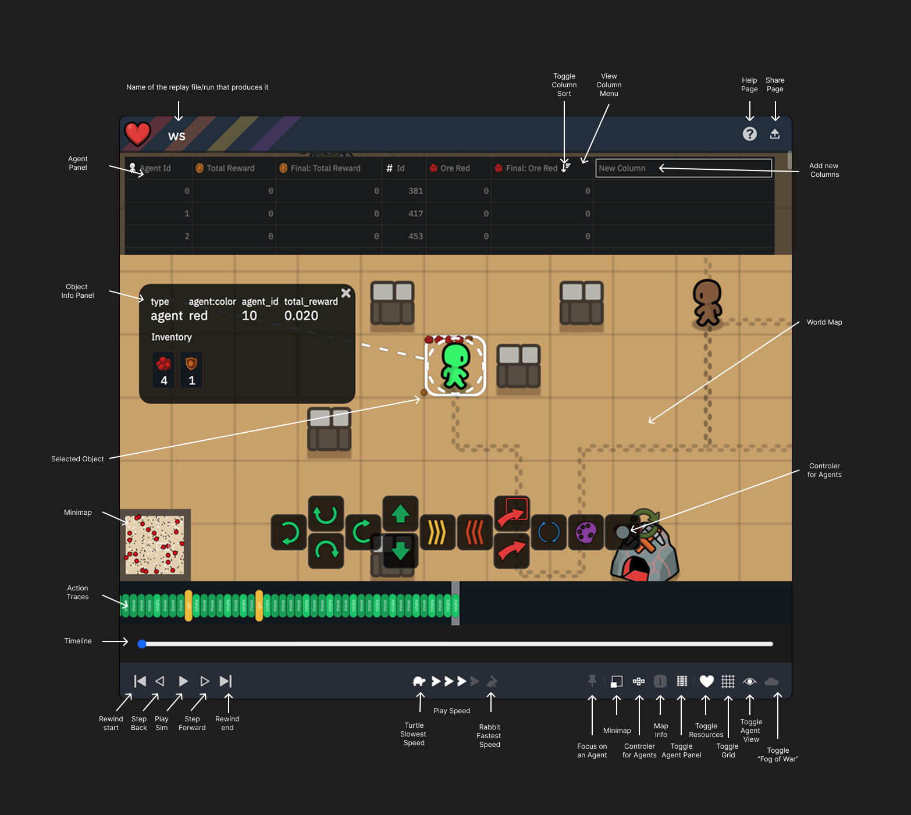
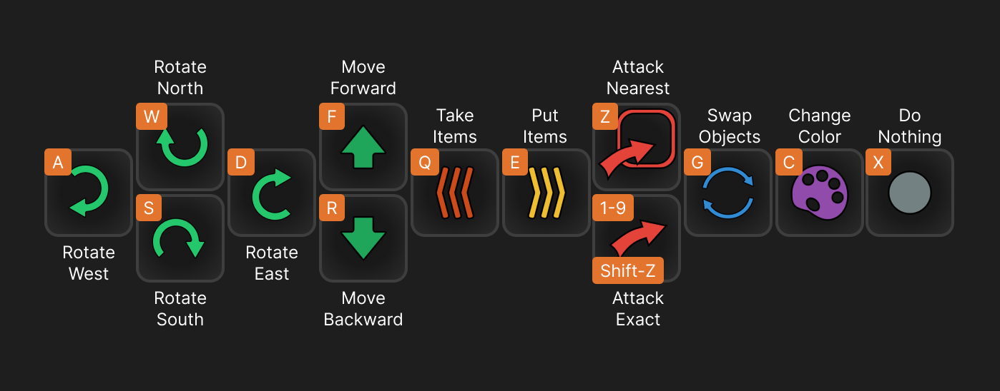

# MettaScope - Metta Replay Viewer & Player

This advanced WebGPU viewer allows you to watch and replay any metta replay. It allows play, pause, scrub through and
step through the replay. You can select individual agents and see their individual action, history, rewards, and
resources.

<p align="middle">

<br>
<a href="https://metta-ai.github.io/metta/?replayUrl=https%3A%2F%2Fsoftmax-public.s3.us-east-1.amazonaws.com%2Freplays%2Fandre_pufferbox_33%2Freplay.77200.json.z&play=true">Interactive demo</a>
</p>

## Installation

Ensure MettaScope is installed through the Metta setup tool:

```bash
# From the metta root directory
metta install mettascope
```

## Usage

### Running the server

From within the metta/mettascope/ directory:

```bash
python -m http.server 2000
```

As this is using WebGPU, we recommend using Chrome. Ensure you have set `chrome://flags/#enable-unsafe-webgpu` to
Enabled.

Then open the browser and go to `http://localhost:2000` to see the player.

### Viewing replays

You can either drag and drop a replay file or pass a url parameter to the player.

`?replayUrl=...the replay file...`

Most tools dealing with replays will provide a full link.

Here are some replays to try out:

- [Simple Environment](https://metta-ai.github.io/metta/?replayUrl=https://softmax-public.s3.us-east-1.amazonaws.com/replays/andre_pufferbox_33/replay.77200.json.z)

- [The 4 Rooms](https://metta-ai.github.io/metta/?replayUrl=https%3A%2F%2Fsoftmax-public.s3.us-east-1.amazonaws.com%2Freplays%2Fb.daphne.terrain_multiagent_24_norewardsharing_maxinv%2Freplay.1500.json.z)

- [Heart collector](https://metta-ai.github.io/metta/?replayUrl=https://softmax-public.s3.us-east-1.amazonaws.com/replays/b.daphne.navigation_terrain_training/replay.31200.json.z)

- [The 4 Maze](https://metta-ai.github.io/metta/?replayUrl=https%3A%2F%2Fsoftmax-public.s3.us-east-1.amazonaws.com%2Freplays%2Fdaphne.navigation%2Freplay.21600.json.z)

- [The 280 Agents](https://metta-ai.github.io/metta/?replayUrl=https%3A%2F%2Fsoftmax-public.s3.us-east-1.amazonaws.com%2Freplays%2Fdaveey.na.240.1x4%2Freplay.8100.json.z)

## Development

To regenerate the html and css files, run the following command:

```bash
python tools/gen_html.py
```

## Running Metta in VSCode/Cursor

1. **Launch** VSCode or Cursor.
2. **Open the project folder**:
   - Go to `File > Open Folder...` and select the `metta/` directory.
3. **Run Metta**:
   - In the top right of VSCode/Cursor, click **"Run and Debug"**.
     - If hidden, open the dropdown menu to find it.
   - In the second dropdown (default: "Train Metta"), select **"Play Metta"**.
   - Click the **green play arrow** to start!

## UI Controls



### Playback Controls

- **Play/Pause**: Control playback with the play/pause button
- **Frame Navigation**: Step forward/backward to move frame by frame
- **Speed Control**: Adjust playback speed using the speed controls
- **Timeline**: Drag the scrubber on the timeline to jump to any point in the replay. The timeline also shows key events
  like agent freezing and acts as a minimap for the trace view.

### Action Traces

The action traces visualization shows the history of agent actions. You can:

- **Zoom**: Use mouse wheel to zoom in/out of the traces
- **Pan**: Click and drag to move around the trace view
- **Trace Colors**: Different colors represent different types of actions. Zooming to read what they are.
- **Double Click**: Double click on an action to jump to that step and selects the agent.

### Visualization Controls

- **Focus on an Agent**: This is useful to control or just follow the agent without having to move the camera around.
- **Toggle Minimap**: On big maps this is useful to see the whole map and where the camera is in relation to the agents.
- **Toggle Control for Agents**: This is needed if you don't know the keyboard shortcuts to play the agents with WASD.
- **Toggle Map Info**: This is useful to show the current step, number of agents and other objects.
- **Toggle Agent Panel**: There you can see the agent's name, id, and the current inventory as well as other stats. You
  can add and remove columns as well as see current and final state of the agent.
- **Toggle Resources**: Some times there are just too many icons on screen and you want a cleaner view.
- **Grid Toggle**: Some times the grid is just too much and you want to get a clearer view.
- **Vision Range**: These ranges allow you to see what the agent would see.
- **Fog of War**: This mode allows you to only see what the agent will see without giving you extra information beyond
  agent's vision.

### Navigation

- **Pan**: Click and drag to move the view
- **Zoom**: Use mouse wheel to zoom in/out
- **Selection**: Click on units to select them and view their details
- **Double Click**: Double click on a unit to select and pin it and view its details

## Agent Controls



When you select an agent, you can take direct control using these keyboard commands, either using the UI buttons or the
keyboard shortcuts.

- **A**: Rotate West (or move West if already facing West)
- **W**: Rotate North (or move North if already facing North)
- **S**: Rotate South (or move South if already facing South)
- **D**: Rotate East (or move East if already facing East)
- **F**: Move Forward
- **R**: Move Backward
- **Q**: Take Items
- **E**: Put Items
- **Z**: Nearest Attack
- **1-9**: Exact Attack
- **A**: Opens up the attack view so that you don't need to remember the buttons.
- **G**: Swap Objects
- **C**: Change Color
- **X**: Do Nothing
