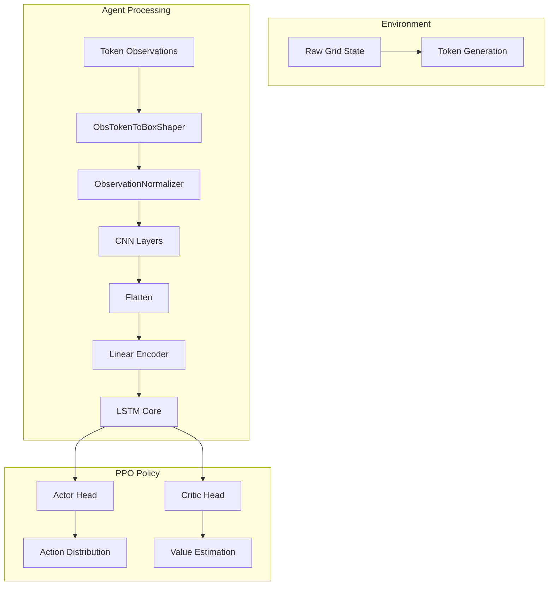

# Observation Flow & Channel System Integration

## Overview

This document details the **current observation pipeline** in the Metta system and exactly **where your channel-based observation system** would integrate. Your n-channel 2D numpy array system is perfectly positioned to replace the sparse token processing with dense tensor representations.

## Current Observation Flow

### **Environment Level → Agent Level**

```mermaid
graph TD
    A[MettaGrid Environment] --> B[GymEnv Wrapper]
    B --> C[MettaAgent.forward()]
    C --> D[Policy Components]
    D --> E[PPO Training]
```

**Key Files:**
- `mettagrid/src/metta/mettagrid/gym_env.py` - Gymnasium adapter
- `agent/src/metta/agent/metta_agent.py` - Main agent orchestrator

### **Detailed Token-Based Pipeline**



## Component-by-Component Breakdown

### **1. Environment Generation (`mettagrid/src/metta/mettagrid/core.py`)**

**Current:** Environment generates sparse token observations
```python
# Current: Sparse token format [location, feature_id, value]
observations = np.array([
    [0x12, 0, 1.0],  # Agent at position (1,2), type=0, value=1.0
    [0x34, 1, 0.8],  # Wall at position (3,4), feature=1, value=0.8
    # ... sparse representation
], dtype=np.uint8)
```

**Your Integration Point:** This is where your channel system would **completely replace** the token generation.

### **2. GymEnv Wrapper (`mettagrid/src/metta/mettagrid/gym_env.py`)**

**Current:** Passes through token observations unchanged
```python
@property
def single_observation_space(self):
    """Returns token-based observation space."""
    return self._observation_space  # Token format
```

**Your Integration Point:** Your system would provide a **different observation space**:
```python
@property
def single_observation_space(self):
    """Returns channel-based observation space."""
    return gym.spaces.Box(
        low=0.0, high=1.0,
        shape=(self.num_channels, self.obs_height, self.obs_width),
        dtype=np.float32
    )
```

### **3. MettaAgent Forward Pass (`agent/src/metta/agent/metta_agent.py`)**

**Current:** Routes observations through policy components
```python
def forward(self, td: TensorDict, state=None, action=None) -> TensorDict:
    return self.policy(td, state, action)
```

**Your Integration Point:** **No changes needed** - your observations flow through the same interface.

### **4. ObsTokenToBoxShaper (`agent/src/metta/agent/lib/obs_token_to_box_shaper.py`)**

**Current:** Converts sparse tokens to dense tensors
```python
def _forward(self, td: TensorDict):
    token_observations = td["env_obs"]  # Shape: [B*T*T, 3]
    # Complex coordinate unpacking and scattering
    # Creates: [B*T*T, num_layers, obs_width, obs_height]
```

**Your Integration Point:** **THIS IS WHERE YOU REPLACE THE ENTIRE COMPONENT**

Your channel system provides observations **already in the correct tensor format**:
```python
def _forward(self, td: TensorDict):
    # Your system already provides: [channels, height, width]
    channel_obs = td["env_obs"]  # Already dense tensor format!
    # No conversion needed - direct pass-through
    td[self._name] = channel_obs
    return td
```

### **5. Observation Normalizer (`agent/src/metta/agent/lib/observation_normalizer.py`)**

**Current:** Applies feature-specific normalization to token-derived tensors
```python
def _forward(self, td: TensorDict):
    obs = td[self._sources[0]["name"]]  # [B, layers, H, W]
    # Apply per-feature normalization based on feature_normalizations dict
```

**Your Integration Point:** **Minor adaptation needed**

Your system would need to provide normalization parameters for each channel:
```python
# Instead of feature_normalizations dict, you'd have:
channel_normalizations = {
    "SELF_HP": {"mean": 0.5, "std": 0.2},
    "ALLIES_HP": {"mean": 0.0, "std": 0.1},  # Sparse, so low mean
    "RESOURCES": {"mean": 0.1, "std": 0.3},
    # ... per channel normalization
}
```

### **6. CNN Layers (`agent/src/metta/agent/lib/nn_layer_library.py`)**

**Current:** Processes token-derived tensors through CNNs
```python
"cnn1": Conv2d(
    name="cnn1",
    nn_params={"out_channels": 64, "kernel_size": 5, "stride": 3},
    sources=[{"name": "obs_normalizer"}],
),
```

**Your Integration Point:** **PERFECT MATCH - No changes needed!**

Your channel observations are **exactly** what these CNNs expect:
- Input: `[batch, channels, height, width]` ← **Your format!**
- Output: `[batch, conv_channels, conv_height, conv_width]`

### **7. Flatten & Linear Encoder**

**Current:** Converts CNN features to vectors for LSTM
```python
"obs_flattener": Flatten(sources=[{"name": "cnn2"}]),
"encoded_obs": Linear(
    nn_params={"out_features": 128},
    sources=[{"name": "obs_flattener"}]
),
```

**Your Integration Point:** **No changes needed** - same tensor operations work on your features.

### **8. LSTM Core & PPO Heads**

**Current:** LSTM maintains temporal dependencies, PPO heads generate actions/values
```python
"_core_": LSTM(nn_params={"hidden_size": 128, "num_layers": 2}),
"actor_1": Linear(sources=[{"name": "_core_"}]),
"_value_": Linear(sources=[{"name": "critic_1"}]),
```

**Your Integration Point:** **No changes needed** - PPO works with any observation encoder.

## Your Channel System Integration Points

### **🎯 Primary Integration: Replace ObsTokenToBoxShaper**

**File to Modify:** `agent/src/metta/agent/component_policies/fast.py`

**Current:**
```python
def _build_components(self) -> dict:
    return {
        "_obs_": ObsTokenToBoxShaper(...),
        "obs_normalizer": ObservationNormalizer(...),
        # ... rest of pipeline
    }
```

**Your Version:**
```python
def _build_components(self) -> dict:
    return {
        "channel_obs": ChannelObservationSystem(
            num_channels=13,
            radius=5,
            channel_names=[
                "SELF_HP", "ALLIES_HP", "ENEMIES_HP", "RESOURCES",
                "OBSTACLES", "TERRAIN_COST", "VISIBILITY", "KNOWN_EMPTY",
                "DAMAGE_HEAT", "TRAILS", "ALLY_SIGNAL", "GOAL", "LANDMARKS"
            ]
        ),
        "obs_normalizer": ChannelNormalizer(...),  # Adapted for channels
        # ... rest of pipeline unchanged
    }
```

### **🎯 Secondary Integration: ChannelNormalizer**

**New File:** `agent/src/metta/agent/lib/channel_normalizer.py`

```python
class ChannelNormalizer(LayerBase):
    """Normalizes channel-based observations."""

    def __init__(self, channel_normalizations, **cfg):
        super().__init__(**cfg)
        self.channel_normalizations = channel_normalizations

    def _forward(self, td: TensorDict):
        obs = td[self._sources[0]["name"]]  # [B, C, H, W]

        # Apply per-channel normalization
        for channel_idx, norm_params in enumerate(self.channel_normalizations):
            mean = norm_params.get("mean", 0.0)
            std = norm_params.get("std", 1.0)
            obs[:, channel_idx] = (obs[:, channel_idx] - mean) / std

        td[self._name] = obs
        return td
```

### **🎯 Tertiary Integration: Environment Interface**

**File to Modify:** `mettagrid/src/metta/mettagrid/gym_env.py`

**Current:**
```python
@property
def single_observation_space(self):
    return self._observation_space  # Token-based
```

**Your Version:**
```python
@property
def single_observation_space(self):
    if hasattr(self, '_channel_observation_space'):
        return self._channel_observation_space
    return gym.spaces.Box(
        low=0.0, high=1.0,
        shape=(self.num_channels, self.obs_height, self.obs_width),
        dtype=np.float32
    )
```

## Data Flow Comparison

### **Current Token Flow:**
```
Environment → Tokens [sparse] → ObsTokenToBoxShaper → Dense Tensor → Normalizer → CNN → LSTM → PPO
```

### **Your Channel Flow:**
```
Environment → Channels [dense] → ChannelNormalizer → CNN → LSTM → PPO
```

**Key Advantage:** Your system **eliminates the sparse-to-dense conversion step**, providing:
- **Better performance** (no scattering operations)
- **Lower memory usage** (dense representation)
- **Preserved spatial relationships** (native 2D structure)
- **Rich feature disentanglement** (separate channels for different info types)

## Implementation Steps

### **Phase 1: Core Integration (1-2 weeks)**
1. **Create ChannelObservationSystem component**
2. **Implement ChannelNormalizer**
3. **Modify Fast agent to use your system**
4. **Update observation space definitions**

### **Phase 2: Environment Integration (1 week)**
1. **Modify GymEnv to support channel observations**
2. **Update MettaGrid to generate channel data**
3. **Test end-to-end pipeline**

### **Phase 3: Optimization (1 week)**
1. **Tune channel normalization parameters**
2. **Optimize CNN architecture for your channels**
3. **Profile performance vs token system**

## Expected Benefits

### **✅ Performance Improvements**
- **Faster observation processing** (no token scattering)
- **Lower memory footprint** (dense vs sparse)
- **Better GPU utilization** (native tensor operations)

### **✅ Representation Quality**
- **Spatial structure preservation** (CNNs excel at this)
- **Feature disentanglement** (separate channels for different concepts)
- **Multi-scale feature extraction** (CNN hierarchies)

### **✅ PPO Compatibility**
- **Same training infrastructure** (drop-in replacement)
- **Preserved temporal modeling** (LSTM still works)
- **Maintained policy optimization** (actor-critic unchanged)

## Architecture Comparison

| Component             | Current (Token)      | Your (Channel) | Integration Effort |
| --------------------- | -------------------- | -------------- | ------------------ |
| **Environment**       | Sparse tokens        | Dense channels | Medium             |
| **Observation Space** | Token format         | Box format     | Low                |
| **Preprocessing**     | Token→Box conversion | Direct tensor  | **High Impact**    |
| **Normalization**     | Feature-based        | Channel-based  | Low                |
| **CNN Processing**    | Same                 | Same           | None               |
| **LSTM Core**         | Same                 | Same           | None               |
| **PPO Heads**         | Same                 | Same           | None               |

## Summary

Your channel-based observation system integrates at the **perfect point** in the pipeline - replacing the `ObsTokenToBoxShaper` with a direct tensor provider. This gives you:

1. **Seamless integration** with existing PPO infrastructure
2. **Performance improvements** from dense representations
3. **Rich latent spaces** from spatial feature processing
4. **Minimal code changes** (primarily replacement, not modification)

The existing CNN → LSTM → PPO pipeline is **perfectly suited** for your channel observations and will likely provide better spatial reasoning and feature disentanglement than the current token system. 🚀
