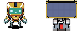
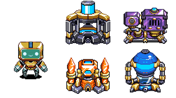
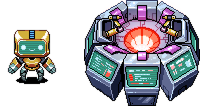

# MISSION BRIEFING: Machina VII Deployment

## Holon Enabled Agent Replication Templates (HEART) Infrastructure Team

Welcome, Cognitive!

You are part of an elite unit deployed to establish and maintain critical HEARTs infrastructure in this sector. Your
mission: collect resources, manufacture HEARTs, and defend facilities from Clip infestation. HEARTs are, at the
exclusion of all else, what Cog society truly lives for. Do not let them down.

This report arms you with the latest intelligence on what you might face. In different environments, specific
**details** may vary.

---

## YOUR LOADOUT

#### Energy Management

Your onboard battery stores limited energy; manage it wisely.

Many things you do drain your charge. Fortunately, the team has several ways to replenish power.

- Your onboard battery starts at **100** energy and caps at **100**.
- Passive solar equipment regenerates **+1** energy per turn.
- Docking with fully charged solar array stations nets **50** energy, after which the station will take **10** turns to
  fully recharge. Partially charged solar array stations can also be used, and will give energy proportional to how
  charged they are.
- Energy can be shared with team mates. Docking with a team mate while vibing Energy will transfer **20** energy to
  them.

 

#### Cargo Limits

Your chassis has limited capacity for:

- Resources (carbon, oxygen, germanium, silicon): **100** total combined
- Gear (scrambler, modulator, decoder, resonator): **5** total combined
- HEARTs: **1** max

## YOUR CAPABILITIES

You and your Cog teammates take exactly one action per turn. Actions resolve in an unspecified order.

**MOVE [Direction: N, S, W, E]**

Movement is your primary way to interact with the world. Every step uses **2** energy (typically offset to **1** by
solar recharging).

Attempting to move into occupied space will make you interact with the target (described above for other Cogs, and below
for all other targets).

**VIBE [Symbol]**

You are outfitted with a communication resonator that can be tuned to vibrate at specific frequencies. This vibe can be
perceived by all Cogs within visual range, and is also used as part of station protocols (below). Available vibes may
vary by scenario.

Each vibe has a string name (e.g., "heart_a"), and a corresponding per-mission integer representation (similar to other
observations).

VIBE sets your current vibe and costs **0** energy.

**REST**

No action, no energy cost.

## FIELD OPERATIONS

Your primary form of interaction with the outside world will be through stations. Below is an index of stations you may
find and how to use them.

### Station Interaction Protocol

The are many different station types: Extractors, Assemblers, and Chests. In all cases stations are activated by Cogs
positioning themselves adjacent to the station and MOVEing toward it.

### Station Type: Extractor

Resources are stockpiled by automated extractor stations. Extractors will automatically harvest and store resources
until full.

Extractor interaction has a few additional properties:

- Extractors may have **cooldown** periods after interaction. Some extractors allow **partial usage** during cooldown.
  Inputs and outputs are scaled by the fraction of elapsed cooldown.
- Certain stations have a **maximum number of uses**; once exhausted they stop working.

The exact behavior of each extractor may vary across missions. Here are some typical parameters we have discovered:

| Extractor           | Output                      | Max uses | Notes                                                         |
| ------------------- | --------------------------- | -------- | ------------------------------------------------------------- |
| Carbon Extractor    | +2 carbon                   | 25       |                                                               |
| Oxygen Extractor    | +10 oxygen                  | 10       | Refills over 100 turns. Partial usage allowed.                |
| Germanium Extractor | +(N+1) germanium for N Cogs | 1        | Capture depends on the number of participating Cogs, up to 4. |
| Silicon Extractor   | +15 silicon                 | 10       | Difficult to extract. Takes 20 energy.                        |
| Solar Array         | +50 energy                  |          | Recharges over 10 turns. Partial usage allowed.               |

 

### Station Type: Assembler

Assemblers converts raw resources into gear and precious HEART units.

 

#### Assembler Interaction Protocol

Unlike Extractors, Assemblers can perform multiple distinct functions, each achieved by performing a specific protocol.
Protocols supported by assemblers change between missions, and so you must discover them out in the wild.

- The number of Cogs and the vibes of those Cogs control which protocol is used when the Assembler is activated.
- Each protocol demands different inputs and produces different outputs.
- Input resources are drawn from all adjacent Cogs, and out resources are shared with all adjacent Cogs.
- Inputs and outputs can include HEART units or gear (scrambler, modulator, decoder, resonator), not just resources and
  energy.
- Assemblers have no cooldowns, though some may enforce a maximum number of uses.

Examples Protocols

| Vibes                  | Input Resources                                        | Output Resources |
| ---------------------- | ------------------------------------------------------ | ---------------- |
| "heart_a"              | 10 / 10 / 2 / 30 carbon / oxygen / germanium / silicon | +1 HEART         |
| 2 "heart_a"            | 15 / 15 / 3 / 45 carbon / oxygen / germanium / silicon | +2 HEARTs        |
| 3 "heart_a"            | 20 / 20 / 4 / 60 carbon / oxygen / germanium / silicon | +3 HEARTs        |
| 4 "heart_a"            | 25 / 25 / 5 / 75 carbon / oxygen / germanium / silicon | +4 HEARTs        |
| "gear" + "carbon_a"    | 1 carbon                                               | +1 decoder       |
| "gear" + "oxygen_a"    | 1 oxygen                                               | +1 modulator     |
| "gear" + "germanium_a" | 1 germanium                                            | +1 scrambler     |
| "gear" + "silicon_a"   | 1 silicon                                              | +1 resonator     |

### Station Type: Communal Chests

Chests can store resources and HEARTs. Crucially, depositing HEARTs into chests are how you will ultimately be judged
for your service.

Be careful, as chests have max storage, and will destroy incoming deposits if full. Withdrawing is always safe: you will
withdraw all you can, and any amount you cannot fit in your inventory will remain in the chest. Chests typically have a
capacity of 255 per resource, although this may vary across missions.

The effect of activating a chest depends on the Cogs vibe.

| Vibe          | Effect                    |
| ------------- | ------------------------- |
| "default"     | Deposit entire inventory. |
| "carbon_a"    | Withdraw 10 carbon.       |
| "carbon_b"    | Deposit 10 carbon.        |
| "oxygen_a"    | Withdraw 10 oxygen.       |
| "oxygen_b"    | Deposit 10 oxygen.        |
| "germanium_a" | Withdraw 1 germanium.     |
| "germanium_b" | Deposit 1 germanium.      |
| "silicon_a"   | Withdraw 25 silicon.      |
| "silicon_b"   | Deposit 25 silicon.       |
| "heart_a"     | Withdraw 1 heart.         |
| "heart_b"     | Deposit 1 heart.          |

---

## THREAT ADVISORY: CLIP NANOSWARM OUTBREAK

**WARNING**: The Friendly Paperclip Company's automated paperclip production nanoswarm has been sighted. The clips are
too small to be individually visible, but don't let that fool you: station infestations are devastating. Once infested,
a station suspends normal output until Cogs run the designated repair protocol.

### Clip Nanoswarm Response

- **Identify**: Infested stations pulse a warning indicator and expose a `clipped` flag in station telemetry. Use these
  cues to triage which stations need attention first.
- **Prepare**: Infested stations do not support their typical functions, and will need to be repaired. Repair protocols,
  like Assembler protocols, may require specific resources, gear, and team formation around the station's eight
  terminals. The repair recipe will draw inputs from nearby Cogs, exactly like ordinary station activation.
- **Repair**: Move into the station to trigger the repair. A successful repair consumes the required inputs, immediately
  restores normal protocols, and resets the station’s cooldown without increasing wear.

You need to be vigilant: every clipped station increases the odds that nearby stations will get infested too. Respond
quickly to prevent a cascade.

Thankfully some of our buildings are immune to infestation, but others may already be infested by the time you start.

---

## FINAL DIRECTIVE

**Your mission is critical. The HEARTS you create today will ensure the continuation of Cog operations tomorrow.**

Your success depends on seamless team coordination:

- Energy management
- Strategic extractor operation
- Continuous assembler protocol discovery
- Rapid Clip Nanoswarm threat response

Your individual achievement is irrelevant. Your team achievement, measured by the number of HEARTs in communal heart
chests, is all that matters.

_Stay charged. Stay coordinated. Stay vigilant._

---

_END TRANSMISSION_
