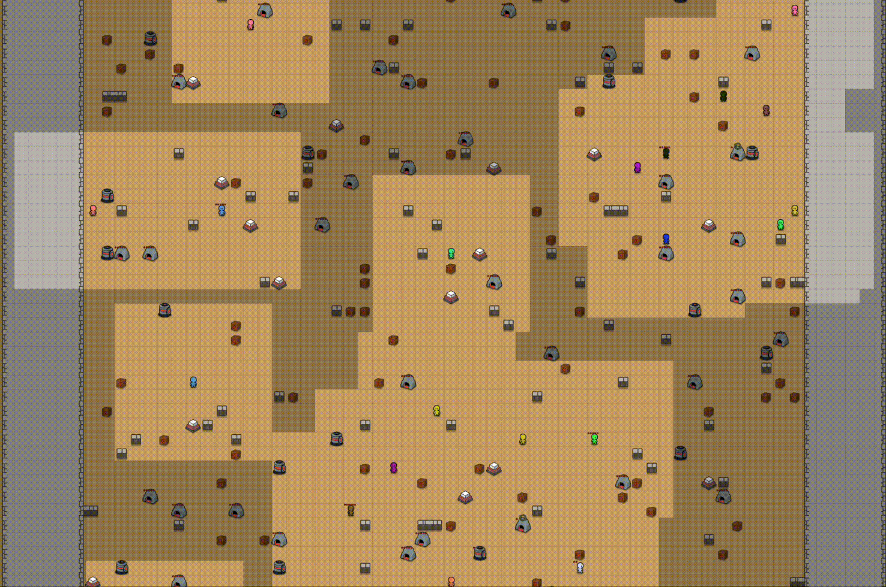

# CoGames: Cogs vs Clips Multi-Agent RL Environment

CoGames is a collection of multi-agent cooperative and competitive environments designed for reinforcement learning
research.

## The game: Cogs vs Clips

Multiple "Cog" agents, controlled by user-provided policies, must cooperate to extract Hearts from the environment.
Doing so requires gathering resources, operating machinery, and assembling components. Many steps will require
interacting with a "station". Many such interactions will require multiple cogs working in tandem.

Your Cogs' efforts may be thwarted by Clips: NPC agents that disable stations or otherwise impede progress.

<p align="middle">

<br>

There are many mission configurations available, with different map sizes, resource and station layouts, and game rules.
Overall, Cogs vs Clips aims to present rich environments with:

- **Resource management**: Energy, materials (carbon, oxygen, germanium, silicon), and crafted components
- **Station-based interactions**: Different stations provide unique capabilities (extractors, assemblers, chargers,
  chests)
- **Sparse rewards**: Agents receive rewards only upon successfully crafting target items (hearts)
- **Partial observability**: Agents have limited visibility of the environment
- **Required multi-agent cooperation**: Agents must coordinate to efficiently use shared resources and stations

Cogs should refer to their [MISSION.md](MISSION.md) for a thorough description of the game mechanics.

## Quick Start

```bash
# Install
uv pip install cogames

# List missions
cogames missions

# Play an episode of the machina_1 game.
cogames play -m training_facility_1 -p random

# Train a policy in a simple, single-agent game
cogames train -m training_facility_1 -p simple

# Watch or play along side your trained policy
cogames play -m training_facility_1 -p simple:train_dir/policy.pt

# Evaluate your policy
cogames eval -m training_facility_1 -p simple:./train_dir/policy.pt
```

## Commands

Most commands are of the form `cogames <command> -p [MISSION] -p [POLICY] [OPTIONS]`

To specify a `MISSION`, you can:
- Use a mission name from the default registry emitted by `cogames missions`, e.g. `training_facility_1`
- Use a path to a mission configuration file, e.g. path/to/mission.yaml"

To specify a `POLICY`, provide an argument with up to three parts `CLASS[:DATA][:PROPORTION]`:
- `CLASS`: Policy shorthand (`noop`, `random`, `lstm`, `simple`) or fully qualified class path like `cogames.policy.random.RandomPolicy`.
- `DATA`: Optional path to a weights file or directory. When omitted, defaults to the policy's built-in weights.
- `PROPORTION`: Optional positive float specifying the relative share of agents that use this policy (default: 1.0).

### `cogames missions -m [MISSION]`

Lists all missions and their high-level specs.

If a mission is provided, it describe a specific mission in detail.

### `cogames play -m [MISSION] -p [POLICY]`

Play an episode of the specified mission.

**Policy**
Cogs' actions are determined by the provided policy, except if you take over their actions manually.

If not specified, this command will use the `noop`-policy agent -- do not be surprised if when you play you don't see other agents moving around! Just provide a different policy, like `random`.

**Options:**

- `--steps N`: Number of steps (default: 1000)
- `--render MODE`: 'gui' or 'text' (default: gui)
- `--non-interactive`: Non-interactive mode (default: false)

`cogames play` supports a gui-based and text-based game renderer, both of which support many features to inspect agents
and manually play alongside them.

### `cogames train -m [MISSION] -p [POLICY]`

Train a policy on a mission.

**Policy**
By default, our `simple` policy architecture will be used. But as is explained above, you can select a different policy architecture we support out of the box (like `lstm`), or can define your own and supply a path to it.

Any policy provided must implement the `TrainablePolicy` interface, which you can find in `cogames/policy/interfaces.py`.

You can continue training an already-initialized policy by also supplying a path to its weights checkpoint file:

```
cogames train -m [MISSION] -p path/to/policy.py:train_dir/my_checkpoint.pt
```

**Mission**
Note that you can supply repeated `-m` missions. This yields a training curriculum that rotates through those environments:

```
cogames train -m training_facility_1 -m training_facility_2 -p simple
```

You can also specify multiple missions with `*` wildcards:
- `cogames train -m 'machina_2_bigger:*'` will specify all missions on the machina_2_bigger map
- `cogames train -m '*:shaped'` will specify all "shaped" missions across all maps
- `cogames train -m 'machina*:shaped'` will specify all "shaped" missions on all machina maps


**Options:**
- `--steps N`: Training steps (default: 10000)
- `--device STR`: 'auto', 'cpu', or 'cuda' (default: auto)
- `--batch-size N`: Batch size (default: 4096)
- `--num-workers N`: Worker processes (default: CPU count)


### Custom Policy Architectures

To get started, `cogames` supports some torch-nn-based policy architectures out of the box (such as SimplePolicy). To
supply your own, you will want to extend `cogames.policy.Policy`.

```python
from cogames.policy.interfaces import Policy

class MyPolicy(Policy):
    def __init__(self, observation_space, action_space):
        self.network = MyNetwork(observation_space, action_space)

    def get_action(self, observation, agent_id=None):
        return self.network(observation)

    def reset(self):
        pass

    def save(self, path):
        torch.save(self.network.state_dict(), path)

    @classmethod
    def load(cls, path, env=None):
        policy = cls(env.observation_space, env.action_space)
        policy.network.load_state_dict(torch.load(path))
        return policy
```

To train with using your class, supply a path to it in your POLICY argument, e.g.
`cogames train training_facility_1 path.to.MyPolicy`.

#### Environment API

The underlying environment follows the Gymnasium API:

```python
from cogames.cli.mission import get_mission
from mettagrid.envs import MettaGridEnv

# Load a mission configuration
_, config = get_mission("assembler_2_complex")

# Create environment
env = MettaGridEnv(env_cfg=config)

# Reset environment
obs, info = env.reset()

# Game loop
for step in range(1000):
    # Your policy computes actions for all agents
    actions = policy.get_actions(obs)  # Dict[agent_id, action]

    # Step environment
    obs, rewards, terminated, truncated, info = env.step(actions)

    if terminated or truncated:
        obs, info = env.reset()
```

### `cogames eval -m [MISSION] -p POLICY [-p POLICY...]`

Evaluate one or more policies

**Policy**
 Note that here, you can provide multiple `-p POLICY` arguments if you want to run evaluations on mixed-policy populations.

**Examples:**

```bash
# Evaluate a single trained policy checkpoint
cogames eval -m machina_1 -p simple:train_dir/model.pt

# Mix two policies: 3 parts your policy, 5 parts random policy
cogames eval -m machina_1 -p simple:train_dir/model.pt:3 -p random::5
```

**Options:**

- `--episodes N`: Number of episodes (default: 10)
- `--action-timeout-ms N`: Timeout per action (default: 250ms)

When multiple policies are provided, `cogames eval` fixes the number of agents each policy will control, but
randomizes their assignments each episode.

### `cogames make-mission -m [BASE_MISSION]`

Create custom mission configuration. In this case, the mission provided is the template mission to which you'll apply modifications.

**Options:**

- `--agents N`: Number of agents (default: 2)
- `--width W`: Map width (default: 10)
- `--height H`: Map height (default: 10)
- `--output PATH`: Save to file

You will be able to provide your specified `--output` path as the `MISSION` argument to other `cogames` commmands.

### `cogames version`

Show version info for mettagrid, pufferlib-core, and cogames.

## Citation

If you use CoGames in your research, please cite:

```bibtex
@software{cogames2024,
  title={CoGames: Multi-Agent Cooperative Game Environments},
  author={Metta AI},
  year={2024},
  url={https://github.com/metta-ai/metta}
}
```
